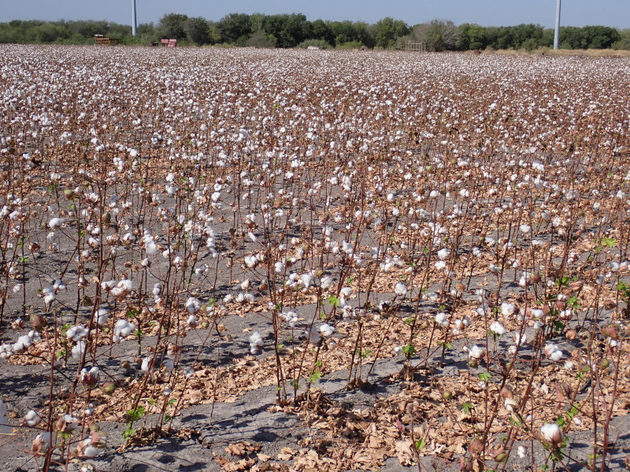
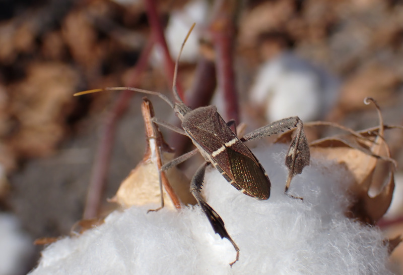

# iCORE Newsletter – 2023/08/03

The iCORE newsletter highlights events and information related to the [innovation in COmputing REsearch (iCORE) lab](https://icore.tamucc.edu/),
as well as the broader GSCS/CS programs at Texas A&M University - Corpus Christi and whatever else might interest that community.
If you have any news or resources you would like to share, send an email to [Evan Krell](https://scholar.google.com/citations?user=jLuwYGAAAAAJ&hl=en) (ekrell@islander.tamucc.edu).

[See past newsletters.](https://github.com/ekrell/icore_website/tree/main/news)

## Welcome

## iCORE Meetings

**[iCORE Teams meeting link](https://teams.microsoft.com/l/meetup-join/19%3Ameeting_MDdlZDBiMTgtYzVjNS00YjhhLWE5OTctY2Y5YzMyYTljNzU5%40thread.v2/0?context=%7B%22Tid%22%3A%2234cbfaf1-67a6-4781-a9ca-514eb2550b66%22%2C%22Oid%22%3A%22994c008b-0707-4f3c-8ac0-73b65e733430%22%2C%22MessageId%22%3A%220%22%7D)**

### Next meeting: August 17, noon-1:30pm

- General updates
- Plans for Fall semester
  - Research directions
  - iCORE events: workshops, presentations, etc

## Upcoming Events

### Evan Krell's SCOTT talk, Friday August 18

- **What:** Short Curious Open Tech Talk (SCOTT) Series: a series of lightning talks at the [Conrad Blucher Institute](https://www.conradblucherinstitute.org/).
- **When:** Next Friday, Auguest 18. 11.00 am - Noon.
- **Where:** NRC 1232 (CBI conference room).

**Title:** The Influence of Feature Grouping Schemes on Explainable AI for Geoscience AI Models

**Synopsis:** Gridded spatial data can be used to develop high performance machine learning models, but their complexity makes it hard to verify that the model learned realistic strategies. Explainable AI (XAI) techniques can be used to investigate models, but they struggle with correlated features. A proposed solution is to group correlated features for XAI. We use FogNet, a deep learning model for coastal fog prediction, to explore XAI grouping schemes. We demonstrate that using a hierarchy of feature groups can be used to gain insights into the scale of the learned features.

**Bio:** Evan Krell is a Ph.D. student in the GSCS program and a member of the Innovation in COmputing REsearch lab (iCORE) as well as the NSF AI Institute for Research on Trustworthy AI in Weather, Climate, and Coastal Oceanography (AI2ES). He is broadly interested in explainable AI, geoscience models, data visualization, marine robotics, fishing, and boating. His current project is to learn Chinese cooking and his three cup chicken (三杯鸡) is way better than the dish at Dao. 

## Recent Updates

### The cotton is ready for harvesting at AgriLife's

- Mahmoud's hard work pulling weeds has payed off: the cotton is ready!
- Now the harvested cotton can be used to create the ground truth for cotton yield estimation modeling.

## Get involved

As always, we encourage all iCORE members and iCORE-adjacent persons to get involved and propose workshop/lecture/training ideas that they would like to present.

## iCORE resources

- location: NRC 2100 Suite (https://goo.gl/maps/Htbp1YMASAmYqkFu9)
- website: http://icore.tamucc.edu/
- twitter: https://twitter.com/ICORE_TAMUCC
- youtube: https://www.youtube.com/channel/UCvsK07PvushTI2BA2BhN-DQ
- discord: https://discord.gg/3eeMN229cr
