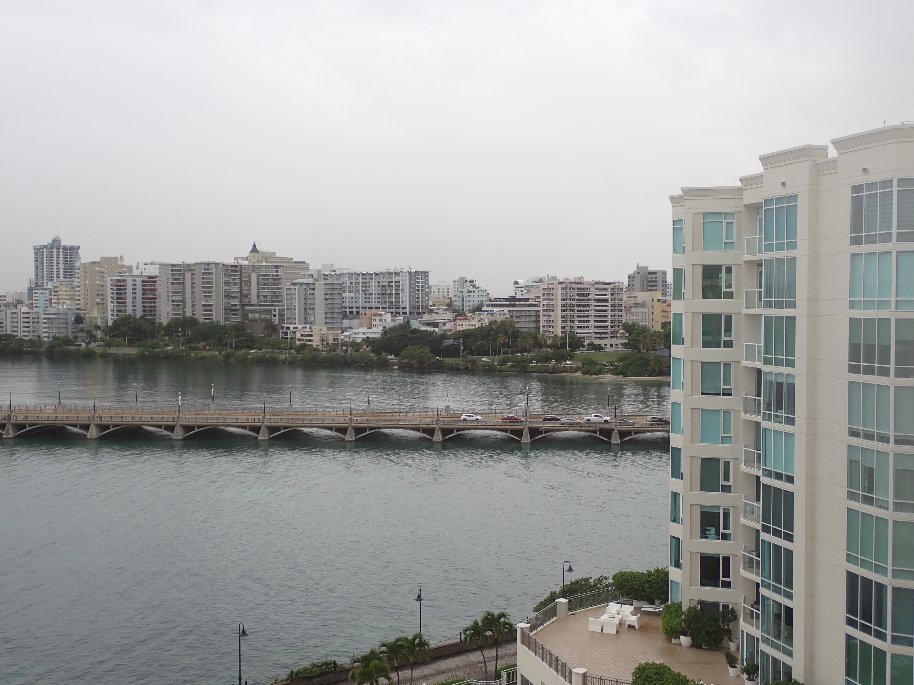
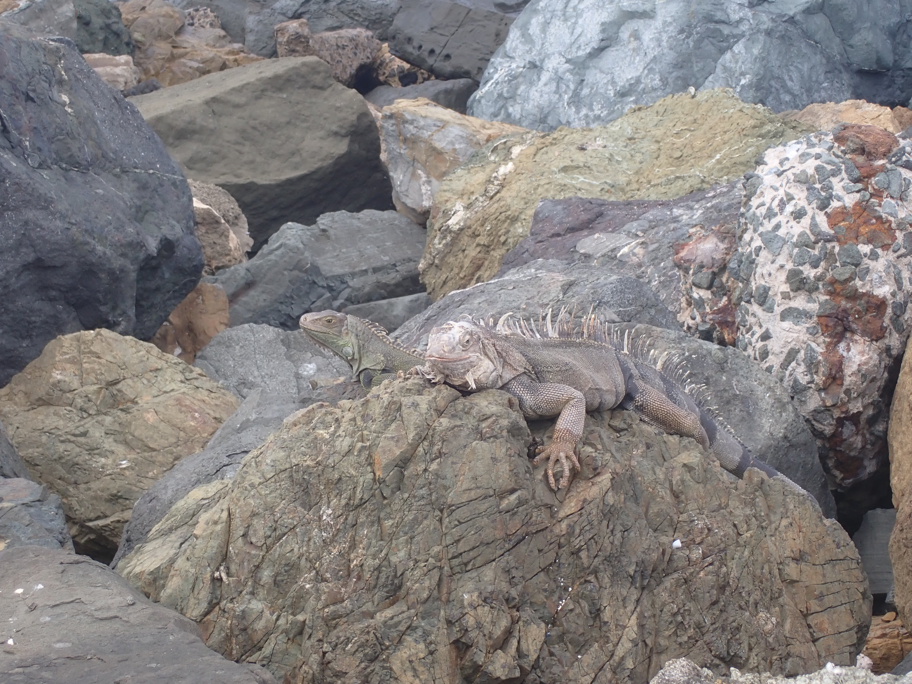
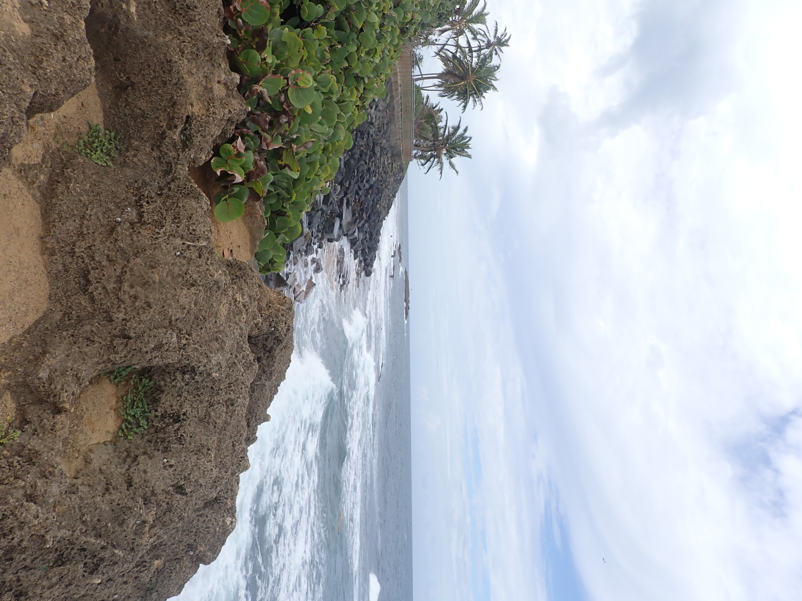
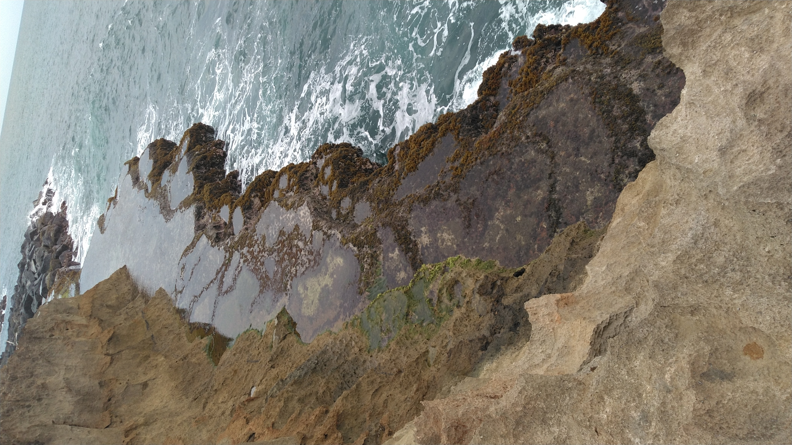

# iCORE Newsletter – 2022/11/02

**Important:** 

1. This week’s iCORE meeting is **canceled**. A number of students have recently inquired about how to get involved with iCORE, and we have been recommending to attend the next meeting. Instead of tomorrow, the next meeting is now November 17th. This is because Dr. King and some iCORE members are involved with the [AGEP 2022 National Research Conference](https://agep2022.tamucc.edu/) which is hosted at TAMUCC from November 2 – 4. Sorry for the inconvenience after we were explicitly suggesting that students come by for tomorrow’s meeting.

2. We have changed the date of the XAI workshop from November 11 to November 18 because it would overlap with Wen Zhong's Research Proposal Seminar. Most of the audience (and presenter) for the XAI workshop are students that should be present at Wen's seminar. We've already received word from people planning to attend the XAI workshop on the 11th. Hopefully that change of date does not prevent your attendance. To ensure accessibility, it will be recorded and possibly made hybrid. 

## News

### SACNAS: National Diversity In STEM Conference (NDiSTEM) in San Juan, Puerto Rico
Last week, the annual SACNAS [NDiSTEM](https://www.sacnas.org/conference) conference was held in San Juan, Puerto Rico. A sizable group of TAMUCC faculty, staff, and students represented our island university. We had an exhibitor's booth for promoting our school’s science and engineering graduate programs. Our prime directive was to promote the school, but some of the students were attending as presenters, including iCORE’s Evan Krell (me). 

In addition to advertising our programs with other student presenters, I also networked heavily with other exhibitors. Since I am in the geospatial computer science (GSCS) PhD program, I focused on those with a significant geospatial component: NOAA, AGU, Geological Society of America, CIRES, International Ocean Discovery Program, USGS, Polar Geospatial Center, etc. Pure CS was not well represented.

I was very interested in their response to our Geospatial CS program. I emphasized that many of the students come from a pure CS background while many others are from a more geospatial side. We are able to develop a broad skillset that differentiates us from a typical CS program and I think would be especially valuable at places like NOAA and USGS. As an experiment, I would sometimes talk with the exhibitors for a while just about my general background and interests before bringing up the GSCS program. In a number of cases, there was a definite interest in the program. Representatives from these groups would typically express surprise that such a program existed and would ask for more information on what kinds of classes we take and projects we work on. The emphasis on coastal applications that many of us are involved in seemed to get their interest in particular. I recognize that these exhibitors are here to promote and will react positively to just about whatever you say, but I think that the repeated interest in specifically our having a geospatial-focused CS degree suggests a recognition of the value the program provides. There were a number of cases where they asked for my contact info, only after a discussion about GSCS. 

In addition to promoting the school, I was also interested in learning about opportunities such as internships and post-docs. A goal of mine was to bring some of SACNAS home to my fellow GSCS students. There are many opportunities for me, but I was specifically asking at booths for opportunities available for non-US citizens, since these make up much of the program. The answer was very often no, but there were a few which I’ll compile and provide links to in a future newsletter. 

Roy Roberts, the president of the TAMUCC SACNAS chapter, was also hard at work to bring SACNAS back to our school. He visited nearly every booth, collecting materials for mostly undergraduate opportunities. These will be shared with TAMUCC students through a local SACNAS event where attendees can shop from all the fliers collected. I saw no reason to replicate this effort for iCORE. Instead, we will inform our readers when we have a date for the SACNAS event.  

A few scenes from San Juan:

## Upcoming events

### Wen Zhong's Research Proposal Seminar: November 11

Wen will have her proposal seminar on Friday, November 11 at 1:00pm. All GSCS students should be there if at all possible, but I highly encourage all of you to come show Wen your support! I believe that the location is to be determined, but I'll report back with all the details in next week's newsletter.

**Abstract:**

Coastal regions have been increasingly affected by the impacts of floods due to heavy rainfall, storm surge, and sea-level rise (SLR) along with climate change. As several mechanisms or driving forces contribute to flooding simultaneously or in close succession, compound flooding comes to be increasingly commonplace. Land subsidence, as an important cause of the relative SLR, can potentially exacerbate coastal flooding. Existing studies have focused on the direct inundation over subsiding land surface, but there is little understanding of the impacts of subsidence on the drainage structure and capacity of coastal watersheds, as well as the implications of these impacts for coastal infrastructure resilience and risk management. Land subsidence could change watershed drainage networks by reshaping the low-relief coastal terrain. This could affect key hydrological and hydraulic processes that control the magnitude, duration, and frequency of flood events. Land subsidence has become a significant concern along the Texas Coast. There is an urgent need for the effective characterization of land subsidence to improve the strategies of flood risk management in Texas coastal areas, especially for the mitigation of compound floods (e.g., the concurrence of coastal flooding and pluvial flooding). The proposed study aims to address this need by developing an integrated framework that combines geodetic remote sensing techniques, machine learning, and hydrological simulation through three interlinked phases. First, integrating satellite interferometric synthetic aperture radar (InSAR) and airborne LiDAR methods to estimate the spatiotemporal pattern of coastal subsidence. Second, applying the hydrological model to simulate the boundary conditions for pluvial flooding by including the above subsidence results. Third, combining the boundary conditions for pluvial and coastal flooding to achieve a compound flooding analysis. This study will analyze the boundary conditions for coastal flooding by integrating subsidence, sea level predictions, and storm surge predictions. Eventually, this study expects to reveal the potential impacts of land subsidence on compound flooding over the selected coastal areas.

### XAI Workshop: November 18

iCORE is hosting an XAI workshop next week. The event will take place at iCORE (NRC 2100 suite) on Friday, November 18 from 1:00 – 2:30. The plan to to briefly introduce XAI and then work together to apply XAI methods to explain tabular and image models. After getting some experience with XAI, we’ll then discuss XAI pitfalls: some of the many ways in which you can apply an XAI technique but get a misleading model explanation. If time permits, we’ll see some of these pitfalls demonstrated through real examples. 

## Get involved

As always, we encourage all iCORE members and iCORE-adjacent persons to get involved and propose workshop/lecture/training ideas that they would like to present.

## iCORE resources

- website: http://icore.tamucc.edu/
- twitter: https://twitter.com/ICORE_TAMUCC
- youtube: https://www.youtube.com/channel/UCvsK07PvushTI2BA2BhN-DQ
- google calendar: https://calendar.google.com/calendar/u/0?cid=Y2JlNDZodnIwZXV0NmZzN2h1bWs2NnB2dnNAZ3JvdXAuY2FsZW5kYXIuZ29vZ2xlLmNvbQ

### How to sync the iCORE Google calendar with Outlook

- Instructions on how to do so: https://support.microsoft.com/en-us/office/see-your-google-calendar-in-outlook-c1dab514-0ad4-4811-824a-7d02c5e77126
- The Google calendar's address in iCal format, needed in the above steps: https://calendar.google.com/calendar/ical/cbe46hvr0eut6fs7humk66pvvs%40group.calendar.google.com/public/basic.ics
