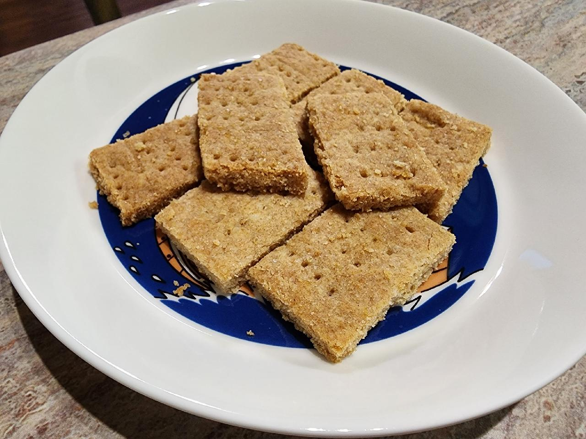

# iCORE Newsletter – 2022/11/21

The iCORE newsletter highlights events and information related to the [innovation in COmputing REsearch (iCORE) lab](https://icore.tamucc.edu/), 
as well as the broader GSCS/CS programs at Texas A&M University - Corpus Christi and whatever else might interest that community. 

## Recent Events

**Evan Krell's XAI workshop**

Last Friday (Nov. 18), Evan Krell presented a workshop on Explainable Artificial Intelligence (XAI). 
The event was hybrid, and we were pleased to see a sizable turnout both in-person and remote: thanks to everyone who came!
There was quite a bit of interesting discussion throughout. Unfortunately, the remote attendees were unable to hear it.
Next time we do a hybrid event, we'll try to have a microphone available instead of relying on Evan's cell phone. 

The workshop materials are [available here](https://github.com/ekrell/xai-intro).

**Larissa Freguete's successful thesis defense**

Last Tuesday (Nov. 15), Larissa Freguete successfully defended her master's thesis! 
Please give her your congratulations!
See last week's newsletter for her abstract. 

**Last iCORE meeting: Abhishek Phadke's practice dissertation proposal defense**

Last meeting (Nov. 17), Abhishek Phadke gave a practice defense of his upcoming dissertation proposal. 
The conference room was packed, and there was a lot of feedback from the attendees.
I have not yet seen the announcement for Abhishek's proposal seminar, but I suspect it will be sent out soon. 
Please attend and support Abhishek if your schedule allows. 

**Shortbread confirmed good**

In case there was any doubt, iCORE has demonstrated that shortbread is, in fact, delicious. 
Evan Krell's homemade shortbread proved popular among a number of visitors from all over the NRC building.
Also, Evan used sprouted flour which is purportedly better for you than processed flour, so one can choose to ignore the stick of butter for the illusion of healthy snacking.

## Get involved

As always, we encourage all iCORE members and iCORE-adjacent persons to get involved and propose workshop/lecture/training ideas that they would like to present.

## iCORE resources

- website: http://icore.tamucc.edu/
- twitter: https://twitter.com/ICORE_TAMUCC
- youtube: https://www.youtube.com/channel/UCvsK07PvushTI2BA2BhN-DQ
- google calendar: https://calendar.google.com/calendar/u/0?cid=Y2JlNDZodnIwZXV0NmZzN2h1bWs2NnB2dnNAZ3JvdXAuY2FsZW5kYXIuZ29vZ2xlLmNvbQ

### How to sync the iCORE Google calendar with Outlook

- Instructions on how to do so: https://support.microsoft.com/en-us/office/see-your-google-calendar-in-outlook-c1dab514-0ad4-4811-824a-7d02c5e77126
- The Google calendar's address in iCal format, needed in the above steps: https://calendar.google.com/calendar/ical/cbe46hvr0eut6fs7humk66pvvs%40group.calendar.google.com/public/basic.ics
