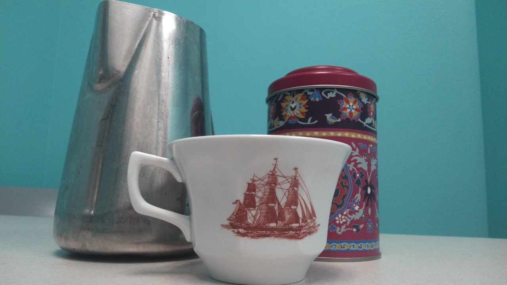

# iCORE Newsletter – 2022/12/05

The iCORE newsletter highlights events and information related to the [innovation in COmputing REsearch (iCORE) lab](https://icore.tamucc.edu/), 
as well as the broader GSCS/CS programs at Texas A&M University - Corpus Christi and whatever else might interest that community. 
If you have any news or resources you would like to share, send an email to [Evan Krell](https://scholar.google.com/citations?user=jLuwYGAAAAAJ&hl=en) (ekrell@islander.tamucc.edu). 

[See past newsletters.](https://github.com/ekrell/icore_website/tree/main/news)

## News

**Carly Stanton's successful thesis proposal defense**

Last week (Dec. 1), Carly successfully defended her computer science master's thesis proposal. I should have announced the defense in the previous email, but I do not get master's student announcements in my inbox. Give Carly your congratulations!

_I will add the abstract here when I get it_

**Abhishek Phadke's successful dissertation proposal defense**

Last week (Nov. 30), Abhishek successfully defended his dissertation proposal. See the last iCORE newsletter for the abstract. Congratulations to Abhishek! 

**Recent publications**

- Hamid Kamangir (iCORE alumni, AI2ES member): [Evaluation and calibration of low‐cost off‐the‐shelf particulate matter sensors using machine learning techniques](https://www.researchgate.net/publication/365125498_Evaluation_and_calibration_of_low-cost_off-the-shelf_particulate_matter_sensors_using_machine_learning_techniques)
- Marina Vicens Miquel (GCSC student, AI2ES member): [A Deep Learning Based Method to Delineate the Wet/Dry Shoreline and Compute Its Elevation Using High-Resolution UAS Imagery](https://www.researchgate.net/publication/365808076_A_Deep_Learning_Based_Method_to_Delineate_the_WetDry_Shoreline_and_Compute_Its_Elevation_Using_High-Resolution_UAS_Imagery)

## Interest

If you have spent much time at iCORE lately, you have likely been offered tea in a Wedgewood teacup as shown. This set is on loan from the personal collection of Evan Krell. The sailing vessel featured on the cups is a famous clipper ship named _Flying Cloud_ and it has an interesting history. 

During the California Gold Rush, there was a need for transport of goods from the east to west coast. Traveling by land was extremely slow, given the long and arduous journey across the western US. The other option was by sea, navigating from New York to San Francisco through the perilous waters around Cape Horn. Any ship that could reliably offer a fast passage was in high demand. Designed to maximize speed, clipper ships were relied on extensively for merchant transport to the California goldfields as well as the tea trade with China. Shipbuilders and captains competed with each other to set record speeds from New York to San Francisco. A fast passage brought a good reputation and demanded higher pay. But also, the races between these merchant vessels was of great interest to New York high society who bet enormous sums on ships and their captains. 

The _Flying Cloud_ was built in Massachusetts by Donald McKay and launched in 1851. The ship was led by a husband and wife team: Josiah Perkins Creesy as the captain and Eleanor Creesy as navigator. Women navigators were extremely rare. She had studied navigation since she was a little girl, and her skill is widely considered to be key in the _Flying Cloud_'s success. They managed to achieve a world record passage between New York and San Francisco: 89 days and 8 hours. The record was maintained for over 130 years! Of course, significant technological improvements had taken place that enabled later ships to reduce the time considerably. 

Next time you are offered tea at iCORE, you have a little background on the ship featured on your cup. If you want to learn more, David W. Shaw has a very good book on the vessel's historic record-setting passage: [Flying Cloud: The True Story of America's Most Famous Clipper Ship and the Woman who Guided Her](https://www.historicnavalfiction.com/other-genres/other-non-fiction/flying-cloud).

## Get involved

As always, we encourage all iCORE members and iCORE-adjacent persons to get involved and propose workshop/lecture/training ideas that they would like to present.

## iCORE resources

- website: http://icore.tamucc.edu/
- twitter: https://twitter.com/ICORE_TAMUCC
- youtube: https://www.youtube.com/channel/UCvsK07PvushTI2BA2BhN-DQ
- google calendar: https://calendar.google.com/calendar/u/0?cid=Y2JlNDZodnIwZXV0NmZzN2h1bWs2NnB2dnNAZ3JvdXAuY2FsZW5kYXIuZ29vZ2xlLmNvbQ

### How to sync the iCORE Google calendar with Outlook

- Instructions on how to do so: https://support.microsoft.com/en-us/office/see-your-google-calendar-in-outlook-c1dab514-0ad4-4811-824a-7d02c5e77126
- The Google calendar's address in iCal format, needed in the above steps: https://calendar.google.com/calendar/ical/cbe46hvr0eut6fs7humk66pvvs%40group.calendar.google.com/public/basic.ics
