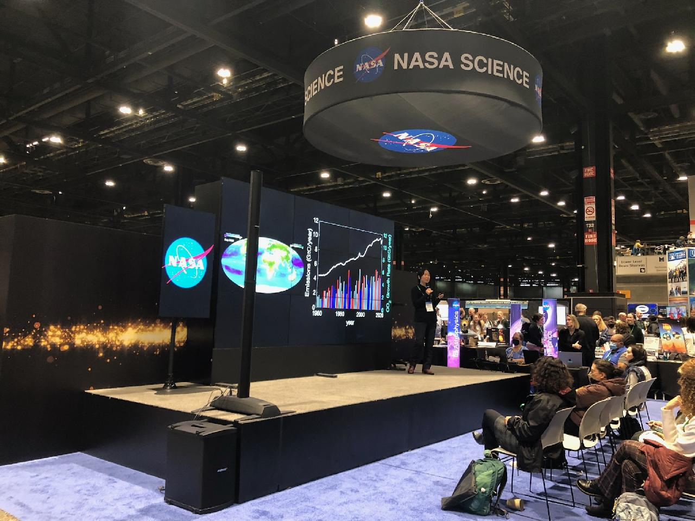
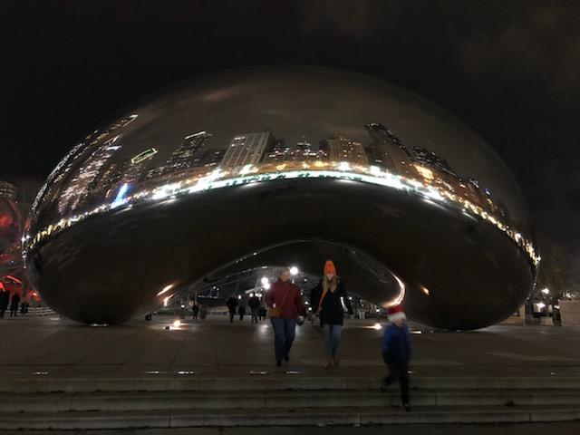
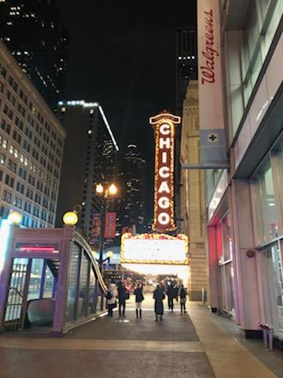
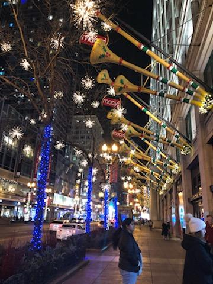
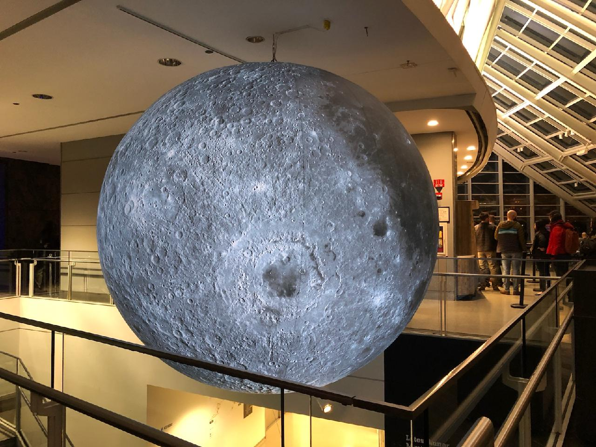

# iCORE Newsletter – 2022/01/24

The iCORE newsletter highlights events and information related to the [innovation in COmputing REsearch (iCORE) lab](https://icore.tamucc.edu/),
as well as the broader GSCS/CS programs at Texas A&M University - Corpus Christi and whatever else might interest that community.
If you have any news or resources you would like to share, send an email to [Evan Krell](https://scholar.google.com/citations?user=jLuwYGAAAAAJ&hl=en) (ekrell@islander.tamucc.edu).

[See past newsletters.](https://github.com/ekrell/icore_website/tree/main/news)

## Happy New Year!

- Last week, Evan Krell and iCORE alumni Laha Ale attempted to persuade Dr. King to give us red envelopes. Everyone was **shocked** when no such envelopes were handed out.
- This week, Wen Zhong is working on her qualifying exams! **Fighting!!**

## Winter Break Conferences

iCORE members were busy over the break, presenting at conferences.

**[AGU Fall Meeting 2022 (Chicago, IL. December 12-16, 2022)](https://www.agu.org/Fall-Meeting)**

Wen Zhong and several members of the [MANTIS lab](https://mantisresearch.org/) attended and presented research at AGU in December. Wen presented a poster and took some pictures for the newsletter.

**[American Meteorological Society Meeting 2023 (Denver, CO. January 8-12)](https://annual.ametsoc.org/index.cfm/2023/)**

TAMUCC sent a very large number of attendees and presenters to this year's AMS. Over 15 undergraduate and graduate students gave poster or oral presentations. The group was representing AI2ES, presenting research related to artificial intelligence for coastal applications. Raven Reese, a member of CBI and AI2ES, is about to launch a CBI-AI2ES newsletter that will cover AMS in great detail, and I don't want to repeat the content. I'll link to the CBI-AI2ES newsletter in the next iCORE newsletter.

Among the attendees were iCORE's very own Dr. King and Evan Krell. Evan went a few days early with Dr. Tissot to establish connections with [CIRA](https://www.cira.colostate.edu/). Specifically, Evan's goal was to get feedback from Dr. Imme Ebert-Uphoff regarding his dissertation work, and see if there might be potential for spending some time at CIRA working on it with Dr. Imme and others at CIRA. Evan was surprised that his name and research was known to many there, and he is excited to report that he expects to spend a couple months in [late spring](https://en.wikipedia.org/wiki/Late_Spring), [early summer](https://en.wikipedia.org/wiki/Early_Summer) in Fort Collins, Colorado.

Photo galleries:
- [Jan. 5 - CIRA and Horsetooth Reservoir](https://photos.app.goo.gl/FLXe1hRGpSXqPAXC7)
- [Jan. 6 - Cherry Creek Trail](https://photos.app.goo.gl/FER7CVj7Zs3rxNVR9)
- [Jan. 6 - Denver Botanic Garden](https://photos.app.goo.gl/ZixyFpLxjHhBLKj29)
- [Jan. 8 - Red Rocks Park & Ampitheater](https://photos.app.goo.gl/sjeni7Q1K3BjcQUKA)

Presentations and networking aside, Evan Krell had a mission in Denver: send a postcard to a certain someone back in Corpus.
After purchasing a generic mountain landscape scene at the closest tacky souvenir shop, he realized something important.
Having never written a postcard before, what exactly was he supposed to write?
After all, he was here for a conference and the most exciting thing so far had been the jellyfish salad.
(Not bad, but he prefers chicken feet. So far, two Chinese students have mentioned cooking chicken feet for Evan and he is still waiting...)
Things took a turn after an ill-fated attempt at ice skating.
During the ambulance ride to the emergency room, Evan realized that he had material for the postcard.
That night, with a blood-stained sweater submerged in a sink of cold water, he wrote the postcard.
But the morning revealed another incident: the ink used smeared at the slightest touch.
Evan took to the streets of Denver by means of electric scooter to purchase yet another postcard.
Two in fact, in case of another disaster.
By writing each stroke three or four times, the mechanical pencil's output was dark enough to be legible and the postcard was finally ready to be sent.
Evan was surprised when informed at the post office nearest to the conference that they were out of stamps.
He walked roughly half an hour to a further post office whose parking lot was quite active with the sale of weed products.
Finally, Evan purchased a stamp, applied it to the postcard, and dropped it off in the box. Self-service, just the way he likes it.
Almost two weeks later, and the postcard's recipient reports that the card has not arrived.
Evan is never sending a postcard again.

## Upcoming Events

**Discussion on Machine Learning Architectures: February 3. 2:00-4:00 pm**

In collaboration with the CBI - AI2ES team, iCORE is hosting a discussion on machine learning architectures.
Several of the undergrad and graduate students are presenting pros and cons of various architectures.
The CBI - AI2ES team is focused on modeling for coastal applications such as fog forecasting, identifying the wet-dry shoreline from images, predicting water level, etc. There is a need to identify promising architectures to focus on for these environmental science tasks, but the discussion should have broad application to ML practitioners. We encourage iCORE members to attend and contribute to the discussion. If you want to contribute a few slides on some selected ML architecture or a comparison of architectures for specific tasks, contact Evan Krell and Dr. Tissot.

**Egyptian Brunch: Date TBD**

There has been some talk about iCORE hosting an Egyptian brunch. Mahmoud Eldefrawy would be in charge of this event, working with the many Egyptian students in NRC and perhaps elsewhere. Unfortunately, Dr. King forbids food in the conference room, so we are working on the when and where of this event.

## Next iCORE Meeting

**We are currently setting up our bi-weekly meetings schedule. Stay tuned!**

## Get involved

As always, we encourage all iCORE members and iCORE-adjacent persons to get involved and propose workshop/lecture/training ideas that they would like to present.

## iCORE resources

- website: http://icore.tamucc.edu/
- twitter: https://twitter.com/ICORE_TAMUCC
- youtube: https://www.youtube.com/channel/UCvsK07PvushTI2BA2BhN-DQ
- google calendar: https://calendar.google.com/calendar/u/0?cid=Y2JlNDZodnIwZXV0NmZzN2h1bWs2NnB2dnNAZ3JvdXAuY2FsZW5kYXIuZ29vZ2xlLmNvbQ

### How to sync the iCORE Google calendar with Outlook

- Instructions on how to do so: https://support.microsoft.com/en-us/office/see-your-google-calendar-in-outlook-c1dab514-0ad4-4811-824a-7d02c5e77126
- The Google calendar's address in iCal format, needed in the above steps: https://calendar.google.com/calendar/ical/cbe46hvr0eut6fs7humk66pvvs%40group.calendar.google.com/public/basic.ics
