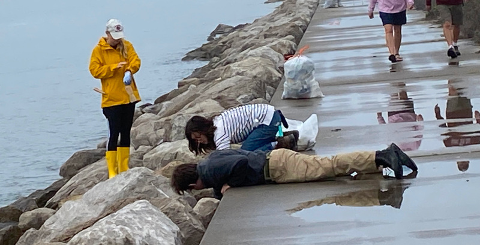
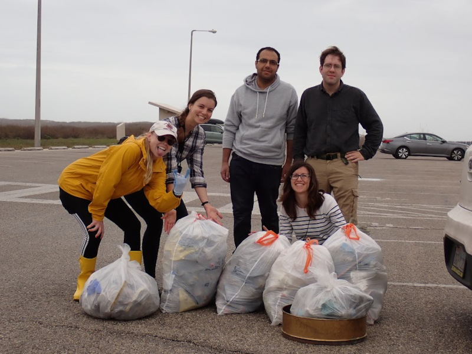

# iCORE Newsletter – 2023/01/24

The iCORE newsletter highlights events and information related to the [innovation in COmputing REsearch (iCORE) lab](https://icore.tamucc.edu/),
as well as the broader GSCS/CS programs at Texas A&M University - Corpus Christi and whatever else might interest that community.
If you have any news or resources you would like to share, send an email to [Evan Krell](https://scholar.google.com/citations?user=jLuwYGAAAAAJ&hl=en) (ekrell@islander.tamucc.edu).

[See past newsletters.](https://github.com/ekrell/icore_website/tree/main/news)

## Upcoming events

### Next iCORE Meeting: Feb. 3, 2:00-4:00pm

- This meeting will contain a presentation & discussion of AI architectures.
- Several of the [AI2ES](https://www.ai2es.org/) students (mostly undergrads) have slides prepared for a comparison of architectures.
- The motivation is that they would like to settle on a small number of architectures to focus on for their coastal modeling applications.
- Among their questions is whether or not they should shift focus heavily toward [transformers](https://en.wikipedia.org/wiki/Transformer_(machine_learning_model)).
- They are very interested in feedback from the computer science community, so iCORE is hosting their presention.

### Abhishek Phadke's SCOTT Talk

- Abhishek Phadke is giving a SCOTT talk
- **Topic:** "Beyond Cryptocurrency: Exploring the Diverse Applications of Blockchain Technology" 
- **When:** February 10th, 2023 
- **Location:** CBI conference room
- **Online link:** Generated at a later date (see next week's newsletter)

## Recent happenings

### AI2ES newsletter

[Link to first issue](https://www.ai2es.org/wp-content/uploads/2023/01/AI2ES-Newsletter-January-2023.pdf)

- The [NSF AI Institute for Research on Trustworthy AI in Weather, Climate, and Coastal Oceanography (AI2ES)](https://www.ai2es.org/) has launchd its own newsletter
- The newsletter is edited by Conrad Blucher Institute's [Raven Reese](https://www.linkedin.com/in/raven-reese-9b03751aa/)
- Inspiration came, no doubt, from the illustrious iCORE newsletter... 
- Many iCORE members are involved with AI2ES including Dr. Scott King, Miranda White, Hamid Kamangir, Evan Krell, et al. 
- TAMUCC's involvement with AI2ES is really through Conrad Blucher Institute with which iCORE is highly involved
- Evan Krell is, for better or worse, the student spotlight. Read for his Denver ice skating incident.
- Why is Evan wearing two shirts, a poncho, and squinting in the photo?

### Helping out with MSGSO's beach clean-up

- iCORE members Evan Krell and Mahmoud Eldefrawy helped out with a beach clean-up hosted by the [Marine Science Graduate Student Organization (MSGSO)](https://tamucc.campuslabs.com/engage/organization/msgso).
- We cleaned along the Packery Channel jetties for quite some time before reaching the beach
- MSGSO hosts a variety of events and are very much open to students outside of marine science
- Of interest: if you take a bag full of trash collected from the beach, you are entitled to a free coffee from [Island Joes](http://www.islandjoescc.com/)
- We were lucky that the barista did not realize that it is only supposed to be the cheaper drip coffee
- We were interested to learn about how some of the MSGSO members are beginning to incorporate machine learning into their work
- We've added them to the newsletter since part of iCORE's mission is to build connections with other labs that are using computer science in some capacity
- It goes without saying that Evan talked too long about XAI using the horse and wolf examples during the coffee break
- [Photo gallery](https://photos.app.goo.gl/As1LdjyZhgzWLzYv5)

## Also...

She finally received the postcard (^^)b

## Get involved

As always, we encourage all iCORE members and iCORE-adjacent persons to get involved and propose workshop/lecture/training ideas that they would like to present.

## iCORE resources

- website: http://icore.tamucc.edu/
- twitter: https://twitter.com/ICORE_TAMUCC
- youtube: https://www.youtube.com/channel/UCvsK07PvushTI2BA2BhN-DQ
- google calendar: https://calendar.google.com/calendar/u/0?cid=Y2JlNDZodnIwZXV0NmZzN2h1bWs2NnB2dnNAZ3JvdXAuY2FsZW5kYXIuZ29vZ2xlLmNvbQ

### How to sync the iCORE Google calendar with Outlook

- Instructions on how to do so: https://support.microsoft.com/en-us/office/see-your-google-calendar-in-outlook-c1dab514-0ad4-4811-824a-7d02c5e77126
- The Google calendar's address in iCal format, needed in the above steps: https://calendar.google.com/calendar/ical/cbe46hvr0eut6fs7humk66pvvs%40group.calendar.google.com/public/basic.ics
