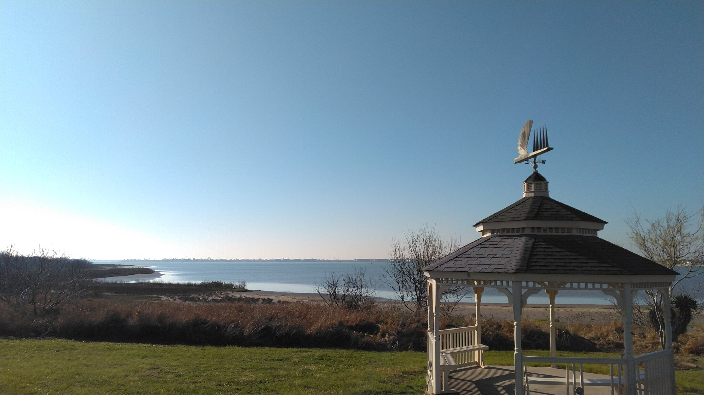
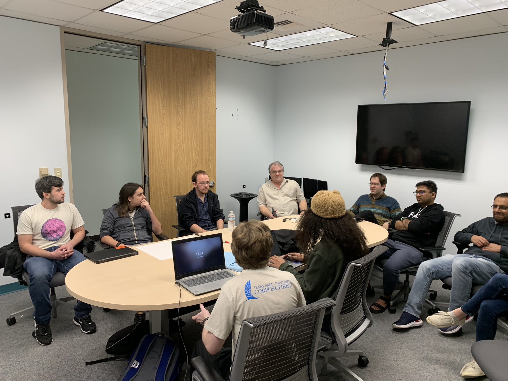
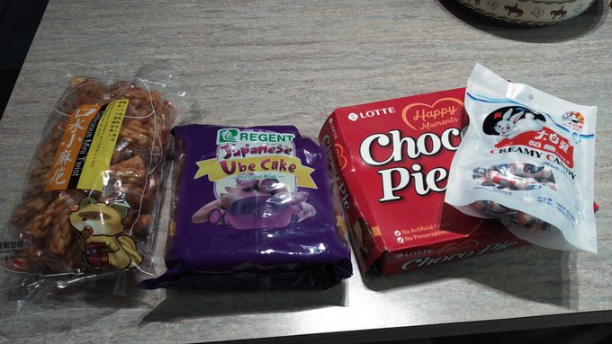
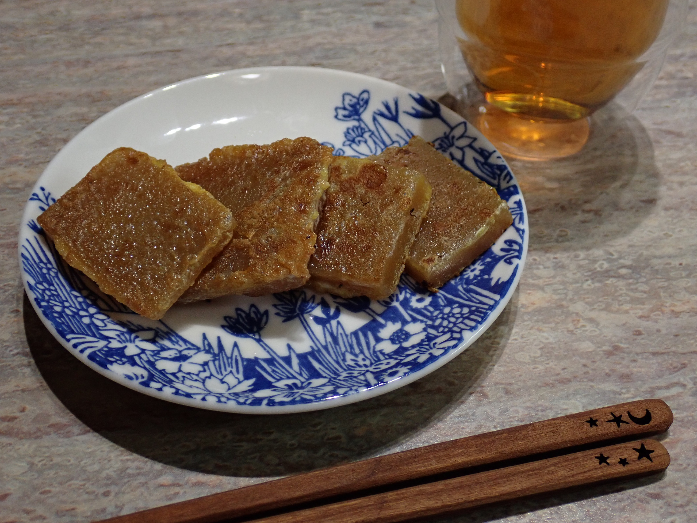

# iCORE Newsletter – 2023/02/07

The iCORE newsletter highlights events and information related to the [innovation in COmputing REsearch (iCORE) lab](https://icore.tamucc.edu/),
as well as the broader GSCS/CS programs at Texas A&M University - Corpus Christi and whatever else might interest that community.
If you have any news or resources you would like to share, send an email to [Evan Krell](https://scholar.google.com/citations?user=jLuwYGAAAAAJ&hl=en) (ekrell@islander.tamucc.edu).

[See past newsletters.](https://github.com/ekrell/icore_website/tree/main/news)

## Welcome

A beautiful view of Oso Bay from the TAMUCC hike and bike trail. Such calm waters would have made for an ideal kayaking day, but alas some of us were busy with a table at Island Days and working on our proposal. 

## Previous iCORE Meeting

- We had our first official iCORE meeting of the semester last Friday (02/03).
- There were 12 attendees from a variety of fields: computer science, life science, physics, ...
- The scheduled AI2ES-led discussion of machine learning architectures was put on hold, but we filled the entire 2 hours with discussion and talks from Evan Krell and Miranda White

## Next iCORE Meeting: Feb. 17, 2:00-4:00pm

- See next week's newsletter for details

## Upcoming Events

### AI2ES & Coastal Dynamics Lab presenting about ML architectures

- **Where:** iCORE (NRC 2100 Suite)
- **When:** Friday, Feb. 10, 2023, 2:00-4:00pm
- This meeting will contain a presentation & discussion of AI architectures.
- Several of the [AI2ES](https://www.ai2es.org/) students (mostly undergrads) within the [Coastal Dynamics Lab](https://www.coastaldynamicslab.org/) have slides prepared for a comparison of architectures.
- The motivation is that they would like to settle on a small number of architectures to focus on for their coastal modeling applications.
- Among their questions is whether or not they should shift focus heavily toward [transformers](https://en.wikipedia.org/wiki/Transformer_(machine_learning_model)).
- They are very interested in feedback from the computer science community, so iCORE is hosting their presention.

### Abhishek Phadke is presenting for the Short Curious Open Tech Talks (SCOTT) Series

- **Topic:** "Beyond Cryptocurrency: Exploring the Diverse Applications of Blockchain Technology" 
- **When:** February 10th, 2023, 12:00-1:00 pm
- **Location:** CBI conference room (1232 NRC)
- **Online link:** [Click to join the meeting](https://nam12.safelinks.protection.outlook.com/ap/t-59584e83/?url=https%3A%2F%2Fteams.microsoft.com%2Fl%2Fmeetup-join%2F19%253ameeting_MGI3MjMzOTktMzlmZi00Y2Q1LTg2NDEtNTA4NDllZDBiN2Qx%2540thread.v2%2F0%3Fcontext%3D%257b%2522Tid%2522%253a%252234cbfaf1-67a6-4781-a9ca-514eb2550b66%2522%252c%2522Oid%2522%253a%2522e0286e66-5e19-4aef-bc0c-534aea05ce60%2522%257d&data=05%7C01%7Cekrell%40islander.tamucc.edu%7C3e6baafd2baf4910367008db08492d32%7C34cbfaf167a64781a9ca514eb2550b66%7C0%7C0%7C638112882665488032%7CUnknown%7CTWFpbGZsb3d8eyJWIjoiMC4wLjAwMDAiLCJQIjoiV2luMzIiLCJBTiI6Ik1haWwiLCJXVCI6Mn0%3D%7C3000%7C%7C%7C&sdata=VGJTvBfs%2F3OomBAzTdL4lM6HrVyqMLvk9eGCf8N334Y%3D&reserved=0)
- **Synopsis:** Blockchain has gained popularity because of its most well-known application: Cryptocurrency. However, this revolutionary technology has the potential to impact a multitude of industries and areas. In this presentation, I will give a short introduction to the less explored but equally impactful applications of blockchain, such as health data management and taxation.

### 2023 Symposium for Student Innovation, Research, and Creative Activities

**Abstracts are due Friday, February 17, 2023**

The [2023 Symposium for Student Innovation, Research, and Creative Activities (SSIRCA)](https://www.tamucc.edu/research/student-symposium/index.php) will be held on Friday, April 21, 2023, at the TAMU-CC University Center. The symposium is open for undergraduate and grad students and will include the following activities:

- Poster presentation
- Exhibition/Gallery display
- Oral presentation
- Video
- Live performance or reading
- Panel discussion
- Workshop

Last year, iCORE members Evan Krell and Mahmoud Eldefrawy participated in the symposium and it was a very good experience. 
We recommend that students participate. Below is a brief summary of the Symposium story:

1. iCORE had just recently begun to occupy NRC 2100
2. Outside the suite, two empty bulletin boards gave the place a gloomy atmosphere
3. [2022 Spring Student Research Symposium](https://www.tamucc.edu/research/student-symposium/2022.php) participants were given a free poster print at the iCREATE lab 
4. Despite warnings that CS students should avoid mixed poster sessions, we took advantage of the opportunity for a free poster print
5. Mahmoud and Evan both entered. Their free prints can still be seen on the wall outside iCORE
6. They both won prizes. They were fortunate that the symposium was set up such that you were judged by people in your field
7. Evan bought an underwater camera with the prize money that he made extensive use of in California last summer
8. He had to brave the cold Arctic-fed waters of Monterey Bay without a wet suite to photograph many an aquatic critter
9. Winners were invited to present at the [2022 SACNAS National Diversity in STEM Conference in San Juan, Puerto Rico](https://www.sacnas.org/2022-sacnas-ndistem-agenda-at-a-glance)
10. Evan leapt CONUS for the first time, and enjoyed exploring San Juan with other TAMUCC attendees
11. Last Monday, he was very kindly gifted with several slices of 年糕

It might not be obvious how #11 follows from the rest of the plot, but, in short, it was very much worth entering the Research Symposium.

## Get involved

As always, we encourage all iCORE members and iCORE-adjacent persons to get involved and propose workshop/lecture/training ideas that they would like to present.

## iCORE resources

- website: http://icore.tamucc.edu/
- twitter: https://twitter.com/ICORE_TAMUCC
- youtube: https://www.youtube.com/channel/UCvsK07PvushTI2BA2BhN-DQ
- google calendar: https://calendar.google.com/calendar/u/0?cid=Y2JlNDZodnIwZXV0NmZzN2h1bWs2NnB2dnNAZ3JvdXAuY2FsZW5kYXIuZ29vZ2xlLmNvbQ
- discord: https://discord.gg/NUd8QgQb
