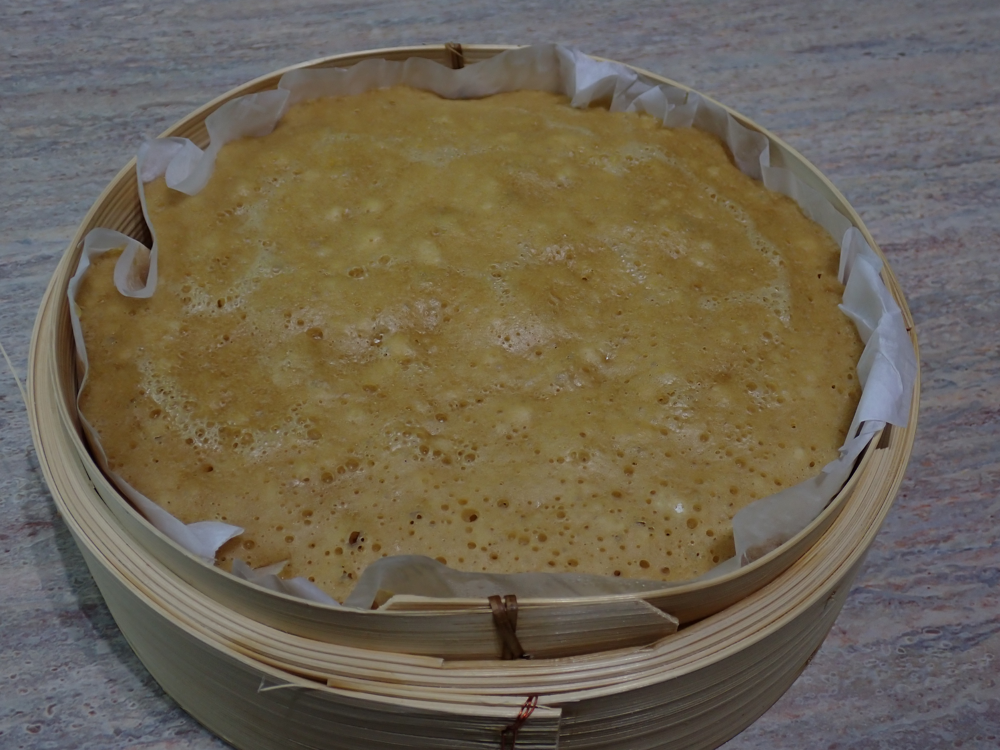
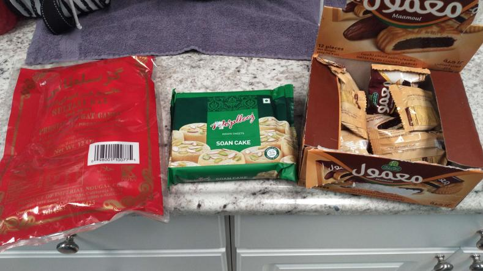
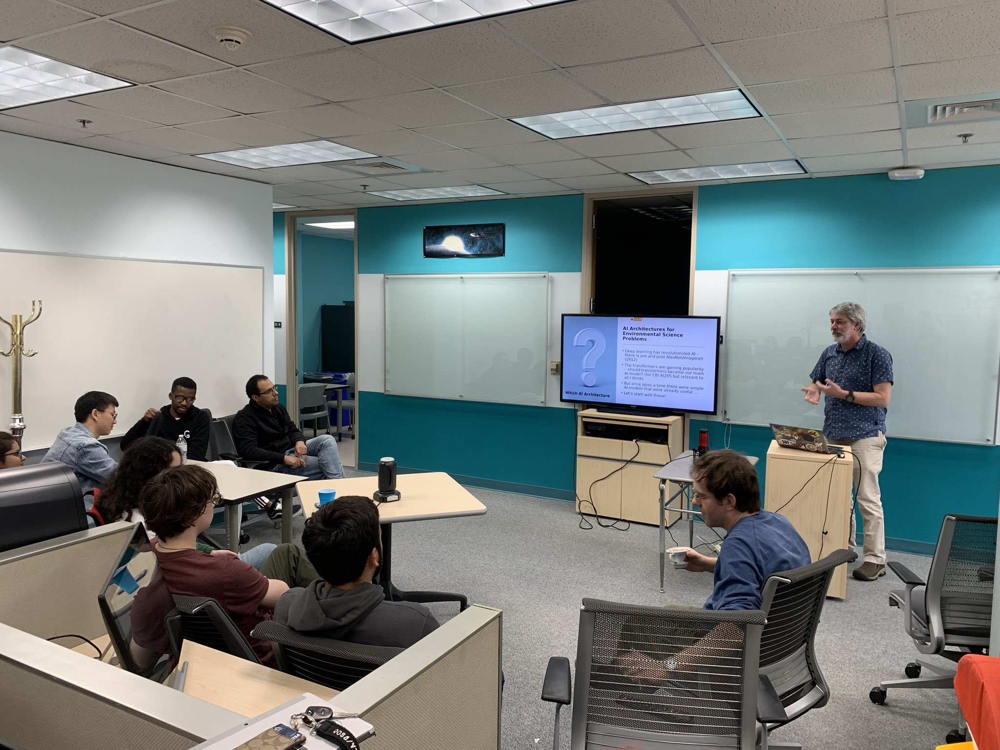

# iCORE Newsletter – 2023/02/13

The iCORE newsletter highlights events and information related to the [innovation in COmputing REsearch (iCORE) lab](https://icore.tamucc.edu/),
as well as the broader GSCS/CS programs at Texas A&M University - Corpus Christi and whatever else might interest that community.
If you have any news or resources you would like to share, send an email to [Evan Krell](https://scholar.google.com/citations?user=jLuwYGAAAAAJ&hl=en) (ekrell@islander.tamucc.edu).

[See past newsletters.](https://github.com/ekrell/icore_website/tree/main/news)

## Welcome

- Starting the week off right, Evan Krell brought in his home-made Ma Lai Go (马拉糕)
- Based on [this recipe](https://www.google.com/url?sa=t&rct=j&q=&esrc=s&source=web&cd=&cad=rja&uact=8&ved=2ahUKEwiCxvjUt5P9AhX8m2oFHSz_CqwQFnoECAwQAQ&url=https%3A%2F%2Fthewoksoflife.com%2Fma-lai-go-chinese-steamed-cake%2F&usg=AOvVaw2QVep5hnj3Ee_zOk12dohW), with two changes based on experience:
  - Reduced the steam time from 30 minutes to 25
  - Reduced stir time from 5 minutes to 4
  

- Last week, we enjoyed several snacks brought my Mahmoud Eldefrawy
- From left to right: Persian, Indian, Egyptian

- Also I forgot to take a photo, but last week we had homemade brownies from Abhishek!

## Next iCORE Meeting: Feb. 17, 2:00-4:00pm

- No major event, since we had one last week. Instead, we'll focus on updates with a couple small discussions from iCORE members on their recent work
- Abhishek will spend a few minutes to describe some possible experiments that he is designing, and would like our feedback
- Evan Krell will share some ideas about his next research direction: XAI benchmarks that focus on evaluating XAI techniques given high-dimensional data with high correlation
  - Expands on work by [Mamalakis et al.](https://arxiv.org/abs/2103.10005)
- This is somewhat of an open mic, so feel free to bring any discussion topics with you or recent findings you want to share

## Recent Events

### AI2ES & Coastal Dynamics Lab presenting about ML architectures (Feb 10.)

- Last Friday, we had a great presentation from the AI2ES Coastal Team
- We learned about transformers and some of the potential benifits is has over RNNs and LSTMs
- There was a lot of discussion throughout from both in-person and online attendees
- One take-away is that the Coastal Team has decided to invest heavily in transformers for their time series prediction (i.e. water level prediction)
- But it is not clear that transformers are a panacea over other methods when dealing with imagery, spatial data, etc. 
- The choice of how to convert the input data into a sequence of discrete tokens is a concern
  - Hamid Kamangir showed how the choice of tokenizing the FogNet input raster has a dramatic influence on performance
  - Is the solution to combine transformers with convolutional layers?

## Upcoming Events

### MSGSO event: _Get Into Grad School Days_

- Hosted by the Marine Science Graduate Student Organization
- Events are for giving guidance to undergrads that are interested in grad school
- Topics include
  - Preparing a CV, cover letter
  - Finding the right lab 
  - Differentiating yourself among a pool of applicants
- The flyer suggests free pizza is involved

### 2023 Symposium for Student Innovation, Research, and Creative Activities

- **Abstracts are due Friday, February 17, 2023**
- The [2023 Symposium for Student Innovation, Research, and Creative Activities (SSIRCA)](https://www.tamucc.edu/research/student-symposium/index.php) will be held on Friday, April 21, 2023, at the TAMU-CC University Center. 
- See the [previous newsletter](https://github.com/ekrell/icore_website/blob/main/news/icore_news_20230207.md) for more information

