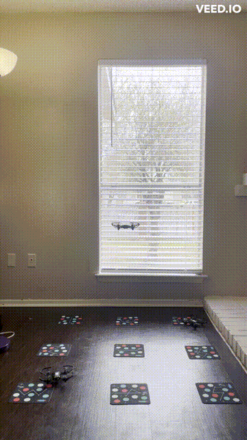

# iCORE Newsletter – 2023/02/21

The iCORE newsletter highlights events and information related to the [innovation in COmputing REsearch (iCORE) lab](https://icore.tamucc.edu/),
as well as the broader GSCS/CS programs at Texas A&M University - Corpus Christi and whatever else might interest that community.
If you have any news or resources you would like to share, send an email to [Evan Krell](https://scholar.google.com/citations?user=jLuwYGAAAAAJ&hl=en) (ekrell@islander.tamucc.edu).

[See past newsletters.](https://github.com/ekrell/icore_website/tree/main/news)

## Welcome

### Congrats to Wen Zhong: PhD Candidate

- Wen Zhong is a GSCS student working in the [Water & Environmental Systems Analysis Lab (WESA)](https://www.wesalab.com/home)
- Last Friday, she passed her qualifying exams and is now a PhD candidate
- Her desk is over at iCORE so stop by and congratulate her!
- But don't bring her anything too sweet! 

### Congrats to Marina Vicens-Miquel: presentation award at [AGU](https://www.agu.org/Fall-Meeting)

- Marina presented a poster: [Generalized model for wet/dry shoreline detection and total water level elevation using deep learning](https://agu.confex.com/agu/fm22/meetingapp.cgi/Paper/1092757)
- Where: AGU Fall Meeting took place in Chicago
- Award: Outstanding Student Presentation
- The feedback was exceptionally positive, with near-perfect or perfect scores from all judges
- Marina is a member of [AI2ES](https://www.ai2es.org/) and [CBI](https://www.conradblucherinstitute.org), who of course work closely with iCORE

## iCORE Meetings

**[iCORE Teams meeting link](https://teams.microsoft.com/l/meetup-join/19%3Ameeting_MDdlZDBiMTgtYzVjNS00YjhhLWE5OTctY2Y5YzMyYTljNzU5%40thread.v2/0?context=%7B%22Tid%22%3A%2234cbfaf1-67a6-4781-a9ca-514eb2550b66%22%2C%22Oid%22%3A%22994c008b-0707-4f3c-8ac0-73b65e733430%22%2C%22MessageId%22%3A%220%22%7D)**

### Last meeting: Feb. 17, 2:00-4:00pm

- Abhishek showed some progress he has made toward indoor experiments with multi-agent UAV teams
- He highlighted many issues that he has faced using the [Tello UAVs](https://www.ryzerobotics.com/tello) 
- In particular, their ability to navigate (using IR and a set of ground markers) is very sensitive to the lighting
  - Performs best with a mix of sunlight from the window and the indoor standing lamp on
  - We brainstormed ideas for how to improve the lighting conditions which might improve the swarm performance
- Below are some short recordings

**Scenario:** Distress condition where one agent of the swarm loses connection and has to land

**Scenario:** Designated recue craft in the middle homes in on the lost agent and initiates reconnection protocol

**Scenario:** The rescue agent can come back to its place where as the disconnected agent can resume swarm operations.

- We also discussed resources for getting started in machine learning
- **Highly recommend:** [CIRA Short Course on Machine Learning for Weather and Climate](https://docs.google.com/document/d/1SPNxZrbHMaIEaS2dbntDow9x_tgSuFTUTOugfa2NuRo/edit)
  - An intro-level ML course with lecture recordings, slides, and Python code notebooks (Google Colab)
  - Focused on weather & climate, but the ML concepts are broadly applicable
  - What we like: many ML intro courses focus on simple tabular models or canned examples, but here the focus is on complex scientific applications from the start. There are challenges in dealing with, for example, high-dimension data with spatial and temporal relationships that apply to a lot of ML tasks especially in science

### Next meeting: March 03, 2:00-4:00pm

**Event: Introduction to Machine Learning, Part One**

- Mahmoud Eldefraway will present a 2-part lecture and workshop on machine learning
- The material should be suitable for both undergrads as well as grads with an interest in ML
- The programming part should be very useful for students who come from non-CS backgrounds and are using ML in their research

## Upcoming Events

###  SACNAS Spring 2023 Schedule

- TAMUCC has a chapter of SACNAS: Society for the Advancement of Chicanos/Hispanics and Native Americans in Science
- It it welcome to anyone who supports their mission, and iCORE members have been involved with their events in the past
- They are very involved with the [Symposium for Student Innovation, Research, and Creative Activities]((https://www.tamucc.edu/research/student-symposium/index.php))
- Evan Krell & Mahmoud Eldefrawy attended last year's symposium which lead to [Evan presenting at the SACNAS NDISTEM Conference in Puerto Rico](https://github.com/ekrell/icore_website/blob/main/news/icore_news_20230207.md)
- They have recently shared their Spring 2023 event schedule, and we encourage you to attend anything that looks interesting

## Weekly Snack Report

- Mahmoud Eldefrawy brought some excellent Middle Eastern snacks from his recent trip to Houston 
- Mahmoud's take: very sweet, which is good
- Evan's take: very sweet, needs coffee
- Wen's take: too sweet
- Evan's dad's take: very sweet, which is good

## Get involved

As always, we encourage all iCORE members and iCORE-adjacent persons to get involved and propose workshop/lecture/training ideas that they would like to present.

## iCORE resources

- website: http://icore.tamucc.edu/
- twitter: https://twitter.com/ICORE_TAMUCC
- youtube: https://www.youtube.com/channel/UCvsK07PvushTI2BA2BhN-DQ
- google calendar: https://calendar.google.com/calendar/u/0?cid=Y2JlNDZodnIwZXV0NmZzN2h1bWs2NnB2dnNAZ3JvdXAuY2FsZW5kYXIuZ29vZ2xlLmNvbQ
- discord: https://discord.gg/NUd8QgQb
