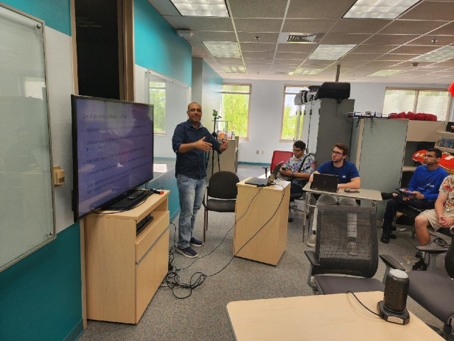
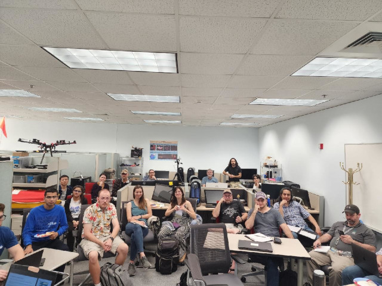

# iCORE Newsletter – 2023/03/07

The iCORE newsletter highlights events and information related to the [innovation in COmputing REsearch (iCORE) lab](https://icore.tamucc.edu/),
as well as the broader GSCS/CS programs at Texas A&M University - Corpus Christi and whatever else might interest that community.
If you have any news or resources you would like to share, send an email to [Evan Krell](https://scholar.google.com/citations?user=jLuwYGAAAAAJ&hl=en) (ekrell@islander.tamucc.edu).

[See past newsletters.](https://github.com/ekrell/icore_website/tree/main/news)

## iCORE Meetings

**[iCORE Teams meeting link](https://teams.microsoft.com/l/meetup-join/19%3Ameeting_MDdlZDBiMTgtYzVjNS00YjhhLWE5OTctY2Y5YzMyYTljNzU5%40thread.v2/0?context=%7B%22Tid%22%3A%2234cbfaf1-67a6-4781-a9ca-514eb2550b66%22%2C%22Oid%22%3A%22994c008b-0707-4f3c-8ac0-73b65e733430%22%2C%22MessageId%22%3A%220%22%7D)**

### Last meeting: March 03

- Mahmoud Eldefrawy presented Part 1 of his workship _A Gentle Introduction to Machine Learning_
- [See the last newsletter for the details of the workshop](https://github.com/ekrell/icore_website/blob/main/news/icore_news_20230227.md)
- We were very pleased to see it well-attended, both in-person and online

### Next meeting: March 17, 2:00-4:00pm

- **Reminder:** Since next meeting is during Spring Break, Part 2 of _A Gentle Introduction to Machine Learning_ is on March 31.
- At this meeting, we'll just give our usual progress updates and plan out the rest of the semester's events.

## Recent Events

### Evan Krell Presented at AI2ES Sitewide Meeting (March 01)

- Evan Krell give a 30-minute presentation at the AI2ES site-wide meeting
- Topic: _Synthetic Benchmarks to Study the Influence of Correlated Values on XAI for Geoscience_
- The slides and recording will show up soon on the [AI2ES Talks](https://www.ai2es.org/publications/ai2es-talks/) page
- The material is about the numerous challenges in applying XAI to high-dimensional geoscience raster datasets
- These challenges motivate Evan's work at his upcoming 2-month stay at [CIRA](https://www.cira.colostate.edu/)

## Upcoming Events & Opportunities

### Dr. Antonio Medrano's Seminar This Friday (March 10)

- **Speaker:** [Dr. Antonio Medrano](https://antoniomedrano.github.io)
- **Subject:** _Effects of Raster Terrain Representation on GIS Shortest Path_
- **Date:** Friday, March 10, 2023
- **Time:** 12:00 PM CST
- **Location:** UC Room 320 (Bayview)  

**Abstract**

Spatial analysis extracts meaning and insights from spatially referenced data, where the results are highly dependent on the quality of the data used and the manipulations on the data when preparing it for analysis. Users should understand the impacts that data representations may have on their results in order to prevent distortions in their outcomes. This talk examines the consequences of two common data preparations when locating a linear feature performing shortest path analysis on raster terrain data: 1) the connectivity of the network generated by connecting raster cells to their neighbors, and 2) the range of the attribute scale for assigning costs. Such analysis is commonly used to locate transmission lines, where the results could have major implications on project cost and its environmental impact. Experiments in solving biobjective shortest paths show that results are highly dependent on the parameters of the data representations, with exceedingly variable results based on the choices made in reclassifying attributes and generating networks from the raster. Based on these outcomes, I outline recommendations for ensuring geographic information system (GIS) data representations maintain analysis results that are accurate and unbiased.

**Biography**

Dr. Antonio Medrano is an assistant professor of geospatial engineering at Texas A&M University– Corpus Christi. He is a part of both the Department of Computing Sciences, and the Conrad Blucher Institute for Surveying & Science. He is the director of the Geospatial Optimization and Analytics Laboratory (GOAL), which focuses on research at the intersection of computing and location analysis.

**Note**

- Dr. Medrano's work here is very relevant to some of the research we have done at iCORE. 
- [Krell et al. published a paper about marine vehicle path planning](https://www.sciencedirect.com/science/article/abs/pii/S0141118722000748).
- We highlighted how _terrible_ the paths are using 4-way connectivity over 8- or 16-way. 
- When the robot's choices are `up, down, left, right`, the robot requires a lot more time and energy than if diagonal moves are allowed.

### 2023 Research Image Student Competition

- [Enter the 2023 Research Image Student Competition](https://www.tamucc.edu/research/ri-week/risc.php)
- Hosted by the Division of Research and Innovation (R&I)
- Participants share an image related to their research work along with a short description
- **Applications are due no later than 11:59 p.m. on Sunday, April 2nd, 2023**
- Last year, Evan Krell and Abhishek Phadke entered
- Tip: crowd pleasers include pretty sunsets with a description vaguely related to one's research

### Applications Open for SACNAS NDISTEM

The following is copy-pasted from the announcement sent out from our local SACNAS chapter:

The Society for Advancement of Chicanos/Hispanics and Native Americans in Science (SACNAS) is hosting the 2023 National Diversity in STEM (NDiSTEM) conference in **Portland, Oregon** from **October 26 – 28, 2023**. This is the largest multidisciplinary and multicultural STEM conference in the country, and it provides a unique opportunity to share your research, attend workshops, and connect with other STEM professionals from diverse backgrounds.
Applications for abstracts and travel scholarships are now open, and I highly encourage you to apply. This is an excellent opportunity to showcase your work, gain valuable insights into the STEM field, and connect with other students and professionals who share your passion for STEM.
To apply, visit [HERE](https://www.sacnas.org/conference/research-presentations) for the presentation application and [HERE](https://www.sacnas.org/conference/travel-scholarships) for the travel scholarship application. Please submit your abstract before the **deadline on March 31 at 5pm PT** for both applications. Our University has a history of sending students to this conference so even if you do not receive the travel scholarship you may still be able to go. However, to be considered for this you must have submitted a presentation and travel scholarship application.
If you have any questions or need help with the application process, please feel free to contact [Roy Roberts] or any officer of our SACNAS Student Chapter. We are here to support you and help you succeed in your academic and professional endeavors!

**Evan's note:** 

- I just want to mention that last year, I had extremely good help from the SACNAS Student Programs Coordinator Emily Pavlik. 
- IT (or someone) accidently terminated my `evan.krell@islander.tamucc` email address.
- Emily Pavlov noticed that emails related to my NDISTEM poster presentation were bouncing and personally called me to clear things up.
- Within minutes, she forwarded all the relevant messages to me. Otherwise, I would have no confirmation code or other important details.

## Get involved

As always, we encourage all iCORE members and iCORE-adjacent persons to get involved and propose workshop/lecture/training ideas that they would like to present.

## iCORE resources

- location: NRC 2100 Suite (https://goo.gl/maps/Htbp1YMASAmYqkFu9)
- website: http://icore.tamucc.edu/
- twitter: https://twitter.com/ICORE_TAMUCC
- youtube: https://www.youtube.com/channel/UCvsK07PvushTI2BA2BhN-DQ
- google calendar: https://calendar.google.com/calendar/u/0?cid=Y2JlNDZodnIwZXV0NmZzN2h1bWs2NnB2dnNAZ3JvdXAuY2FsZW5kYXIuZ29vZ2xlLmNvbQ
- discord: https://discord.gg/NUd8QgQb
