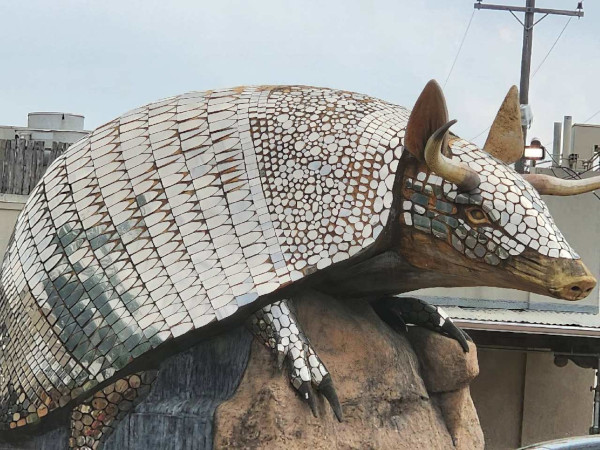

# iCORE Newsletter – 2023/03/28

The iCORE newsletter highlights events and information related to the [innovation in COmputing REsearch (iCORE) lab](https://icore.tamucc.edu/),
as well as the broader GSCS/CS programs at Texas A&M University - Corpus Christi and whatever else might interest that community.
If you have any news or resources you would like to share, send an email to [Evan Krell](https://scholar.google.com/citations?user=jLuwYGAAAAAJ&hl=en) (ekrell@islander.tamucc.edu).

[See past newsletters.](https://github.com/ekrell/icore_website/tree/main/news)

## Welcome

Spotted a rather large armadillo specimen in Houston.

## iCORE Meetings

**[iCORE Teams meeting link](https://teams.microsoft.com/l/meetup-join/19%3Ameeting_MDdlZDBiMTgtYzVjNS00YjhhLWE5OTctY2Y5YzMyYTljNzU5%40thread.v2/0?context=%7B%22Tid%22%3A%2234cbfaf1-67a6-4781-a9ca-514eb2550b66%22%2C%22Oid%22%3A%22994c008b-0707-4f3c-8ac0-73b65e733430%22%2C%22MessageId%22%3A%220%22%7D)**

### Next meeting: March 31, 2:00-4:00pm

- Mahmoud will present Part 2 of [_A Gentle Introduction to Machine Learning_](https://github.com/ekrell/icore_website/blob/main/news/icore_news_20230227.md)
- Part 2 will focus on code: how to use Python libraries to build and train models

### Future meeting: April 14, 2:00-4:00pm

- Meeting theme: _computer science in **your** domain_
- Seeking volunteers **outside CS** to share how they are using programming and CS in their research
- We are looking for short presentations (flexible on length)
- The goal is to share knowledge and find opportunities for collaboration 
  - CS students can learn how their knowledge can be applied to research in other fields
  - Non-CS can get potentially get feedback on techniques and tools they likely don't know about

| **Name**        | **Program** | **Description**                                                                                                              |
|-----------------|-------------|------------------------------------------------------------------------------------------------------------------------------|
| Florian Morvais | CMSS        | Using machine learning to predict phenomena such as lightning rate and clouds' maximum echo top heights from satellite data (CS applied to atmospheric science)|
| Josh Boyd         |    GSCS     | Swarm array imaging: a swarm of drones capture synchronous imagery over dynamics environments  (CS applied to robotics)                                                                                                                           |
|                 |             |                                                                                                                              |
|                 |             |                                                                                                                              |

- **Help us fill out this table: contact Evan Krell (ekrell@islander.tamucc.edu) if you want to present!**
- **Or share this newsletter with someone you know**

## Upcoming Events

### 24th Annual Earth Day - Bay Day 2023 (April 22)

- iCORE's [Mahmoud Eldefrawy](https://scholar.google.com/citations?user=mOgRZRMAAAAJ&hl=en) will be representing iCORE at this year's [Earth Day-Bay Day](https://www.baysfoundation.org/edbd/)
- **What:** a free family-friendly event for the community showcasing environmental conservation and other issues
- **When:** Saturday, April 22,  10 AM - 4 PM
- **Where:** [Heritage Park, Corpus Christi](https://www.google.com/maps/place/Heritage+Park/@27.8063399,-97.3979637,17z/data=!3m1!4b1!4m6!3m5!1s0x86685e62812bfb41:0xde92ae5040c7c2a4!8m2!3d27.8063352!4d-97.395775!16s%2Fg%2F1tftxc_j)
- Actually a fun event with many booths and exhibitors in science, industry, education, etc
- Last year, Evan Krell was there to represent iCORE and AI2ES
- They had a raptors show that was really cool, and lots of free swag
- This year, Mahmoud will be showcasing robots and artificial intelligence at TAMUCC's booth near the Lichtenstein House: go say hi to Mahmoud!

### Research Presentation from Dr. Carlos Rubio-Medrano (April 5)

- **What:** SACNAS is hosting a talk from [Dr. Carlos Rubio-Medrano](https://carlosrubiomedrano.com), assistant Professor in the Computer Science department
- **Where:** Michael and Karen O'Connor Building (OCNR) 258
- **When:** 3-4 PM Central
- **Online meeting**: [zoom link](https://tamucc.zoom.us/j/93668554553)
- His research involves cybersecurity and autonomous systems
- We don't have any description of what the talk is about, but should be something alone those lines
- GCSC student Efrén López Morales, who sometimes attends iCORE events, is one of his PhD students

### Apply for SACNAS NDISTEM by March 31!

- **Conference:** [SACNAS National Diversity in STEM Conference (NDISTEM)](https://www.sacnas.org/conference)
- **What:** A multi-discipline STEM conference
- **Where:** Portland, Oregon
- **When:** October 26 – 28
- **Funding:**
  - There may be opportunities to be funded through the local SACNAS Chapter, **but nothing guaranteed**
  - But to be eligible for funding through TAMUCC, last year you needed to have done the following:
    1. Apply for the [SACNAS Travel Scholarship](https://www.sacnas.org/conference/travel-scholarships), **if eligable**
    2. Apply to [present a poster or talk](https://www.sacnas.org/conference/research-presentations)
- We'll keep you posted on the details, but if you are interested at all, go ahead and apply for both presenting and travel funds 
- Send questions to **Roy Roberts** (`roy.roberts@tamucc.edu`), TAMUCC SACNAS Chapter President

Last year, iCORE member Evan Krell attended the NDISTEM conference in Puerto Rico and it was a very good experience. 

## Get involved

As always, we encourage all iCORE members and iCORE-adjacent persons to get involved and propose workshop/lecture/training ideas that they would like to present.

## iCORE resources

- location: NRC 2100 Suite (https://goo.gl/maps/Htbp1YMASAmYqkFu9)
- website: http://icore.tamucc.edu/
- twitter: https://twitter.com/ICORE_TAMUCC
- youtube: https://www.youtube.com/channel/UCvsK07PvushTI2BA2BhN-DQ
- google calendar: https://calendar.google.com/calendar/u/0?cid=Y2JlNDZodnIwZXV0NmZzN2h1bWs2NnB2dnNAZ3JvdXAuY2FsZW5kYXIuZ29vZ2xlLmNvbQ
- discord: https://discord.gg/3eeMN229cr
