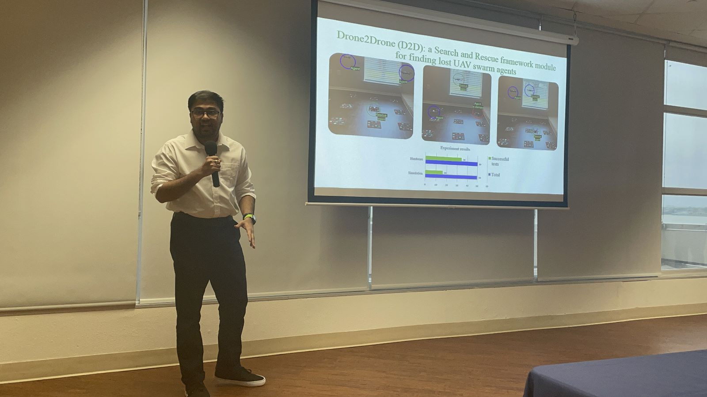
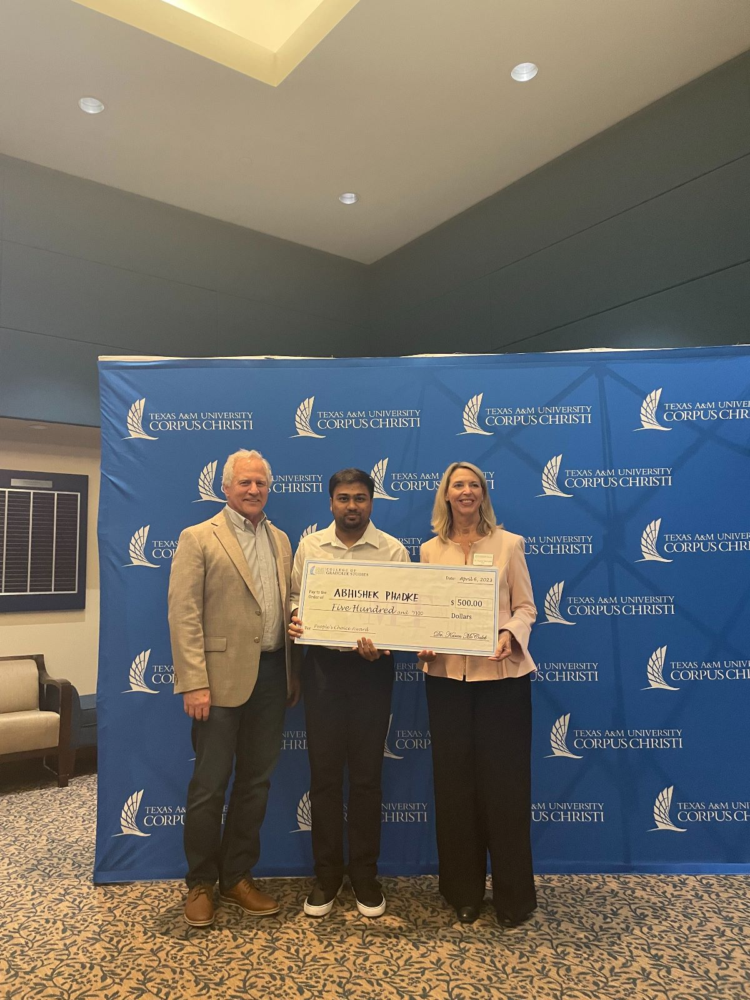

# iCORE Newsletter – 2023/04/11

The iCORE newsletter highlights events and information related to the [innovation in COmputing REsearch (iCORE) lab](https://icore.tamucc.edu/),
as well as the broader GSCS/CS programs at Texas A&M University - Corpus Christi and whatever else might interest that community.
If you have any news or resources you would like to share, send an email to [Evan Krell](https://scholar.google.com/citations?user=jLuwYGAAAAAJ&hl=en) (ekrell@islander.tamucc.edu).

[See past newsletters.](https://github.com/ekrell/icore_website/tree/main/news)

## Welcome

__photo of corpus__

## Recent Happenings

### Abhishek Phadke wins 3rd place in Three Minute Thesis (3MT) competition

- [3MT](https://threeminutethesis.uq.edu.au/) is a challenge to present your research to a broad audience in under 3 minutes.
- This competition was developed by The University of Queensland (UQ) to facilitate researcher's communication skills.
- The TAMUCC 3MT competition is organized by [G.R.O.W.](https://www.tamucc.edu/grad-college/grow/index.php), and took place last Thursday (3/6).

### Next meeting: April 14, 2:00-4:00pm

**Schedule**

| **Time**    | **Subject** | **Description** |
| ----------- | ----------- | --------------- |
| 2:00 - 2:30 | Updates | iCORE members share 1-minute updates. Then, a general discussion time before the event. |
| 2:30 - 4:00 | Event   | Computer Science + Domain Expertise (see below). | 

**Event: computer science + domain expertise**

- Build collaborations: connect CS & non-CS students to solve problems using AI, HPC, and other technologies.
- This event is a sequence of short presentations about using computer technologies to solve domain problems.
- **Seeking non-CS volunteers** to show how they are using or planning to use computer science in their research.
  - CS students can learn about opportunities to apply their knowledge.
  - Non-CS students can get feedback and ideas from a CS perspective.
- Volunteers should prepare 8-15 minute talks in the form of slides, posters, videos, etc.

| **Name**        | **Program** | **Domain** | **Description**                                                                                                              |
|-----------------|-------------|------------|------------------------------------------------------------------------------------------------------------------|
| Florian Morvais | CMSS | Atmospheric science        | Using machine learning to predict phenomena such as lightning rate and clouds' maximum echo top heights from satellite data.  |
| Josh Boyd       | GSCS | Robotics & surveying       | Swarm array imaging: a swarm of drones capture synchronous imagery over dynamics environments.                                |
|       |       |     |                                                                                                                                                         |
| Evan Krell      | GSCS | Atmospheric science        | Using machine learning to detect wildfire-driven thunderstorms (pyroCbs) from satellite imagery and atmospheric model data.   |

- **Help us fill out this table: contact Evan Krell (ekrell@islander.tamucc.edu) if you want to present!**
- **Or share this newsletter with someone you know**

## Tech Tips

## Weekly Snack Report

__photo of snacks from Houston shared at iCORE__

## Get involved

As always, we encourage all iCORE members and iCORE-adjacent persons to get involved and propose workshop/lecture/training ideas that they would like to present.

## iCORE resources

- location: NRC 2100 Suite (https://goo.gl/maps/Htbp1YMASAmYqkFu9)
- website: http://icore.tamucc.edu/
- twitter: https://twitter.com/ICORE_TAMUCC
- youtube: https://www.youtube.com/channel/UCvsK07PvushTI2BA2BhN-DQ
- google calendar: https://calendar.google.com/calendar/u/0?cid=Y2JlNDZodnIwZXV0NmZzN2h1bWs2NnB2dnNAZ3JvdXAuY2FsZW5kYXIuZ29vZ2xlLmNvbQ
- discord: https://discord.gg/3eeMN229cr

