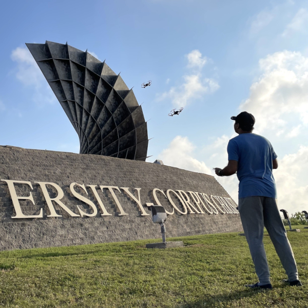
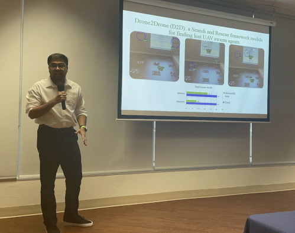
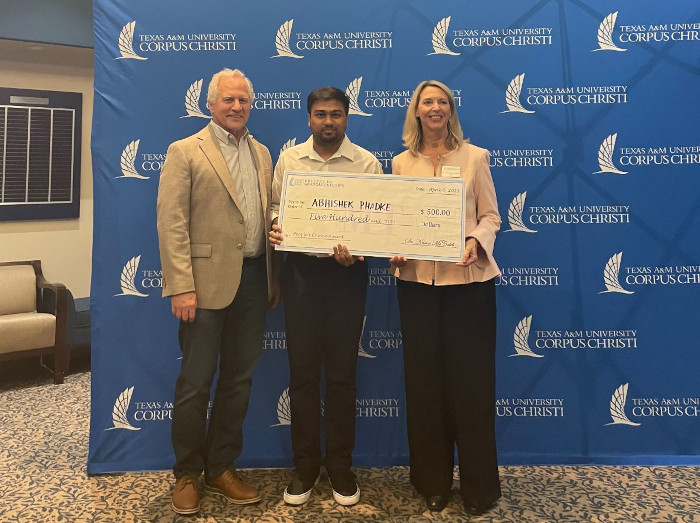

# iCORE Newsletter – 2023/04/11

The iCORE newsletter highlights events and information related to the [innovation in COmputing REsearch (iCORE) lab](https://icore.tamucc.edu/),
as well as the broader GSCS/CS programs at Texas A&M University - Corpus Christi and whatever else might interest that community.
If you have any news or resources you would like to share, send an email to [Evan Krell](https://scholar.google.com/citations?user=jLuwYGAAAAAJ&hl=en) (ekrell@islander.tamucc.edu).

[See past newsletters.](https://github.com/ekrell/icore_website/tree/main/news)

## Welcome

Abhishek Phadke, flying multiple aerial vehicles on campus. 

This is Abhishek's entry to the [Research Image Student Competition](https://www.tamucc.edu/research/ri-week/risc.php). 
The images were displayed yesterday, and the competition results will be announced Friday. Good luch to Abhishek!

## Recent Happenings

### Abhishek Phadke wins 3rd place in Three Minute Thesis (3MT) competition

- [3MT](https://threeminutethesis.uq.edu.au/) is a challenge to present your research to a broad audience in under 3 minutes.
- This competition was developed by The University of Queensland (UQ) to facilitate researcher's communication skills.
- The TAMUCC 3MT competition is organized by [G.R.O.W.](https://www.tamucc.edu/grad-college/grow/index.php), and took place last Thursday (3/6).

**Congrats to Abhishek!**

### Next meeting: April 14, 2:00-4:00pm

**Schedule**

| **Time**    | **Subject** | **Description** |
| ----------- | ----------- | --------------- |
| 2:00 - 2:30 | Updates | iCORE members share 1-minute updates. Then, a general discussion time before the event. |
| 2:30 - 4:00 | Event   | Computer Science + Domain Expertise (see below). | 

**Event: computer science + domain expertise**

- Build collaborations: connect CS & non-CS students to solve problems using AI, HPC, and other technologies.
- This event is a sequence of short presentations about using computer technologies to solve domain problems.
- **Seeking non-CS volunteers** to show how they are using or planning to use computer science in their research.
  - CS students can learn about opportunities to apply their knowledge.
  - Non-CS students can get feedback and ideas from a CS perspective.
- Volunteers should prepare 8-15 minute talks in the form of slides, posters, videos, etc.

| **Name**        | **Program** | **Domain** | **Description**                                                                                                              |
|-----------------|-------------|------------|------------------------------------------------------------------------------------------------------------------|
| Florian Morvais | CMSS | Atmospheric science        | Using machine learning to predict phenomena such as lightning rate and clouds' maximum echo top heights from satellite data.  |
| Josh Boyd       | GSCS | Robotics & surveying       | Swarm array imaging: a swarm of drones capture synchronous imagery over dynamics environments.                                |
|       |       |     |                                                                                                                                                         |
| Evan Krell      | GSCS | Atmospheric science        | Using machine learning to detect wildfire-driven thunderstorms (pyroCbs) from satellite imagery and atmospheric model data.   |

- **Help us fill out this table: contact Evan Krell (ekrell@islander.tamucc.edu) if you want to present!**
- **Or share this newsletter with someone you know**

## Tech Tips

_Share your tech tips with the iCORE community: email Evan Krell (ekrell@islander.tamucc.edu)_. 

It is, perhaps, little known that the `.pdf` output of [Matplotlib's pyplot](https://matplotlib.org/3.5.3/api/_as_gen/matplotlib.pyplot.html)
is stored such that each graphical element is a separate object. This means that you can modify your plots after the fact using vector-based design tools such as Adobe Illustrator or the open source alternative [InkScape](https://inkscape.org/). 

- In a Python program, the following is used to save the figure to a file. 
- The output filetype is automatically determined based on the extension. (Here, a PDF since we used `.pdf`).

<b></b>

    plt.savefig("plot_example.pdf")

- [Download it here](../img/plot_example.pdf), if you want to follow along. 

**Modify the plot in InkScape**

- Open the file `plot_example.pdf`.
- Using the Select tool (arrow), you can drag individual elements around.
- However, some elements are _grouped_ together, so that they all move together. 
- To modify the elements inside a group, _ungroup_ them by selecting the group and pressing `CONTROL + SHIFT + G`.
- I am not going to give a full InkScape tutorial here, but the following shows (crudely) how you can modify the plot.

This is **much** better than modifying a `.png` in PhotoShop or GIMP because the high-quality, scalable vectors are preserved.

## Get involved

As always, we encourage all iCORE members and iCORE-adjacent persons to get involved and propose workshop/lecture/training ideas that they would like to present.

## iCORE resources

- location: NRC 2100 Suite (https://goo.gl/maps/Htbp1YMASAmYqkFu9)
- website: http://icore.tamucc.edu/
- twitter: https://twitter.com/ICORE_TAMUCC
- youtube: https://www.youtube.com/channel/UCvsK07PvushTI2BA2BhN-DQ
- google calendar: https://calendar.google.com/calendar/u/0?cid=Y2JlNDZodnIwZXV0NmZzN2h1bWs2NnB2dnNAZ3JvdXAuY2FsZW5kYXIuZ29vZ2xlLmNvbQ
- discord: https://discord.gg/3eeMN229cr

