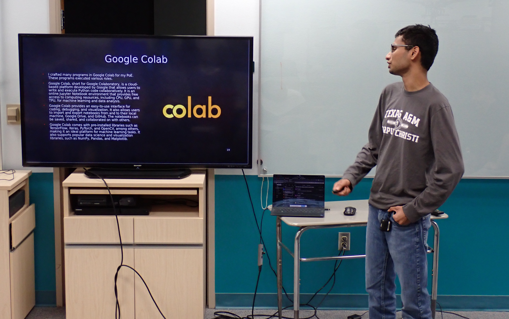
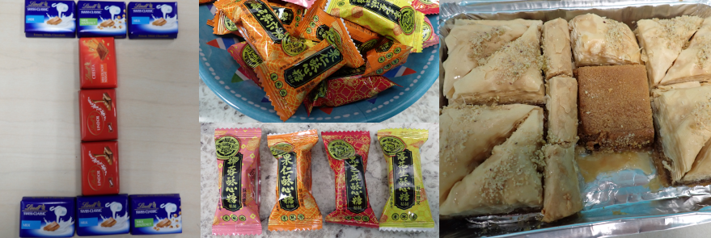

# iCORE Newsletter – 2023/04/17

The iCORE newsletter highlights events and information related to the [innovation in COmputing REsearch (iCORE) lab](https://icore.tamucc.edu/),
as well as the broader GSCS/CS programs at Texas A&M University - Corpus Christi and whatever else might interest that community.
If you have any news or resources you would like to share, send an email to [Evan Krell](https://scholar.google.com/citations?user=jLuwYGAAAAAJ&hl=en) (ekrell@islander.tamucc.edu).

[See past newsletters.](https://github.com/ekrell/icore_website/tree/main/news)

## Welcome

__CORPUS PHOTO__

## iCORE Meetings

**[iCORE Teams meeting link](https://teams.microsoft.com/l/meetup-join/19%3Ameeting_MDdlZDBiMTgtYzVjNS00YjhhLWE5OTctY2Y5YzMyYTljNzU5%40thread.v2/0?context=%7B%22Tid%22%3A%2234cbfaf1-67a6-4781-a9ca-514eb2550b66%22%2C%22Oid%22%3A%22994c008b-0707-4f3c-8ac0-73b65e733430%22%2C%22MessageId%22%3A%220%22%7D)**

### Previous meeting: 

- We had a several presenters on the theme of applying AI and other CS techniques to domain problems.
- We had an invited guest Florian Morvais present on how he uses AI for the atmospheric science domain.
- This was followed by several short presentations from iCORE members: Abhiskek Phadke, Josh Boyd, and Mohit Mathew (pictured below).

**Thanks to all our presenters and attendees!**

### Next meeting: April 28, 2:00-4:00pm

- We do not currently have a particular agenda beyond updates, general research discussion, and iCORE planning, etc.

## Upcoming Events

### Symposium for Student Innovation, Research, and Creative Activities (Friday, 4/21)

- Several iCORE members are participating with poster or oral presentations.
- Let me know if I missed anyone below.

| **Name**        | **Type** | **Time** | **Location**       | **Title**                                                                                                                                            |
|-----------------|----------|----------|--------------------|------------------------------------------------------------------------------------------------------------------------------------------------------|
| Josh Boyd       | oral     | 11:34 AM | UC Jetty 123       | UAV SWARM-BASED SYNCHRONOUS ARRAY IMAGING FOR COASTAL ENVIRONMENTS                                                                                   |
| Abhishek Phadke | poster   | 02:00 PM | UC Anchor Ballroom | DRONE2DRONE: A SEARCH AND RESCUE FRAMEWORK FOR FINDING LOST UAV SWARM AGENTS.                                                                        |
| Mohit Mathew    | oral     | 09:50 AM | UC Oso 221         | AUTONOMOUS GROUND VEHICLE NAVIGATION                                                                                                                 |
| Florian Morvais | poster   | 02:00 PM | UC Anchor Ballroom | ESTIMATE GLM-OBSERVED FLASH RATE IN PRECIPITATION FEATURES BY APPLYING AI NEURAL NETWORK MODELS TO THE GMI PASSIVE-MICROWAVE BRIGHTNESS TEMPERATURES |
| Evan Krell      | poster   | 02:00 PM | UC Anchor Ballroom | DEVELOPMENT OF A MACHINE LEARNING SYSTEM FOR DETECTING THE ATMOSPHERIC POTENTIAL OF WILDFIRE-DRIVEN THUNDERSTORMS                                    |

## Weekly Snack Report

- Swiss chocolates straight the source, thanks to Dr. Tissot.
- Middle eastern sweets (a.k.a. _the usual_) from Mahmoud.
- And Chinese peanute candies from Evan.

## Get involved

As always, we encourage all iCORE members and iCORE-adjacent persons to get involved and propose workshop/lecture/training ideas that they would like to present.

## iCORE resources

- location: NRC 2100 Suite (https://goo.gl/maps/Htbp1YMASAmYqkFu9)
- website: http://icore.tamucc.edu/
- twitter: https://twitter.com/ICORE_TAMUCC
- youtube: https://www.youtube.com/channel/UCvsK07PvushTI2BA2BhN-DQ
- google calendar: https://calendar.google.com/calendar/u/0?cid=Y2JlNDZodnIwZXV0NmZzN2h1bWs2NnB2dnNAZ3JvdXAuY2FsZW5kYXIuZ29vZ2xlLmNvbQ
- discord: https://discord.gg/3eeMN229cr

