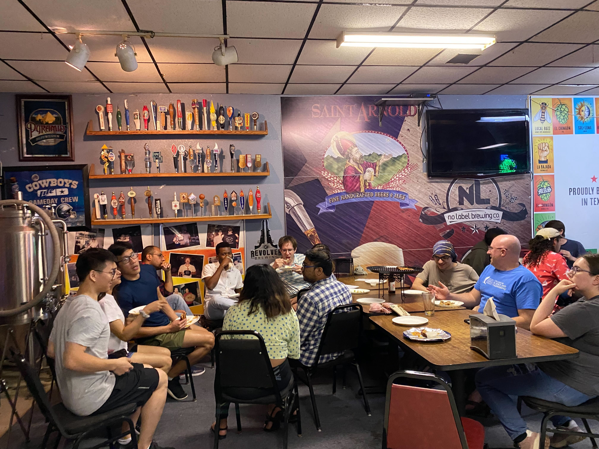
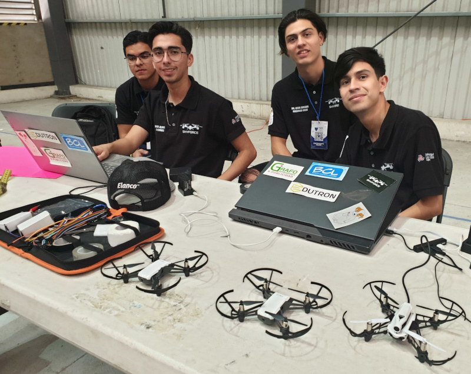
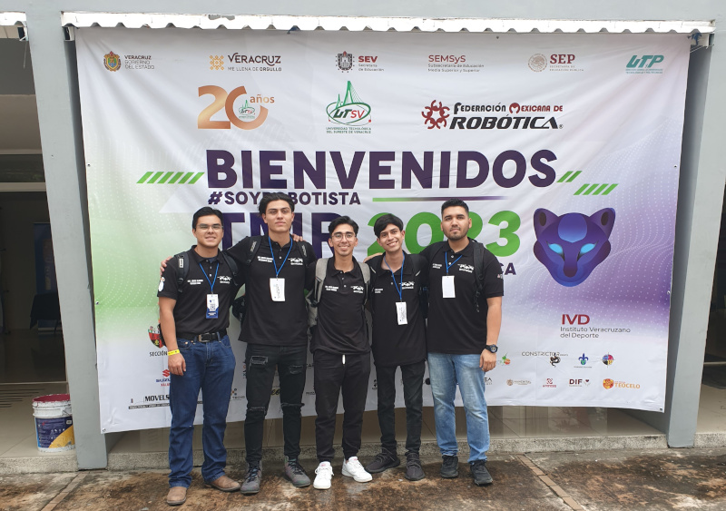
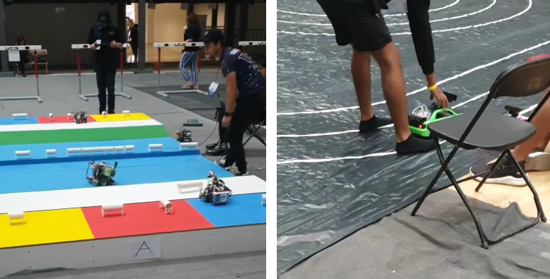

# iCORE Newsletter – 2023/05/08

The iCORE newsletter highlights events and information related to the [innovation in COmputing REsearch (iCORE) lab](https://icore.tamucc.edu/),
as well as the broader GSCS/CS programs at Texas A&M University - Corpus Christi and whatever else might interest that community.
If you have any news or resources you would like to share, send an email to [Evan Krell](https://scholar.google.com/citations?user=jLuwYGAAAAAJ&hl=en) (ekrell@islander.tamucc.edu).

[See past newsletters.](https://github.com/ekrell/icore_website/tree/main/news)

## Welcome

Thanks to the iCORE newsletter, there was a strong iCORE & GSCS presence at the [SACNAS Pizza Social](https://github.com/ekrell/icore_website/blob/main/news/icore_news_20230426.md). 

## iCORE Meetings

**[iCORE Teams meeting link](https://teams.microsoft.com/l/meetup-join/19%3Ameeting_MDdlZDBiMTgtYzVjNS00YjhhLWE5OTctY2Y5YzMyYTljNzU5%40thread.v2/0?context=%7B%22Tid%22%3A%2234cbfaf1-67a6-4781-a9ca-514eb2550b66%22%2C%22Oid%22%3A%22994c008b-0707-4f3c-8ac0-73b65e733430%22%2C%22MessageId%22%3A%220%22%7D)**

### Next meeting: May 5, 2:00-4:00pm

- General updates.
- Plans for next semester: workshops, etc.
- We need to update the iCORE website.
- We need a protocol for documenting finished projects (or project milestones).

## News

### iCORE Alumni Alexis Guijarro mentored a team for the Mexican Robotics Tournament 2023

Alexis Guijarro has mentored his team SkyForce at the Mexican Robotics Tournament 2023 which took place in Xalapa, Mexico. As part of the autonomous drone challenges, SkyForce competed with other teams to complete tests such as obstacle avoidance, moving through loops, navigation by waypoints, autonomous landing, and 3D scanning. At the end of this event, Alexis' team ended in 6th place and he believes that current team members are on track for better results next year. Alongside these challenges, other categories were present: Unmanned Ground Vehicles for disasters, Autonomous cars, LEGO® and Home Robots.

**We love to see iCORE alumni sharing their great work with us!**

### iCORE member Evan Krell is helping to organize the AMS 2024 AI Short Course

- The [American Meteorological Society (AMS)](https://www.ametsoc.org/) Annual Meeting has short courses on the weekend before the main conferences.
- Previous instructors include iCORE alumni [Hamid Kamangir](https://scholar.google.com/citations?user=YLYJGQ8AAAAJ&hl=en).
- For the 104th Annual Meeting (January 2024), Evan Krell and Dr. Kara Lamb are organizing the course. 
- The course will have beginner and intermediate tracks. The latter will likely have a strong focus on model evaluation and explainable AI. 
- Materials from previous AMS AI short courses:
  - [2019](https://github.com/djgagne/ams-ml-python-course)
  - [2020](https://github.com/alburke/ams-2020-ml-python-course)
  - [2021](https://github.com/cmac994/ams-2021-ml-python-course-supervised-learning)

## Get involved

As always, we encourage all iCORE members and iCORE-adjacent persons to get involved and propose workshop/lecture/training ideas that they would like to present.

## iCORE resources

- location: NRC 2100 Suite (https://goo.gl/maps/Htbp1YMASAmYqkFu9)
- website: http://icore.tamucc.edu/
- twitter: https://twitter.com/ICORE_TAMUCC
- youtube: https://www.youtube.com/channel/UCvsK07PvushTI2BA2BhN-DQ
- discord: https://discord.gg/3eeMN229cr
