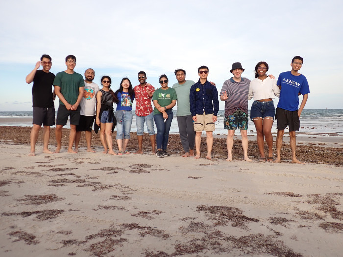
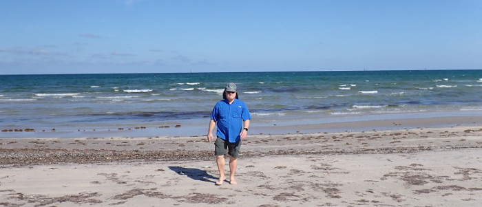
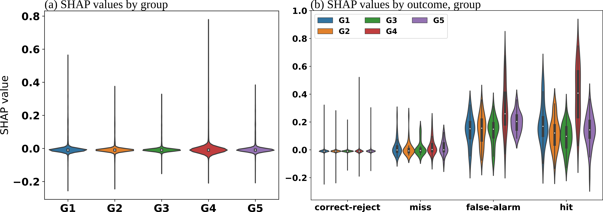
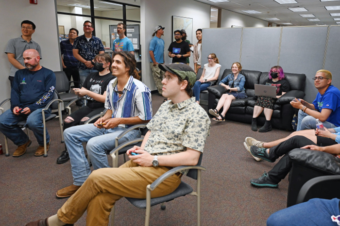
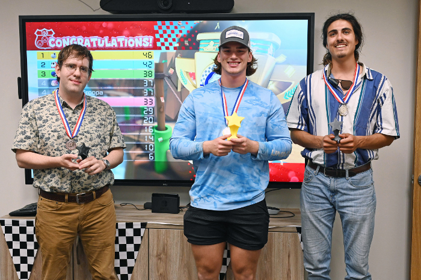

# iCORE Newsletter – 2023/05/19

The iCORE newsletter highlights events and information related to the [innovation in COmputing REsearch (iCORE) lab](https://icore.tamucc.edu/),
as well as the broader GSCS/CS programs at Texas A&M University - Corpus Christi and whatever else might interest that community.
If you have any news or resources you would like to share, send an email to [Evan Krell](https://scholar.google.com/citations?user=jLuwYGAAAAAJ&hl=en) (ekrell@islander.tamucc.edu).

[See past newsletters.](https://github.com/ekrell/icore_website/tree/main/news)

## Welcome

## Recent Events

### iCORE Beach Day

- Last Thursday, iCORE and friends of iCORE enjoyed an evening at the beach.
- The theme was build-your-own sandwich from a variety of meats, cheeses, and condiments to place within slices of bread from JB's German Bakery. 
- While condiment quality was high, Evan was bullied for forgetting to bring the mayo. 
- [photo album](https://photos.app.goo.gl/C5rXijBnjcgnwcao9)

### 2023 UF + NVIDIA Hackathon

- Dr. Philippe Tissot and Evan Krell are participating in a [hackathon hosted by University of Florida (UF) and NVIDIA](https://news.it.ufl.edu/research/2023-ufnvidia-hackathon/).
- We are working remotely with a team of NOAA scientists to develop AI models for detecting when a water level reading is bad data.
- The focus of the hackathon is to work with mentors from NVIDIA to learn how to accelerate code and take advantage of HPC GPU resources.
- Evan's role is to adapt their existing model training and evaluation code and make it more suitable for running a very large number of jobs.
- Right now, we are learning how to use [NVIDIA Nsight Systems](https://developer.nvidia.com/nsight-systems) for GPU code profiling.
- We are also learning about strategies to store our large CSV data in a way that supports efficient loading on GPUs. 
- The code is under active development, but is [open source and available](https://github.com/NOAA-CO-OPS/wlai-uf-hackathon-2023).

### New Preprint Available from Evan Krell

- We have finally submitted the FogNet XAI paper!
- There is a preprint available at [ESS Open Archive](https://essopenarchive.org/doi/full/10.22541/essoar.168394745.56383253/v1)

### iCORE On the Podium in the Conrad Blucher Institute's (CBI) Mario Kart Tournament

On May 12th, CBI hosted a Mario Kart tournament. It is well-known that the institute's directory, Rick Smith, is _very good_ at this game. 
But, was there within iCORE a challenger to the position of CBI's Mario Kart champ?

Last semester, playing Mario Kart was a familiar sight in iCORE. Evan would bring his switch to play again Mahmoud, Wen, and whoever we could get to come over from the Mantis Lab. 
As the only one with prior experience playing the game, Evan more or less always dominated the competition. Mahmoud, in some misguided notion that will be helpful, likes to tell people how _gangster_ Evan is. 
In this case, _gangster_ means that Evan can catch big fish, kayak for quite some time, and has some skill in Mario Kart. (Evan hopes that Wen doesn't think he is part of a triad).

But a key detail is that Mahmoud has _only_ seen Evan play Mario Kart against complete beginners who can barely stay on course in Moo Moo Meadows. 
Word began to spread about Evan's Mario Kart expertise based on minimal evidence. In the days leading up to the tournament, 
the word around NRC was that Evan was the one to beat. It didn't help that Son Nguyen was telling everyone that Evan is a Mario Kart _legend_.

This put Evan in a tricky situation. He was expected to be at least competitive in the upcoming tournament.
Evan may be a _legend_, but in this case more properly called a _myth_. 
So, he had no choice but to spend each evening for the two weeks preceding May 12th in [serious training](https://www.youtube.com/watch?v=iE9ZF2eA-Fc).

As for the results: Evan Krell placed 3rd in the CBI Mario Kart tournament, barely placing iCORE on the podium. 
However, it is worth noting that the true legend, Rick Smith, was not among those victors having slipped into fourth place in the final race.

## Summer Plans

- Marina Vicens-Miquel will be doing research at University of Valencia in Spain as part of an AI2ES effort to expand international collaboration.
- Evan Krell will be a visiting scholar at the [Cooperative Institute for Research in the Atmosphere (CIRA)](https://www.cira.colostate.edu/), working with Dr. Imme Ebert-Uphoff and Dr. Antonios Mamalakis.
- Hamid Kamangir has already started his internship with Microsoft Research (MSR) where is developing AI models as a Research Scientist intern.

## Get involved

As always, we encourage all iCORE members and iCORE-adjacent persons to get involved and propose workshop/lecture/training ideas that they would like to present.

## iCORE resources

- location: NRC 2100 Suite (https://goo.gl/maps/Htbp1YMASAmYqkFu9)
- website: http://icore.tamucc.edu/
- twitter: https://twitter.com/ICORE_TAMUCC
- youtube: https://www.youtube.com/channel/UCvsK07PvushTI2BA2BhN-DQ
- discord: https://discord.gg/3eeMN229cr
