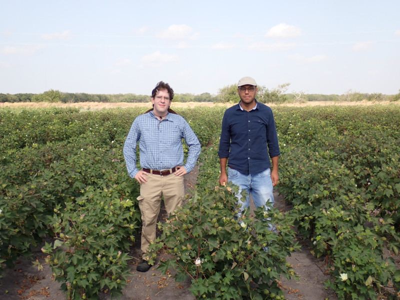

# iCORE Newsletter – 2023/07/20

The iCORE newsletter highlights events and information related to the [innovation in COmputing REsearch (iCORE) lab](https://icore.tamucc.edu/),
as well as the broader GSCS/CS programs at Texas A&M University - Corpus Christi and whatever else might interest that community.
If you have any news or resources you would like to share, send an email to [Evan Krell](https://scholar.google.com/citations?user=jLuwYGAAAAAJ&hl=en) (ekrell@islander.tamucc.edu).

[See past newsletters.](https://github.com/ekrell/icore_website/tree/main/news)

## Welcome

Evan Krell with iCORE's #1 farmer Mahmoud Eldefrawy. We are among the cotton fields at [AgriLife](https://agrilifeextension.tamu.edu/). Mahmoud's research involves deep learning and computer vision for estimating crop yield.  

## iCORE Meetings

**[iCORE Teams meeting link](https://teams.microsoft.com/l/meetup-join/19%3Ameeting_MDdlZDBiMTgtYzVjNS00YjhhLWE5OTctY2Y5YzMyYTljNzU5%40thread.v2/0?context=%7B%22Tid%22%3A%2234cbfaf1-67a6-4781-a9ca-514eb2550b66%22%2C%22Oid%22%3A%22994c008b-0707-4f3c-8ac0-73b65e733430%22%2C%22MessageId%22%3A%220%22%7D)**

### Last meeting: July 20, noon-1:30pm

- There were only four of us at the meeting so we changed location to Coffee Waves.
- The purpose of doing so was to enjoy drinks at Dr. King's expense.
- We had general updates and accidently met up with Waylon Collins from the National Weather Service.
- Dr. King gave us a lesson in stone-age gaming history by talking about the ASCII-based network games he used to play.

### Next meeting: August 3, noon-1:30pm

- Dr. King will be out... and when the King is away, the peasants will play.
- There will tea, tea sandwiches, snacks, etc.

## Recent Events

### Evan's Visit to AgriLife

Yesterday (7/19), Evan Krell was given a tour of AgriLife for two purposes: (1) to get some photos of where Mahmoud does his research for the iCORE newsletter, and (2) for a secret mission related to the cotton that Wen warned Evan against doing. But he is a stupid boy and remains undeterred. 
For Mahmoud's research, it is very important to obtain accurate ground truth data regarding the yield of the cotton harvest. So, tending to the crops at AgriLife and keeping the cotton free of weeds has become nearly his full-time occupation. 

[A full album of AgriLife photos can be found here](https://photos.app.goo.gl/iUD9oxAUPnUG7gns6). 

Here are some rows of cotton. For a while, Mahmoud was working on a vehicle that would navigate between the rows to obtain imagery to create point clouds. 

In its earliest stage, the cotton flower is pink. Soon it will turn yellow. 

The cotton ball is in fact the plant's fruit since it surrounds the seed. 

  

Ovens are used to dry out the cotton by maintaining a relatively low heat for many days. 

My contribution to AgriLife's cotton-growing program: I picked a weed. 

Lei Zhao and Mahmoud: computer scientists toiling away under the summer sun. 

### Recent Defenses 

We have recently had 4 proposal defenses from students that are either part of iCORE or at least iCORE related. 

#### Wen Zhang (June 30)**

[Wen Zhang](https://scholar.google.com/citations?user=GRzJpkkAAAAJ&hl=en) (not to be confused with iCORE's Wen Zhong) is a GSCS student who actually has little to do with iCORE. She does not come to meetings or our fun events, but she is included in the newsletter because everyone at iCORE likes her a lot. She is now Dr. Zhang and is starting a position at Wright State University in Dayton, Ohio. 

**Topic:** Towards Intelligent and Sustainable IoT System: Infusing AI and Energy Harvesting for Sparsity-aware Sensing, Intermittent Routing, and Air- ground Integrated Data Collection

**Abstract:** The increasing prevalence of Artificial Intelligence on the Internet of Everything (AIoE) has resulted in a surge of embedded devices, which are now ubiquitous in all aspects of our lives. However, due to the limited battery life, embedded devices with short lifetimes are required to provide a growing number of services and applications. This presents a significant challenge for both academia and industry. In response, the sustainability of embedded devices has taken center stage, with Energy Harvesting (EH) emerging as a promising solution. EH devices can perpetually power themselves by harvesting energy from the surrounding environment, such as radio frequency and thermal energy. While EH has improved device longevity, utilizing EH-powered devices over a large field remains challenging. Due to the transient nature of energy harvesting, EH devices must alternate between executing (discharging) and sleeping (recharging), which results in frequent interruptions during sensing and communication. Although conventional strategies for sensing, communication, and energy allocation have been proposed in the past, they are inadequate for EH devices as they assume that devices can be waken up at any time, the exact opposite of EH devices. While studies have focused on EH-aware sensing and communication strategies, they have primarily targeted optimizing individual perspectives. To address this issue, this dissertation proposes a sustainable and intelligent IoT system using emerging technologies such as deep reinforcement learning and compressed sensing. The proposed framework comprises three components: 1) A comprehensive sparsity-aware spatiotemporal data sensing framework for the EH IoT system; 2) Environment adaptive multi-hop routing and energy allocation for EH IoT network; and 3) A drone-assisted EH IoT framework that assists ground EH devices in completing data collection tasks, such as environmental monitoring.

#### Carly Stanton (July 14)

[Carly Stanton](https://www.linkedin.com/in/carly-stanton-gisp-8363b252?original_referer=https%3A%2F%2Fwww.google.com%2F) is very much a member of iCORE, being a master's student under Dr. King. She successfuly defended a master's thesis in Computer Science. She doesn't attend enough of iCORE's fun events, but to be fair she has a real job: GIS Consultant at FACTOR, INC. 

**Topic:** Overcoming Data Limitation Challenges in Predicting Tropical Storm Surge with Interpretable Machine Learning Methods

**Abstract:** The impacts of climate change have increased the risk of storm surge flooding in coastal areas. Tropical islands are especially vulnerable to the effects of sea level rise and the increase in frequency and intensity of tropical cyclones (TCs). Typically, storm surge prediction is performed using a combination of numerical forecasting models, synoptic forecasting, and statistical methods. Machine learning techniques, particularly artificial neural networks (ANNs), have shown promise in accurately predicting storm surge levels in the short term. However, deep learning methods are computationally expensive and require large amounts of data to train their models. Often researchers must train ANN models on synthetic data generated by numerical models. This study aims to train simpler, interpretable models, including random forest (RF) regression, multiple linear regression (MLR), and support vector machine regression (SVR), to predict storm surge in San Juan Bay, Puerto Rico using limited local meteorological and tidal data and hurricane reanalysis data from actual storm events over the last few decades. These algorithms were used to predict surge at five different lead times from one hour to 24 hours and were trained on three different feature sets with two different types of training data windows. Models were trained using a leave-one-out cross-validation (LOOCV) approach, in which data for one TC was separated out for each model as a validation dataset. The performance of the models and different training methods was compared in terms of RMSE and error at peak surge. It was found that an RF model trained on data from only eight TCs was able to predict the peak surge of Hurricane Irma to within 0.03 m and predicted time of peak surge within three hours at lead times up to 12 hours as long as one extreme TC event, in this case Hurricane Maria, was included in the training data. However, all models failed to accurately predict surge for Hurricane Maria, even when including other high-surge storms in the training data. Other training methods achieved lower RMSE when validated against a peak surge window from the 12 hours prior to 12 hours after peak surge, but could not approach the accuracy of the RF model at predicting peak storm surge.

#### Pratikshya Regmi (July 10)

[Pratikshya Regmi](https://scholar.google.com/citations?user=K3FNEsQAAAAJ&hl=en) is a member of the MANTIS lab, but almost never fails to attend iCORE workshops and social events. We consider her an important part of iCORE. She defended her master's and is now preparing for her next adventure: a PhD in geospatial analytics at North Carolina State. 

**Topic:** Application OF UAS Photogrammetry AND Geospatial-AI Techniques for Palm Tree Detection and Mapping

**Abstract:** This research aims to utilize uncrewed aircraft system (UAS) photogrammetry and deep learning techniques to provide effective and user-friendly approaches for detecting palm trees, thereby facilitating monitoring and management initiatives. This study was carried out at Texas A & M University-Corpus Christi (TAMUCC) Ward Island campus.  The primary purpose of this study was to utilize high resolution orthomosaic imagery generated from UAS-based structure-from-motion (SfM) photogrammetry to detect, map, and quantify the number of palm trees on campus.  A GIS-based pre-trained model and a customizable model were evaluated. The deep learning model exhibiting the highest performance in terms of precision, recall, and F1-Score was selected as the optimal model. The model obtained through fine-tuning of a pre-trained GIS-based model was identified as the optimal choice, yielding the following values: precision=0.88, recall=0.95, and F1-score=0.91. The chosen optimal model was employed to examine the impact of image ground sampling distance (GSD) on the deep learning model’s classification performance. GSD values were varied by downsampling of the original image GSD to values of 5 cm, 10 cm, 20 cm, and 40 cm, respectively. The findings revealed that the model’s performance deteriorated as the resolution decreased. Furthermore, the optimal model was subjected to an additional test using multi-temporal image datasets acquired from different UAS flights conducted at the same altitude with approximately the same GSD (1.6 cm). Remarkably, the results demonstrated that the model maintained a comparable level of accuracy across all three testing datasets. The obtained results were verified using ground truth values of palm tree counts taken from a portion of the campus study area. This study concludes that fine-tuning of a pre-trained deep learning model within a GIS-based framework enabled a relatively high level of classification performance for the task of palm tree detection and mapping using UAS orthomosaic imagery. Although effectiveness of the model decreased with reduced image GSD, the model was able to maintain relatively consistent performance across different UAS flights with imagery acquired at the same approximate GSD demonstrating it’s potential for generalization.

#### Jose Luis Landivar (July 10)

[Jose Landivar](https://www.linkedin.com/in/jose-luis-landivar) is part of the Mantis lab and is another student involved with AgriLife for applying geospatial technology to agricultural applications. He has attended some of the previous iCORE events. Having defendis has master's thesis, he plans to continue his research at AgriLife for some time while considering his next steps. 

**Topic:** A Comparitave Analysis OF Georeferencing Techniques for Plant Height Estimation in Precision Agriculture Using UAS Photogrammetry

**Abstract:** In the rapidly evolving fields of geospatial engineering and precision agriculture, the accuracy and reliability of georeferencing techniques and Uncrewed Aircraft System (UAS) methodologies are crucial for effective decision-making and crop management. This research aims to enhance UAS Structure-from-Motion (SfM) photogrammetry data quality for plant height estimation in support of precision agriculture. The study investigates and compares the accuracy and reliability of three distinct methods used for georeferencing of the UAS imagery, which subsequently enables more accurate SfM 3D reconstruction: Global Navigation Satellite System (GNSS) without any correction aiding (GNSS-only), GNSS+Real-Time Kinematic (RTK), receiving RTK corrections from a local base station, GNSS+Real-Time Network (RTN), receiving RTK corrections from the Texas Department of Transportation (TxDOT) GNSS reference station network. The study further assesses the correlation between manually measured plant heights and those estimated from UAS-SfM point cloud data, exploring three different Digital Terrain Model (DTM) generation techniques. The research was conducted at the Texas A&M AgriLife Research and Extension Center in Corpus Christi, Texas, USA, on corn crops grown during the 2022 and 2023 agricultural seasons. The three DTM generation methods under consideration included 1) using a DTM acquired from a flight conducted before plant emergence, 2) creating a DTM by interpolating ground height points, and 3) implementing automatic classification algorithms. Our findings reveal that the GNSS+RTK solution implemented with a DJI D-RTK 2 mobile station acting as a local base for providing RTK corrections during flight provided the most reliable and accurate outcomes across multiple data collection dates for the UAS platform evaluated. Furthermore, the use of one ground control point (GCP) improved accuracy compared to scenarios with no GCPs used, while GNSS-only without correction aiding reported the least accurate results as expected. Regarding plant height estimation, the highest accuracy was generally achieved with greater canopy cover percentages, with the optimal percentage varying depending on the data collection date and DTM creation method. The highest correlation of 0.92 between manual measurements and UAS-SfM derived plant heights was found when the DTM was either interpolated from ground height points or obtained from a pre-emergence flight.

## Upcoming Events

### Mel Wilson Reyes' AI2ES Presentation

- **Title:** Visibility Estimation from Camera Images Using Deep Learning
- **Where:** NRC 1232 Conference Room
- **When:** 1:15 PM - 2:45 PM

**Abstract:**

Atmospheric visibility is an important and complex meteorological variable that directly affects safe and reliable transportation. Specifically, declining visibility can pose an increased risk to automotive, aviation, and maritime traffic and operations. Traditional visibility sensors, e.g., those of the Automated Surface Observing Systems (ASOS) network, are costly and designed for air traffic use, thus these visibility sensor networks have limited coverage state-wide. In contrast, camera footage is highly available, accessible, and fairly inexpensive. While it is possible to construct a model that detects a visibility measure for a single camera or location, this type of model is not generalizable to new locations with varying physical features or different fields of view. I propose a comparative visibility model that is generalizable solution to new locations. I train a convolutional neural network (CNN) that compares a query image and a reference image that originate from the same cameras and determines the degree to which the query image is less visible than the reference image. A query image from a new camera can then be compared to a set of reference images with known visibility distances from the same camera. These comparisons can then be used to infer the query image’s underlying visibility distance. In addition, a model can be trained using a set of locations that have different maximum visibility distances, fields of view, and physical characteristics. The resulting comparative model can generalize to novel sites. When combined with a small number of calibrated reference images for a given site, visibility distances can be accurately estimated from previously unseen query images. Results from a large combined NYSM/ASOS data set show that the models learned using the proposed method are able to generalize to new locations. The approach is successful in the comparative case and the numerical visibility prediction case. With these outcomes, the model is also able to effectively monitor visibility over time.

