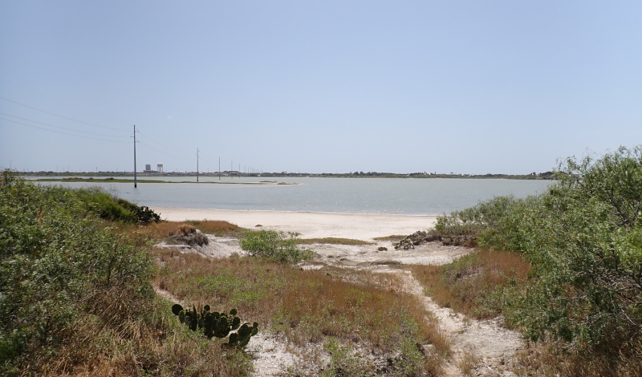
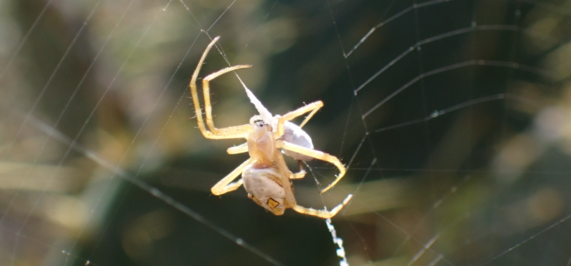
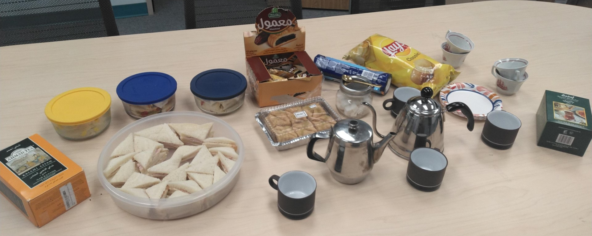
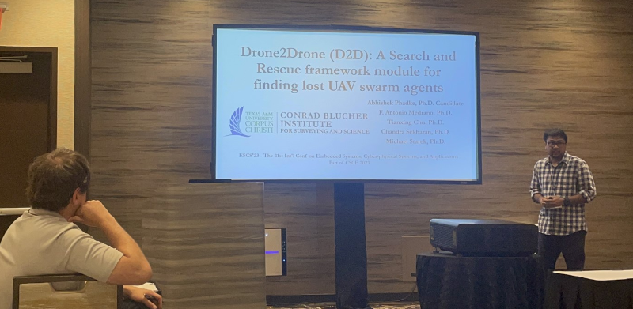
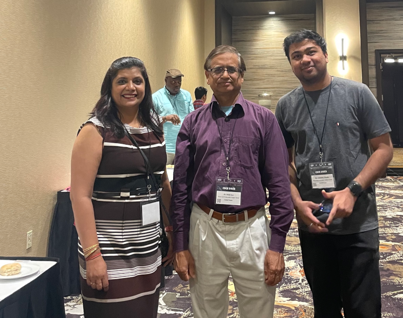
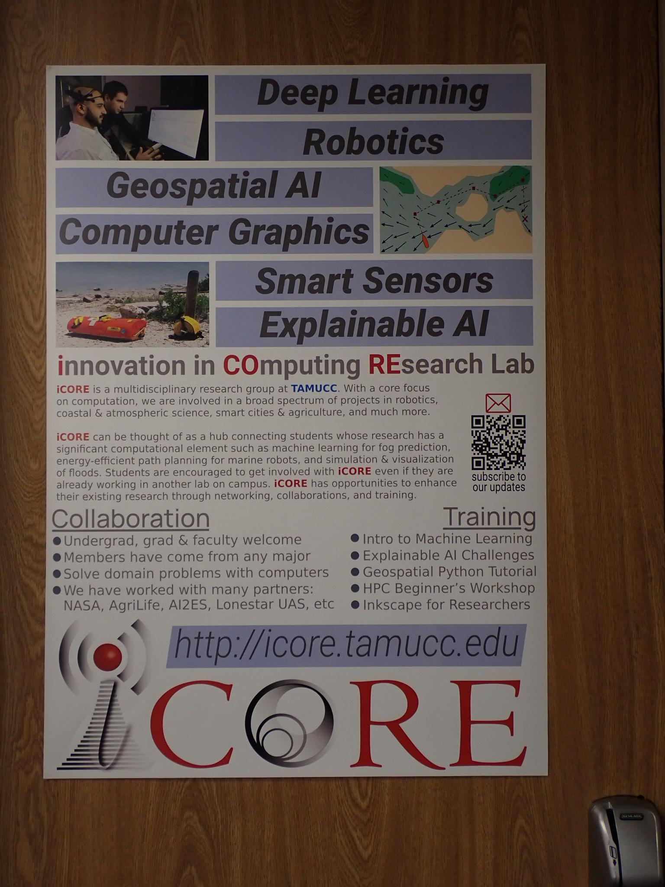
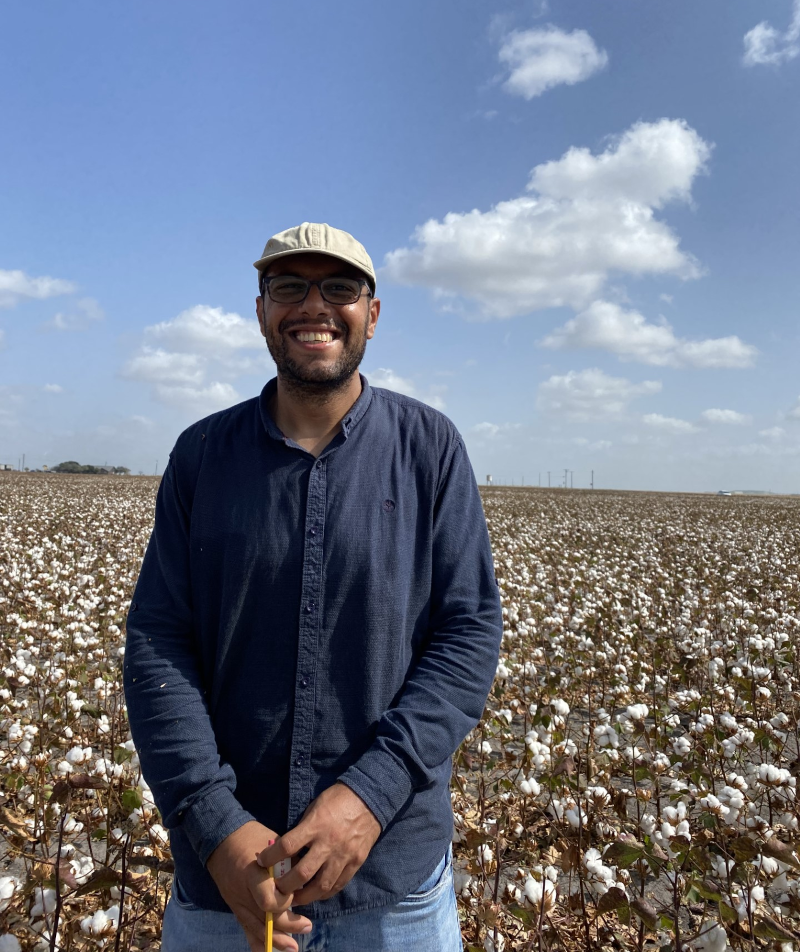
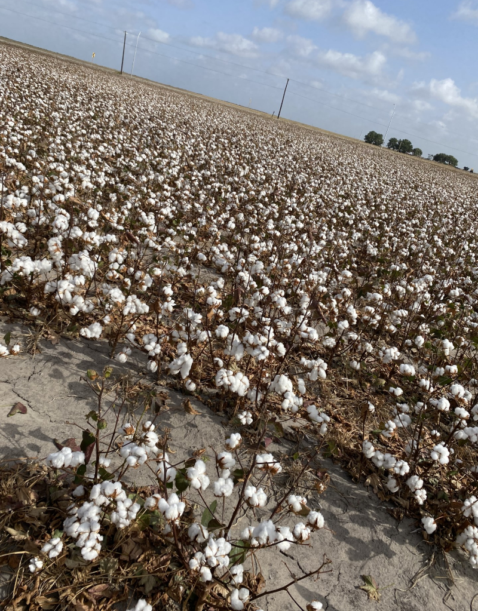

# iCORE Newsletter – 2023/08/03

The iCORE newsletter highlights events and information related to the [innovation in COmputing REsearch (iCORE) lab](https://icore.tamucc.edu/),
as well as the broader GSCS/CS programs at Texas A&M University - Corpus Christi and whatever else might interest that community.
If you have any news or resources you would like to share, send an email to [Evan Krell](https://scholar.google.com/citations?user=jLuwYGAAAAAJ&hl=en) (ekrell@islander.tamucc.edu).

[See past newsletters.](https://github.com/ekrell/icore_website/tree/main/news)

## Welcome

This spider, busily ensaring its prey, was spotted at the [Oso Bay Wetlands Preserve](https://www.cctexas.com/parks/services/general-government/oso-bay-wetlands-preserve-learning-center) on July 29. Click on the spider photo above to navigate to a video of the web-spinning action. Perhaps Bria Marty can provide an identification?

### Last meeting: August 3, noon-1:30pm

- Dr. King was away... so we replaced our weekly meeting a small tea party.
- Evan brought several mini tea sandwiches (cucumber, turkey, deviled ham, etc).
- Mahmoud brought middle eastern sweets: baklava & date-filled cookies.
- The tea selections were [Ahmad Kalami Assam](https://www.sadaf.com/products/ahmad-kalami-assam-tea-44-7804?variant=39729262067918&currency=USD&utm_source=google&utm_medium=organic&utm_campaign=shopping&utm_content=Ahmad+Kalami+Assam+Tea+16+oz.&gclid=Cj0KCQjwoK2mBhDzARIsADGbjeoqCh3sgGWz8xyoJKEh7y8CnG2s2LtyKOut7HnKMZWX6My50kiVoOcaAsoAEALw_wcB) and [Sadaf Cardamom Tea](https://www.sadaf.com/collections/loose-leaf-tea/products/sadaf-special-blend-cardamom-tea-44-6154).
- Don't worry, Dr. King: we cleaned up the conference room...

### Next meeting: August 17, noon-1:30pm

- No plans yet

## News

### Abhishek Phadke & Josh Boyd published an editorial on autonomous aircraft systems

**[Navigating the skies: examining the FAA’s remote identification rule for unmanned aircraft systems](https://cdnsciencepub.com/doi/10.1139/dsa-2023-0029)**

**Abstract:**  As technology and innovations in unmanned aerial vehicles progress, so does the need for regulations in place to create safe and controlled flying scenarios. The Federal Aviation Administration (FAA) is a governing body under the United States Department of Transportation that is responsible for a wide range of regulatory activities related to the United States airspace. In a recently published final rule, the FAA addresses several concerns such as the need for a system to identify all aircrafts flying in national airspace, as well as the implementation of a separate system from the prevalent Automatic Dependent Surveillance–Broadcast system to prevent interference with manned aircrafts. Their solution to these concerns is the deployment of remote identification (RID) on all unmanned aircraft systems (UAS) flying under its implied jurisdiction. While US governing agencies retain the use of the word UAS for now, the International Civil Aviation Organization terminology is remotely piloted aircraft systems. The FAA describes the RID implementation as a “Digital license plate” for all UAS flying in the United States airspace. They outline additional policies including several options for compliance, operating rules, and design and production guidelines for manufacturers. As the September 2023 deadline for compliance draws near, this article highlights possible deployment applications and challenges.

## Recent Events

### Abhiskek Phadke presented at the **annual CSCE 2023 world congress; 21st International conference on Embedded Systems, Cyber physical Systems and Applications**

- **Title:** _D2D (Drone2Drone): a search and rescue framework module for finding lost UAV swarm agents._
- **Authors:** Abhishek Phadke, F. Antonio Medrano, Tianxing Chu, Chandra Sekharan, Michael Starek

Above, Abhishek at the CSCE conference with TAMUCC computer science faculty Dr. Yadav and Dr. Kar. 

### Upgraded the door to iCORE

- Evan designed and printed a poster for the door of iCORE.
- He thinks that it does not look too bad...
- Hosting a tea party at iCORE outside of the breakroom will get him in trouble with Dr. King...
- BUT creating and printing this at his own expense should get him _just enough_ credits to get back out of trouble...

### Mahmoud's cotton continues to grow

- iCORE's number one farmer Mahmoud is still hard at work, tending to the cotton fields.
- The crops seem to have progressed substantially since the [previous newsletter]().
- Soon they will be harvested and dried, and Mahmoud will have ground truth data for training crop yield prediction models.

## Get involved

As always, we encourage all iCORE members and iCORE-adjacent persons to get involved and propose workshop/lecture/training ideas that they would like to present.

## iCORE resources

- location: NRC 2100 Suite (https://goo.gl/maps/Htbp1YMASAmYqkFu9)
- website: http://icore.tamucc.edu/
- twitter: https://twitter.com/ICORE_TAMUCC
- youtube: https://www.youtube.com/channel/UCvsK07PvushTI2BA2BhN-DQ
- discord: https://discord.gg/3eeMN229cr

