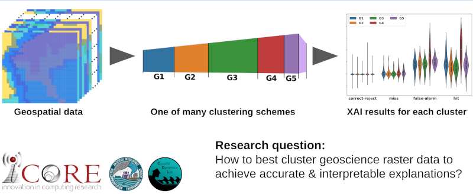

# iCORE Newsletter – 2023/08/11

The iCORE newsletter highlights events and information related to the [innovation in COmputing REsearch (iCORE) lab](https://icore.tamucc.edu/),
as well as the broader GSCS/CS programs at Texas A&M University - Corpus Christi and whatever else might interest that community.
If you have any news or resources you would like to share, send an email to [Evan Krell](https://scholar.google.com/citations?user=jLuwYGAAAAAJ&hl=en) (ekrell@islander.tamucc.edu).

[See past newsletters.](https://github.com/ekrell/icore_website/tree/main/news)

## iCORE Meetings

**[iCORE Teams meeting link](https://teams.microsoft.com/l/meetup-join/19%3Ameeting_MDdlZDBiMTgtYzVjNS00YjhhLWE5OTctY2Y5YzMyYTljNzU5%40thread.v2/0?context=%7B%22Tid%22%3A%2234cbfaf1-67a6-4781-a9ca-514eb2550b66%22%2C%22Oid%22%3A%22994c008b-0707-4f3c-8ac0-73b65e733430%22%2C%22MessageId%22%3A%220%22%7D)**

### Next meeting: August 17, noon-1:30pm

- General updates
- Plans for Fall semester
  - Research directions
  - iCORE events: workshops, presentations, etc

## Recent Updates

### The cotton is ready for harvesting at AgriLife

- Mahmoud's hard work pulling weeds has payed off: the cotton is ready!
- Now the harvested cotton can be used to create the ground truth for cotton yield estimation modeling.
- His research is a collaboration with [AgriLife](https://agrilifeextension.tamu.edu/).

## Upcoming Events

### Evan Krell's SCOTT talk, Friday August 18

- **What:** Short Curious Open Tech Talk (SCOTT) Series: a series of lightning talks at the [Conrad Blucher Institute](https://www.conradblucherinstitute.org/).
- **When:** Next Friday, Auguest 18. 11.00 am - Noon.
- **Where:** NRC 1232 (CBI conference room).

**Title:** The Influence of Feature Grouping Schemes on Explainable AI for Geoscience AI Models

**Synopsis:** Gridded spatial data can be used to develop high performance machine learning models, but their complexity makes it hard to verify that the model learned realistic strategies. Explainable AI (XAI) techniques can be used to investigate models, but they struggle with correlated features. A proposed solution is to group correlated features for XAI. We use FogNet, a deep learning model for coastal fog prediction, to explore XAI grouping schemes. We demonstrate that using a hierarchy of feature groups can be used to gain insights into the scale of the learned features.

**Bio:** Evan Krell is a Ph.D. student in the GSCS program and a member of the Innovation in COmputing REsearch lab (iCORE) as well as the NSF AI Institute for Research on Trustworthy AI in Weather, Climate, and Coastal Oceanography (AI2ES). He is broadly interested in explainable AI, geoscience models, data visualization, marine robotics, fishing, and boating. His current project is to learn Chinese cooking and his three cup chicken (三杯鸡) is way better than the dish at Dao. 

### Evan Krell will present at the [DoD Cloud Post-Processing and Verification Workshop](https://cpaess.ucar.edu/meetings/dod-cloud-post-processing-and-verification-workshop)

- **Where:** Boulder, CO
- **When:** Sep. 13 to Sep. 14, 2023

**Title:** The Influence of Feature Aggregation for Explainable AI for High Dimensional Geoscience Applications

**Abstract:** High-dimensional gridded spatial data has become increasingly used to develop complex machine learning models of atmospheric phenomena such as fog and clouds. For example, FogNet is a 3D convolutional neural network whose input data is composed of gridded numerical weather predictions and satellite imagery. With complex learning techniques and gridded inputs, models can be trained to extract spatial patterns to represent highly nonlinear functions. However, it is challenging to understand how the trained model behaves. For critical applications, it is important for experts to verify that the model has learned physically realistic strategies. Insight into how the model works can increase user’s trust in the model and better inform decision-makers. Explainable artificial intelligence (XAI) is a class of techniques to expose how models operate. XAI can be used to highlight which cells of a gridded input were most influential for a given model output. A major challenge when using XAI to explain gridded spatial data is that XAI techniques are often very sensitive to correlations among the input features. Spatial data typically exhibits a high degree of spatial autocorrelation. A proposed solution, often used for tabular data, is to group the correlated features. However, it is challenging to select the optimal clusters to group spatial data. Using FogNet as a case study, we experiment with multiple approaches to feature aggregation for geospatial data. We demonstrate that choices in how the grid cells are formed into groups can greatly influence the model explanations. We also show that the discrepancies among explanations can be reasonably explained based on the nature of the input features. These differences can be used to gain some insight into the scale of the spatial features learned. While a single grouping scheme may produce misleading XAI results, we show how a hierarchy of groups can aid model interpretation. 

## Get involved

As always, we encourage all iCORE members and iCORE-adjacent persons to get involved and propose workshop/lecture/training ideas that they would like to present.

## iCORE resources

- location: NRC 2100 Suite (https://goo.gl/maps/Htbp1YMASAmYqkFu9)
- website: http://icore.tamucc.edu/
- twitter: https://twitter.com/ICORE_TAMUCC
- youtube: https://www.youtube.com/channel/UCvsK07PvushTI2BA2BhN-DQ
- discord: https://discord.gg/3eeMN229cr
