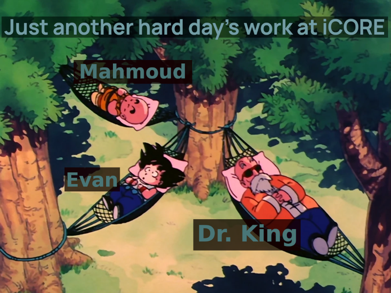

# iCORE Newsletter – 2023/08/21

The iCORE newsletter highlights events and information related to the [innovation in COmputing REsearch (iCORE) lab](https://icore.tamucc.edu/),
as well as the broader GSCS/CS programs at Texas A&M University - Corpus Christi and whatever else might interest that community.
If you have any news or resources you would like to share, send an email to [Evan Krell](https://scholar.google.com/citations?user=jLuwYGAAAAAJ&hl=en) (ekrell@islander.tamucc.edu).

[See past newsletters.](https://github.com/ekrell/icore_website/tree/main/news)

## Welcome

## iCORE Meetings

**[iCORE Teams meeting link](https://teams.microsoft.com/l/meetup-join/19%3Ameeting_MDdlZDBiMTgtYzVjNS00YjhhLWE5OTctY2Y5YzMyYTljNzU5%40thread.v2/0?context=%7B%22Tid%22%3A%2234cbfaf1-67a6-4781-a9ca-514eb2550b66%22%2C%22Oid%22%3A%22994c008b-0707-4f3c-8ac0-73b65e733430%22%2C%22MessageId%22%3A%220%22%7D)**

### Previous meeting: August 17, noon-1:30pm

After going over our usual updates, we starting planning some events for this semester's events. Ideas include:

- Version 2 of Mahmoud Eldefrawy's Intro to ML workshop (new & improved)
- A lecture of geospatial algorithms from Abhishek Phadke
- Various technical trainings from Josh Boyd's software team at LoneStar UAS
- Inkscape for research graphics from Evan Krell
- Something from Waylon Collins (National Weather Service)

### Next meeting: September 1, 3:30 - 5:30

- Meetings are now Friday afternoons (tragic)

https://ekrell.github.io/doc/Slides_SCOTT_EvanKrell_XAIFeatureGroups.pdf

theking.png
evan_scott.jpg
agrilife_sinton_4.jpg
agrilife_sinton_1.jpg
agrilife_sinton_2.jpg
agrilife_sinton_3.jpg
