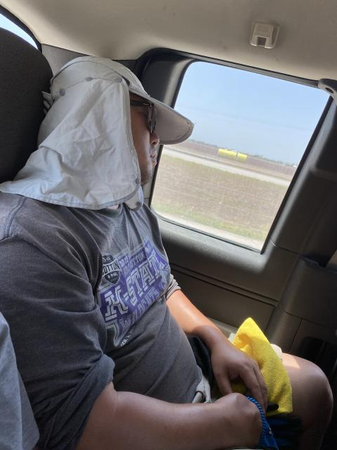

# iCORE Newsletter – 2023/08/21

The iCORE newsletter highlights events and information related to the [innovation in COmputing REsearch (iCORE) lab](https://icore.tamucc.edu/),
as well as the broader GSCS/CS programs at Texas A&M University - Corpus Christi and whatever else might interest that community.
If you have any news or resources you would like to share, send an email to [Evan Krell](https://scholar.google.com/citations?user=jLuwYGAAAAAJ&hl=en) (ekrell@islander.tamucc.edu).

[See past newsletters.](https://github.com/ekrell/icore_website/tree/main/news)

## Welcome

## iCORE Meetings

**[iCORE Teams meeting link](https://teams.microsoft.com/l/meetup-join/19%3Ameeting_MDdlZDBiMTgtYzVjNS00YjhhLWE5OTctY2Y5YzMyYTljNzU5%40thread.v2/0?context=%7B%22Tid%22%3A%2234cbfaf1-67a6-4781-a9ca-514eb2550b66%22%2C%22Oid%22%3A%22994c008b-0707-4f3c-8ac0-73b65e733430%22%2C%22MessageId%22%3A%220%22%7D)**

### Previous meeting: August 17, noon-1:30pm

After going over our usual updates, we starting planning some events for this semester's events. Ideas include:

- Version 2 of Mahmoud Eldefrawy's Intro to ML workshop (new & improved)
- A lecture on geospatial algorithms from Abhishek Phadke
- Various technical trainings from Josh Boyd's software team at LoneStar UAS
- Inkscape for research graphics from Evan Krell
- Something from Waylon Collins (National Weather Service)

### Next meeting: September 1, 3:30 - 5:30

- Meetings are now Friday afternoons (tragic)

## Recent Events

### AgriLife Sinton Adventure (08/16)

Last week, iCORE's Mahmoud Eldefrawy (a.k.a. cotton boy) did some work with AgriLife. 
That is the whole news: Mahmoud worked. For some time, Wen and Evan have been concerned as to whether or not work was in fact being done. From what I can see, a typical Mahmoud day is as follows. The morning is spent at AgriLife chatting with the guys, followed by a substantial buffet lunch at either Southern Charm or China Bear. In the afternoon, Mahmoud shows up at iCORE with his usual question "have you had your coffee". Even though he has, in fact, had his coffee, Evan joins in for a quick trip to Coffee Waves. During the short drive, they jam out to [Taiwanese mountain love songs](https://youtu.be/3wnmnL0G0ao) or [خلاص خلاص خلاويص خلصنا](https://soundcloud.com/ayman-no3man/jgpuxobwlhcr?utm_source=clipboard&utm_medium=text&utm_campaign=social_sharing). After a half-hour or so at iCORE, Mahmoud heads back home. There, Evan and Wen have no idea what he is up to (certainly not cooking or cleaning). But the big question is: does Mahmoud work? So, the big news this week is *photographic evidence of Mahmoud doing something out in the field*.

Last Wednesday, Mahmoud was tasked with a trip to Sinton to collect sensors that had been deployed underground. The location of the sensors is known by their guide, Lei Zhao, who was seen catching some shut-eye on the way to the field. 

On reaching the site, they quickly discovered that the ground was very dry due to a shortage of water. This made digging up the sensors quite a challenge. Not to be deterred, Mahmoud managed to extract enough earth to be able to retrieve to buried sensors. So to those questioning whether or not Mahmoud works, they may cast aside their doubts: **Mahmoud dug a hole.** 

Always ready to share the credit of his deeds, Mahmoud photographed AgriLife field crew member Colton with the uncovered sensor. 

But the adventure does not end there! While out in the field, a storm quickly developed and chased our heroes out of Sinton.
They had to endure heavy rain, flashes of lightning, etc. This may have been a blessing in disguise. The South Texas summer heat was beginning to take its toll and its not clear just how much longer Cotton Boy could have managed. Was his life saved by the storm? It remains a mystery. 
 
### SCOTT: The Influence of Feature Grouping Schemes on Explainable AI for Geoscience AI Models (08/18)

Last Friday, Evan Krell presented about his current research related to explainable AI for Conrad Blucher Institute (CBI). 
The SCOTT series are short presentations for CBI members to share knowledge within the group. 

[Slides are available here](https://ekrell.github.io/doc/Slides_SCOTT_EvanKrell_XAIFeatureGroups.pdf)

## Get involved

As always, we encourage all iCORE members and iCORE-adjacent persons to get involved and propose workshop/lecture/training ideas that they would like to present.

## iCORE resources

- location: NRC 2100 Suite (https://goo.gl/maps/Htbp1YMASAmYqkFu9)
- website: http://icore.tamucc.edu/
- twitter: https://twitter.com/ICORE_TAMUCC
- youtube: https://www.youtube.com/channel/UCvsK07PvushTI2BA2BhN-DQ
- discord: https://discord.gg/3eeMN229cr
