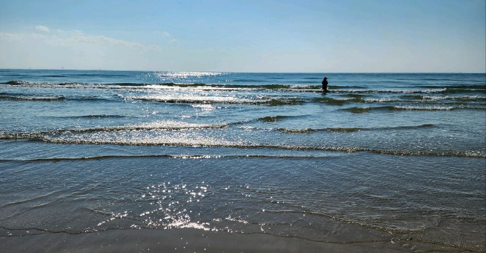
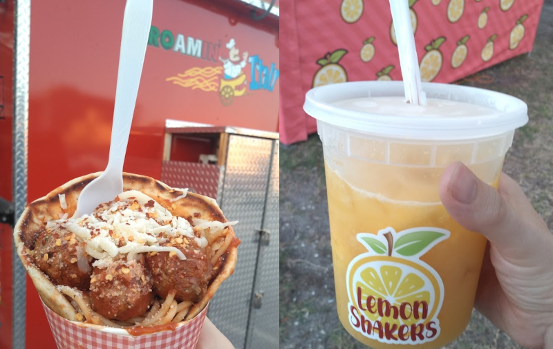

# iCORE Newsletter – 2023/09/04

The iCORE newsletter highlights events and information related to the [innovation in COmputing REsearch (iCORE) lab](https://icore.tamucc.edu/),
as well as the broader GSCS/CS programs at Texas A&M University - Corpus Christi and whatever else might interest that community.
If you have any news or resources you would like to share, send an email to [Evan Krell](https://scholar.google.com/citations?user=jLuwYGAAAAAJ&hl=en) (ekrell@islander.tamucc.edu).

[See past newsletters.](https://github.com/ekrell/icore_website/tree/main/news)

## Welcome

I hope you are all enjoying the three-day weekend!

(I can't believe I am writing a newsletter on labor day.)

## iCORE Meetings

**[iCORE Teams meeting link](https://teams.microsoft.com/l/meetup-join/19%3Ameeting_MDdlZDBiMTgtYzVjNS00YjhhLWE5OTctY2Y5YzMyYTljNzU5%40thread.v2/0?context=%7B%22Tid%22%3A%2234cbfaf1-67a6-4781-a9ca-514eb2550b66%22%2C%22Oid%22%3A%22994c008b-0707-4f3c-8ac0-73b65e733430%22%2C%22MessageId%22%3A%220%22%7D)**

### Next meeting: September 8, 3:30 - 5:30

- Back-to-school iCORE meeting.
- The main purpose is to schedule Fall 2023 iCORE events.
- In addition, to see where everyone is at in their research.
- And perhaps to welcome any new iCORE members?
- Please come and bring anyone who might be interested in learning about how they can get involved with CS research.
- Or, how they can better incorporate CS in their existing research.

### Fall 2023 Event Planning

- We are making a schedule for this semester's events.
- We are looking for event ideas (workshops, tutorials, training, etc.).
- Please let us know if you have ideas for:
  - Something you **want to present**.
  - Something you **want to learn about**.
- At the very **minimum**, we want to populate the below table with events.
- If there is interest in even more events, we may schedule additional meeting times. 

| **Date** | **Topic**          |
|----------|--------------------|
| Sept 8   | First fall meeting |
| Sept 22  |                    |
| Oct 6    |                    |
| Oct 20   |                    |
| Nov 3    |                    |
| Dec 1    |                    |

## Recent Happenings

### Abhishek Phadke Published a Journal Article

- Let's congratulate [Abhishek](https://sites.google.com/view/abhishek-phadke) on his new journal publication!
- Abhishek is a member of iCORE and the [Geospatial Optimization & Analytics Lab (GOAL)](https://sites.google.com/view/abhishek-phadke).
- Recently, he brought delicious corn for Evan and Mahmoud... but Evan ate it all, thinking Mahmoud had a separate portion.
- But more importantly, he is doing very interesting work in autonomous aerial vehicle systems.
- **Title:** [Designing UAV Swarm Experiments: A Simulator Selection and Experiment Design Process](https://www.mdpi.com/1424-8220/23/17/7359)
- **Authors:** Abhishek Phadke, F. Antonio Medrano, Chandra N. Sekharan, & Tianxing Chu

**Abstract:** The rapid advancement and increasing number of applications of Unmanned Aerial Vehicle (UAV) swarm systems have garnered significant attention in recent years. These systems offer a multitude of uses and demonstrate great potential in diverse fields, ranging from surveillance and reconnaissance to search and rescue operations. However, the deployment of UAV swarms in dynamic environments necessitates the development of robust experimental designs to ensure their reliability and effectiveness. This study describes the crucial requirement for comprehensive experimental design of UAV swarm systems before their deployment in real-world scenarios. To achieve this, we begin with a concise review of existing simulation platforms, assessing their suitability for various specific needs. Through this evaluation, we identify the most appropriate tools to facilitate one’s research objectives. Subsequently, we present an experimental design process tailored for validating the resilience and performance of UAV swarm systems for accomplishing the desired objectives. Furthermore, we explore strategies to simulate various scenarios and challenges that the swarm may encounter in dynamic environments, ensuring comprehensive testing and analysis. Complex multimodal experiments may require system designs that may not be completely satisfied by a single simulation platform; thus, interoperability between simulation platforms is also examined. Overall, this paper serves as a comprehensive guide for designing swarm experiments, enabling the advancement and optimization of UAV swarm systems through validation in simulated controlled environments.

## Upcoming Events

### MSGSO 11th Annual Student Research Symposium

- The [Marine Science Graduate Student Organization (MSGSO)](https://msgsoresearchforum.wixsite.com/msgsosymposium) is hosting a research forum at TAMUCC
- This is open to all undergraduate & graduate students in the College of Science & College of Engineering
- To clarify, this is not limited to marine science topics. 
- **When:** Friday, October 20th 2023,  08:00 am - 05:00 pm
- [**Submit your abstract by Oct. 2.**](https://msgsoresearchforum.wixsite.com/msgsosymposium)
- Please share broadly.

## Snack of the Week

- There is a downtown [Art Walk](https://godowntowncc.com/artwalk/) on the first Friday of every month
- iCORE members met up with our Life Science friends
- We enjoyed food truck snacks:
  - Pasta from [Roamin' Italy](https://www.facebook.com/RoaminItaly/)
  - Mango limeade from [Lemon Shakers](https://www.facebook.com/people/Lemon-Shakers/100027677786522/)

## Get involved

As always, we encourage all iCORE members and iCORE-adjacent persons to get involved and propose workshop/lecture/training ideas that they would like to present.

## iCORE resources

- location: NRC 2100 Suite (https://goo.gl/maps/Htbp1YMASAmYqkFu9)
- website: http://icore.tamucc.edu/
- twitter: https://twitter.com/ICORE_TAMUCC
- youtube: https://www.youtube.com/channel/UCvsK07PvushTI2BA2BhN-DQ
- discord: https://discord.gg/3eeMN229cr
