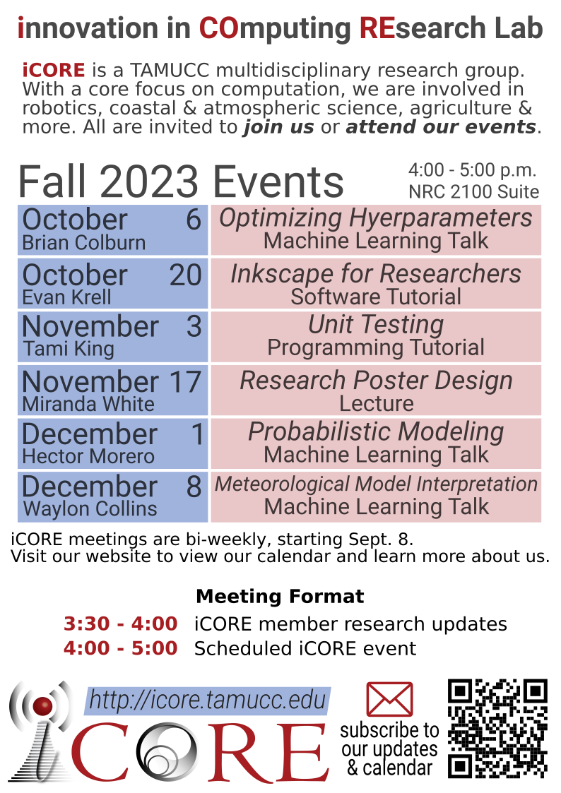
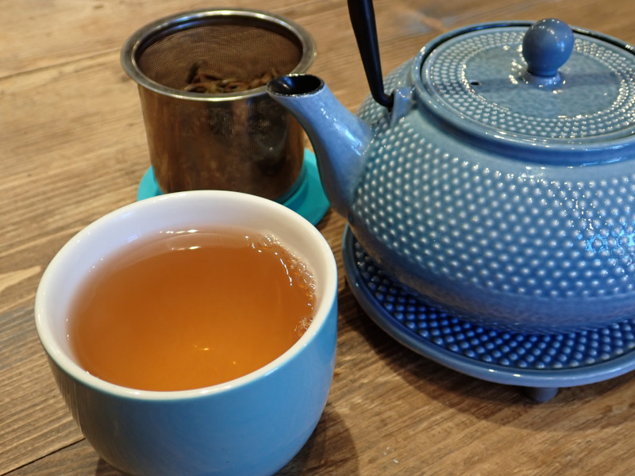
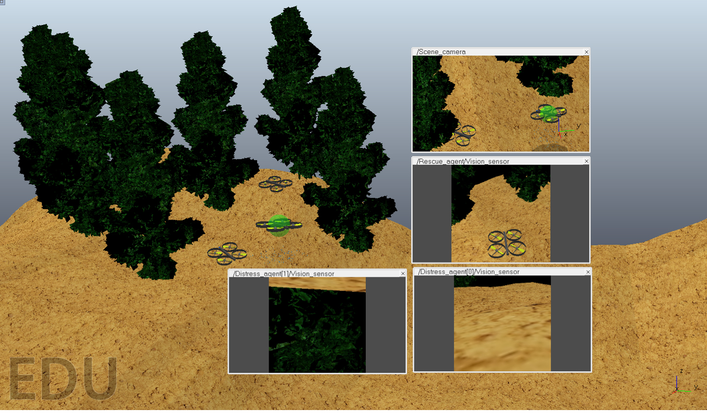
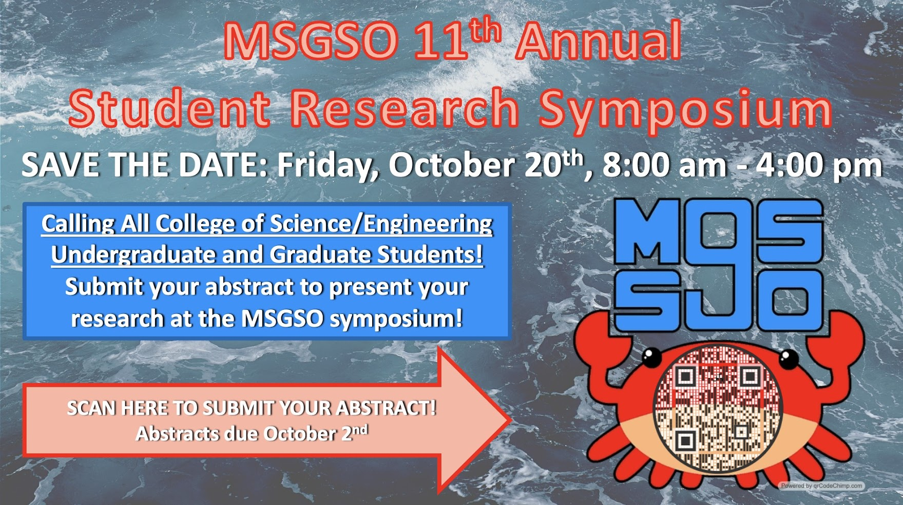
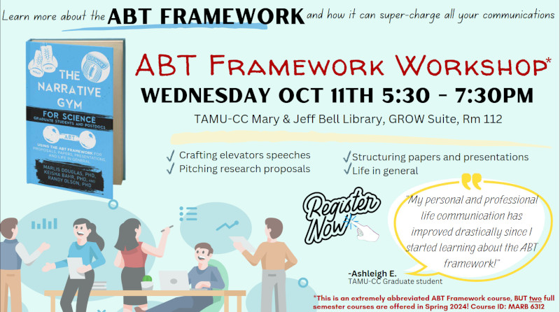
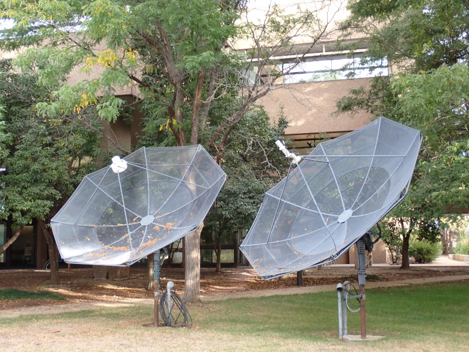
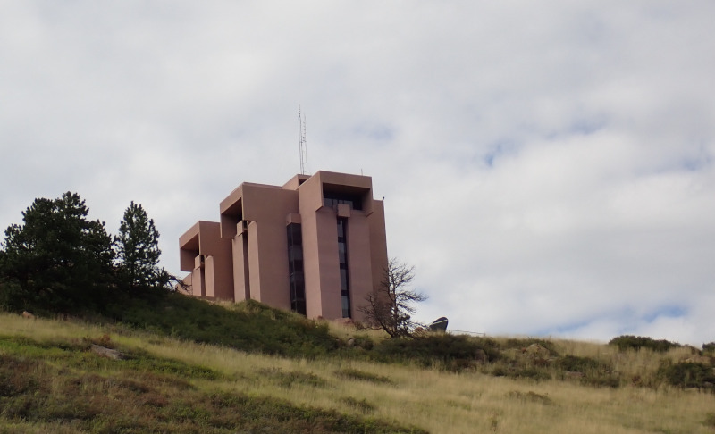
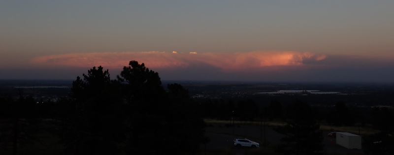

# iCORE Newsletter – 2023/09/29

The iCORE newsletter highlights events and information related to the [innovation in COmputing REsearch (iCORE) lab](https://icore.tamucc.edu/),
as well as the broader GSCS/CS programs at Texas A&M University - Corpus Christi and whatever else might interest that community.
If you have any news or resources you would like to share, send an email to [Evan Krell](https://scholar.google.com/citations?user=jLuwYGAAAAAJ&hl=en) (ekrell@islander.tamucc.edu).

[See past newsletters.](https://github.com/ekrell/icore_website/tree/main/news)

## Welcome

Greetings from Ft. Collins, Colorado. I, Evan, am writing this newsletter from my temporary desk at the Cooperative Institute for Research in the Atmosphere (CIRA).
I am spending a month in Colorado for research. First, I spent a week in Boulder to attend two conferences that I'll report on below. I then transferred to an AirBnB in Ft. Collins where I'm spending the remaining three weeks doing research with Dr. Imme Ebert-Uphoff. I am working on my dissertation research related to addressing challenges in applying explainable AI (XAI) techniques to geoscience models that use gridded spatial data inputs. The above image shows that I managed the ~9-mile ride to CIRA using my rental bike.  

## iCORE Meetings

**[iCORE Teams meeting link](https://teams.microsoft.com/l/meetup-join/19%3Ameeting_MDdlZDBiMTgtYzVjNS00YjhhLWE5OTctY2Y5YzMyYTljNzU5%40thread.v2/0?context=%7B%22Tid%22%3A%2234cbfaf1-67a6-4781-a9ca-514eb2550b66%22%2C%22Oid%22%3A%22994c008b-0707-4f3c-8ac0-73b65e733430%22%2C%22MessageId%22%3A%220%22%7D)**

### Fall 2023 iCORE Event Calendar

### Previous Meeting: September 22, 3:30 - 5:30

- I was not at the meeting, or at least I was trying not to be at the meeting. 
- It likely went over general updates and planning for the Google visit that took place on the 26th.
- I had just gotten out of a conference and was soon to travel from Boulder to Ft. Collins.
- In the meantime, I was relaxing with some tea at [Ku Cha](https://www.kuchatea.com/).
- While trying to enjoy my tea, I got a text from Dr. King that no one but me could start the Teams meeting.
- As usual, I had to save the day since iCORE can't function 5 minutes without me.

### Next Meeting: October 6

- 3:30pm - 4:00pm: iCORE member updates
- 4:00pm - 5:00pm: **Event: Machine Learning Talk: Optimizing Hyperparameters** (description below)

## Upcoming Events

### Machine Learning Talk: Optimizing Hyperparameters

- Speaker: Brian Colburn, (undergraduate research assistant in the [Coastal Dynamics Lab](https://www.coastaldynamicslab.org/) & [AI2ES](https://www.ai2es.org/)
- He is working on a coastal fog prediction model using variational autoencoders
- Over the past year, he has worked extensively with hyperparameter tuning systems
- He is planning to share some of his insights and strategies

## Recent News

### Marina Vicens-Miquel presented at the AI2ES site-wide meeting

- The talk highlighted the international collaboration between AI2ES and the University of Valencia
- Speakers include our own [Marina Vicens-Miquel](https://marinavicensmiquel.github.io/main.html) as well as Veronica Nieves, Cristina Radin, Javier Martinez Amaya
- The recording and slides will eventually be found [here](https://www.ai2es.org/publications/ai2es-talks/)

### New Journal Paper from Abhishek Phadke

- [Abhishek](https://sites.google.com/view/abhishek-phadke) has published another paper
- [Examining application-specific resiliency implementations in UAV swarm scenarios](https://intellrobot.com/article/view/6159 )
- Authors: Abhishek Phadke & F. Antonio Medrano
- The article is Open Access and published in the journal [Intelligence & Robotics](https://intellrobot.com/)

### MSGSO 11th Annual Student Research Symposium

- The [Marine Science Graduate Student Organization (MSGSO)](https://msgsoresearchforum.wixsite.com/msgsosymposium) is hosting a research forum at TAMUCC.
- This is open to all undergraduate & graduate students in the College of Science & College of Engineering.
- To clarify, this is not limited to marine science topics. 
- **When:** Friday, October 20th 2023,  08:00 am - 05:00 pm.
- [**Submit your abstract by Oct. 2.**](https://msgsoresearchforum.wixsite.com/msgsosymposium).
- Please share broadly.

### ABT Framework Workshop (science communication skills)

- GROW is hosting a workshop on science communication
- **Speaker:** [Dr. Keisha Bahr](https://www.harteresearch.org/people/keisha-bahr), director of the [Bahr Lab](http://www.bahrlab.com/)
- **When:** Wednesday October 11th from 5:30-7:30
- **Where:** GROW Suite in the Library

## Evan's Colorado Research Adventure (Part One)

### DoD Post Cloud Post-Processing and Verification Workshop (September 13 - 14)

Jason Nachamkin, Chuyen Nguyen, and others from the Naval Research Lab (NRL) - Monterey organized a DoD workshop that was held at the NCAR Foothills campus in Boulder, CO. My Colorado adventure began by attending this workshop along with Dr. King and Dr. Tissot. This was a small, 2-day workshop where all talks occurred in a single meeting room. There were many science talks. Most were very specific in dealing directly with cloud models and their evaluation. Others were more general, such as an XAI talk from [David John Gagne](https://staff.ucar.edu/users/dgagne) and my own talk on XAI challenges related to geospatial models. There were also panel discussions to facilitate interaction between the atmospheric modeling community and military decision-makers. Of major interest is avoiding [icing hazards during flight](https://www.weather.gov/source/zhu/ZHU_Training_Page/icing_stuff/icing/icing.htm). Very accurate forecasts are of critical interest to the military. 

- Evan Krell's [presentation recording](https://www.youtube.com/watch?v=dHMcvaBCE5k&t=14650s) & [slides](https://cpaess.ucar.edu/sites/default/files/2023-dod-presentation/krell-dod-2023.pdf).

### Energy, Fire, and Changing Landscapes – Satellite Applications (September 21 - 22)

The week after, I attended another conference. Since I was already in Boulder, we decided that I should at least check it out since I am interested in satellite data and have worked with NRL for predicting [pyrocumulonimbus](https://en.wikipedia.org/wiki/Cumulonimbus_flammagenitus) events based on NWP atmospheric data and satellite fire data. The [workshop](https://eap.wisc.edu/2023-conference-ncar/) took place at the NCAR Mesa lab: a notable architectural achievement by [Ieoh Ming Pei](https://en.wikipedia.org/wiki/I._M._Pei) and featured in the Woody Allen film [Sleeper](https://en.wikipedia.org/wiki/Sleeper_(1973_film)). The event turned out a little different than I expected: its purpose was to connect the energy companies with fire researchers so that they can incorporate better wildfire forecasts into their decision-making. These are all Western energy companies, and they face many challenges related to wildfires. A big issue is that the grid itself is responsible for a large number of fires. So, they rely on accurate predictions to determine when there is a risk of triggering a fire. In this case, they initiate a preventative power shutoff. This prevents triggering wildfires but comes at a great cost to the customers, especially those relying on electricity for medical equipment. So, the focus is on improved modeling capabilities. It was all very interesting to hear their perspectives. An important point was the need for higher-resolution satellite data. The polar-orbiting satellites (e.g. VIIRS) have the spatial resolution to analyze their utilities, but the temporal resolution is far too low. By the time the satellite passes over the area of interest, critical events have occurred. The geostationary instruments (e.g. MODIS) are fixed in place and thus have very high temporal resolution but the imagery is too coarse for their needs. [Recordings will be available here](https://eap.wisc.edu/2023-conference-ncar-speakers-and-sessions/). Below is a beautiful sunset taken from the MESA lab after the first day. 

### Shorts Adventure

Between conferences, my typical Boulder schedule was to go out exploring in the morning and spend the rest of my time working in my Residence Inn & Suites. I had no car, so I generally got around on foot. It is only an hour to get to the downtown area with the all the restaurants and shops. Eventually, that main street (pearl street) turns into neighborhood of very large houses nestled among the trees. Eventually the street terminates at a trailhead called The People's Crossing. There is a very large network of connected trails with nearby parks and creeks. This is the story of one such outing. 

### Hiking Mount Sanitas

### Formosa Bakery

### Ft. Collins Night Ride

