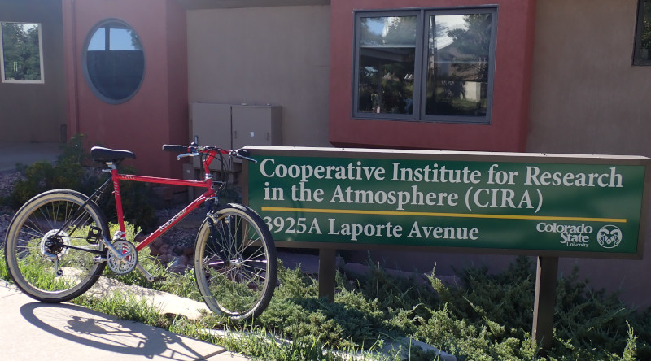

# iCORE Newsletter – 2023/09/04

The iCORE newsletter highlights events and information related to the [innovation in COmputing REsearch (iCORE) lab](https://icore.tamucc.edu/),
as well as the broader GSCS/CS programs at Texas A&M University - Corpus Christi and whatever else might interest that community.
If you have any news or resources you would like to share, send an email to [Evan Krell](https://scholar.google.com/citations?user=jLuwYGAAAAAJ&hl=en) (ekrell@islander.tamucc.edu).

[See past newsletters.](https://github.com/ekrell/icore_website/tree/main/news)

## Welcome

Greetings from Ft. Collins, Colorado. I, Evan, am writing this newsletter from my temporary desk at the Cooperative Institute for Research in the Atmosphere (CIRA).
I am spending a month in Colorado for research. First, I spent a week in Boulder to attend two conferences that I'll report on below. I then transferred to an AirBnB in Ft. Collins where I'm spending the remaining three weeks doing research with Dr. Imme Ebert-Uphoff. I am working on my dissertation research related to addressing challenges in applying explainable AI (XAI) techniques to geoscience models that use gridded spatial data inputs. The above image shows that I managed the ~9-mile ride to CIRA using my rental bike.  
