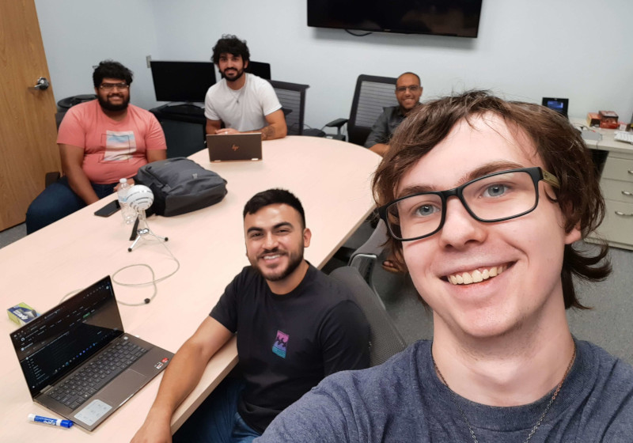
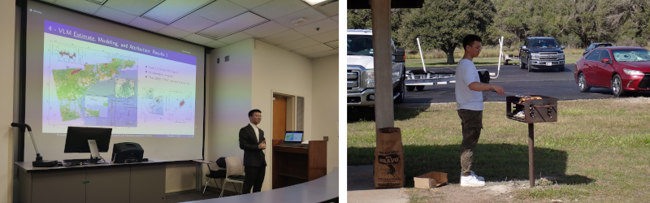

# iCORE Newsletter – 2023/11/07

The iCORE newsletter highlights events and information related to the [innovation in COmputing REsearch (iCORE) lab](https://icore.tamucc.edu/),
as well as the broader GSCS/CS programs at Texas A&M University - Corpus Christi and whatever else might interest that community.
If you have any news or resources you would like to share, send an email to [Evan Krell](https://scholar.google.com/citations?user=jLuwYGAAAAAJ&hl=en) (ekrell@islander.tamucc.edu).

[See past newsletters.](https://github.com/ekrell/icore_website/tree/main/news)

## Welcome

## iCORE Meetings

**[iCORE Teams meeting link](https://teams.microsoft.com/l/meetup-join/19%3Ameeting_MDdlZDBiMTgtYzVjNS00YjhhLWE5OTctY2Y5YzMyYTljNzU5%40thread.v2/0?context=%7B%22Tid%22%3A%2234cbfaf1-67a6-4781-a9ca-514eb2550b66%22%2C%22Oid%22%3A%22994c008b-0707-4f3c-8ac0-73b65e733430%22%2C%22MessageId%22%3A%220%22%7D)**

### Fall 2023 iCORE Event Calendar

### Previous Meeting: November 3, 3:30 - 5:00 PM

Last Friday, iCORE hosted a great talk on Automated Testing from Tami King. She presented test-driven development concepts such as _unit testing_, _integration testing_, and _acceptance testing_. Python and Ruby code examples included _test discovery_, _grouping tests_, _fixtures_, _markers_, and _mocking_. Thanks to the fifteen people who joined us either in person or online for the presentation. The material was highly relevant to programmers and _test-driven development_ is something that most of us don't do but should. 

### Next Meeting: November 17, 3:30 - 5:00 PM

- **3:30 - 4:00 PM:** General updates
- **4:00 - 5:00 PM:** Research Poster Design lecture by Miranda White

## Upcoming Events

### Lecture: Research Poster Design

- Speaker: [Miranda White](https://www.linkedin.com/in/miranda-white-859b2414a/) 
- When: Friday, Nov. 17, 4:00 - 5:00 PM
- Where: iCORE (NRC 2100 suite)

Miranda White will share some of her strategies for successful poster design. She won first place in the student poster competition at AMS 2022 for her poster: [AI Ensemble Predictions for Cold Stunning Events in the Shallow Laguna Madre](https://ams.confex.com/ams/103ANNUAL/meetingapp.cgi/Paper/418860). We can all learn a lot from her insights. I would recommend any students with upcoming poster presentations to attend. I think that the AI2ES undergrads might be in big trouble if they don't...

### New group at iCORE: Computer Science Interview Practice Club

- When: Thursdays at 4:00 PM
- Where: iCORE (NRC 2100 suite)
- Contact: Matthew Kastl (mkastl@islander.tamucc.edu)
- [Discord](https://discord.gg/ThpnUPZAcf)

iCORE is now hosting the Computer Science Interview Practice Club, a **student-run** group for practicing interview questions. Many software development companies use a mix of technical and coding questions to compare and contrast applicants. The CS Interview Practice Club meets to practice coding skills and others to ensure that they are ready for highly competitive CS jobs. They use a book called [Cracking the Coding Interview](https://www.crackingthecodinginterview.com/). Anyone can attend, and I highly encourage CS undergrads to check it out. While I understand that fixing a segmentation fault is its own reward, I've heard that some people receive money for doing this and it would be nice to get some of that bread. To get involved, please check out the [discord](https://discord.gg/ThpnUPZAcf) or email Matthew Kastl at mkastl@islander.tamucc.edu. 

### News

### Xiaojun Qiao has successfully defended his PhD proposal in the Geospatial Computer Science program

Last Friday, Xiaojun Qiao successfully defended his dissertation! Can you believe that the very next day, the doctor had to grill his own celebration dinner while I just lounged in my chair and watched it happen? Be sure to give Xiaojun your congrats. He is properly a member of the [MANTIS](https://mantisresearch.org/) lab, but has long been a supporter of iCORE events and has collaborated with iCORE members. Most recently, for applying XAI for subsidence modeling. As of now, he has 5 papers: 3 are published or accepted and 2 more are under review. More importantly, he is very good at making dumplings and grilling chicken. 

### Evan Krell's PhD Proposal has been delayed

- He was scheduled to present last Friday @ noon
- But one small problem: his graduate faculty representative quit and he didn't know
- So he can't reschedule until the school decides his next GFR

### Open Source Computer Vision & AI Library OpenCV Needs Support 

This tip comes from iCORE alumni [Alexis Guijarro](https://toton.dev/). OpenCV is one of the most used libraries for computer vision and is a critical component in countless AI projects, both research and operational. However, they have had some trouble pushing OpenCV version 5 due to a lack of funds. So consider [supporting OpenCV](https://www.indiegogo.com/projects/opencv-5-support-non-profit-open-source-cv-ai#/), especially if you are among the thousands using it in their projects. Obviously, most of us are students with limited funds, but it doesn't hurt to spread the word. Another way to help is to share your projects with the OpenCV community. They are looking for examples of projects that they can share in their newsletters, blogs, and other promotional media. Here is the [submission form](https://form.jotform.com/233105358823151). 

### Dr. King & Evan Krell are headed to New Zealand to establish international research collaborations for AI2ES

Part of [AI2ES](https://www.ai2es.org/) is to establish international research collaborations. So, Evan and Dr. King will be spending 2 weeks in New Zealand to work with some of Dr. King's colleagues from Auckland University on the North Island and the University of Otago on the South Island. We will keep the iCORE community updated on our adventures. 

## Upcoming Conferences

### AGU Annual Meeting 2023 (San Francisco, CA)

| **Speaker** | **When**               | **Topic**                                                                                                                                                                     | 
|-------------|------------------------|-------------------------------------------------------------------------------------------------------------------------------------------------------------------------------|
| Wen Zhong   | Dec. 12, 18:24 - 18:27 | The Impact of Potential Land Subsidence on a Future DEM Based on InSAR, Airborne LiDAR, and Deep Learning                                                                     | 
| Marina Vicens-Miquel | Dec. 15, 16:10 - 20:30 | Advancing Coastal Inundation Frequency Predictions with an AI-based Sub-seasonal to Multi-year Water Level Model in the Gulf of Mexico                                        | 
| Evan Krell  | Dec. 15, 10:30 - 14:50 | Exploring the Influence of Correlated Features on Geoscience AI Models to Improve the Scientific Insights Gained From Using Explainable AI Techniques for Feature Attribution | 

## Get involved

As always, we encourage all iCORE members and iCORE-adjacent persons to get involved and propose workshop/lecture/training ideas that they would like to present.

## iCORE resources

- location: NRC 2100 Suite (https://goo.gl/maps/Htbp1YMASAmYqkFu9)
- website: http://icore.tamucc.edu/
- twitter: https://twitter.com/ICORE_TAMUCC
- youtube: https://www.youtube.com/channel/UCvsK07PvushTI2BA2BhN-DQ
- discord: https://discord.gg/3eeMN229cr
