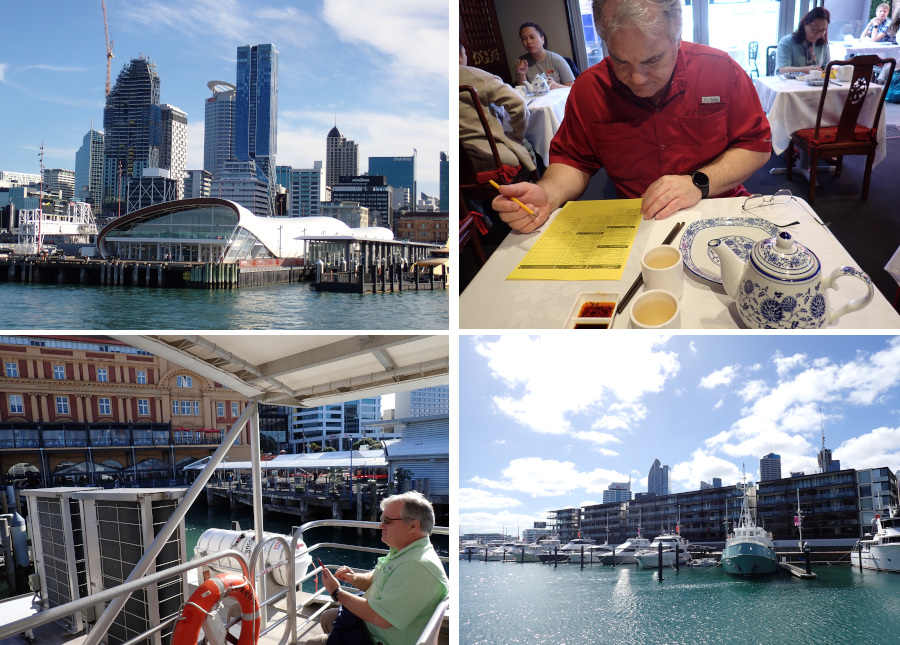
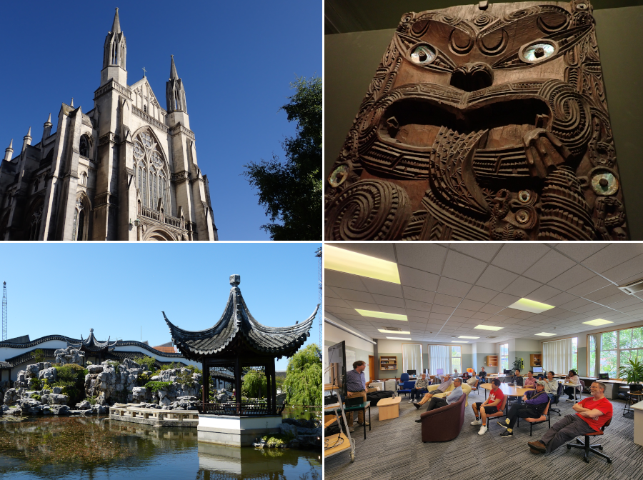

# iCORE Newsletter – 2023/11/07

The iCORE newsletter highlights events and information related to the [innovation in COmputing REsearch (iCORE) lab](https://icore.tamucc.edu/),
as well as the broader GSCS/CS programs at Texas A&M University - Corpus Christi and whatever else might interest that community.
If you have any news or resources you would like to share, send an email to [Evan Krell](https://scholar.google.com/citations?user=jLuwYGAAAAAJ&hl=en) (ekrell@islander.tamucc.edu).

[See past newsletters.](https://github.com/ekrell/icore_website/tree/main/news)

## Welcome

## iCORE Meetings

**[iCORE Teams meeting link](https://teams.microsoft.com/l/meetup-join/19%3Ameeting_MDdlZDBiMTgtYzVjNS00YjhhLWE5OTctY2Y5YzMyYTljNzU5%40thread.v2/0?context=%7B%22Tid%22%3A%2234cbfaf1-67a6-4781-a9ca-514eb2550b66%22%2C%22Oid%22%3A%22994c008b-0707-4f3c-8ac0-73b65e733430%22%2C%22MessageId%22%3A%220%22%7D)**

### Fall 2023 iCORE Event Calendar

### Previous Meeting: November 17, 3:30 - 5:00 PM

Miranda White shared with us her knowledge about creating high-quality research posters. I wasn't there, but I heard that it was very well received by the audience. It is no surprise since Miranda is very good at presenting and has won first place in the student poster competition at AMS 2022: [AI Ensemble Predictions for Cold Stunning Events in the Shallow Laguna Madre](https://ams.confex.com/ams/103ANNUAL/meetingapp.cgi/Paper/418860).

### Next Meeting: December 1, 3:30 - 5:00 PM

- **3:30 - 4:00 PM:** General updates
- **4:00 - 5:00 PM:** Machine Learning Talk: Probabilistic Modeling by Hector Marrero-Colominas

## Upcoming Events

### Machine Learning Talk: Probabilistic Modeling

- Speaker: Hector Marrero-Colominas
- When: Friday, Dec. 1, 4:00 - 5:00 PM
- Where: iCORE (NRC 2100 suite)

Hector Marrero-Colominas is a Computer Science major at Del Mar College as well as an Undergraduate Research Assistant here at TAMUCC as part of AI2ES.
Hector spent Summer 2023 working with the University of Oklahoma's [Interaction, Discovery, Exploration, Adaptation Laboratory (IDEA)](https://www.mcgovern-fagg.org/idea/). 
Under the co-supervision of Monique Shotande, Andrew Fagg, and AI2ES principal investigator Amy McGovern, Hector learned a lot about probabilistic modeling is willing to share some of that knowledge with us at iCORE. You can learn more about Hector's summer research with the IDEA lab in the [AI2ES July 2023 newsletter](https://www.ai2es.org/wp-content/uploads/2023/08/July-AI2ES-Newsletter-2023.2.pdf). 

## News

### Dr. King & Evan Krell's New Zealand Research Adventure

I am writing this newsletter from my hotel in Auckland, a coastal city in New Zealand's North Island. Dr. King and I have spent the last 2 weeks in NZ with a mission to establish international research collaborations within AI2ES. First, we spent a couple days in Auckland to visit Dr. Patrice Delmas, director of the Intelligent Vision Systems Lab (IVSLab) at The University of Auckland. They are very involved with deploying vision systems for marine applications. They work closely with the marine science department for data collection, and develop computer vision algorithms for a variety of applications involving underwater and aerial imaging platforms. We had a lot of discussions about sea turtles and the potential for detecting [arribada events](https://www.nps.gov/pais/learn/nature/kempsridleystory.htm). 

We then flew to Dunedin in the South Island to meet with AI researchers from the University of Otago: Dr. Lech Szymanski & Dr. Brendan McCane. Here, we started laying the foundation for multiple project ideas. Dr. Szymanski has developed a novel XAI method, but stopped working on it because of the problem of assessing XAI. I am currently working on XAI benchmarks with Dr. Imme Ebert-Uphoff and Dr. Antonios Mamalakis. After our discussions, Dr. Szymanski applied his technique, [Switched Linear Projections (SLP)](https://github.com/lechszym/slp), to the benchmarks and initial results suggest that the method is competitive with others and may have some advantages. We also started developing ideas for an AI2ES project using [Generative Flow Networks]((https://yoshuabengio.org/2022/03/05/generative-flow-networks/) for causal discovery. In the short time, I'll be learning about the technique but plan to apply it to a coastal dataset soon.

I spent four days sick in Dunedin, so I missed a weekend of the trip. I still had work to do, and gave a presentation on FogNet to our colleagues from my hotel. In-person, I later gave a very casual presentation on what I learned about causal discovery as well as another on XAI benchmarks to the university's AI group. The audience was a good size with both faculty and grad students. I received some very good feedback from scientists at the University of Otago that should enrich my dissertation work. 

Dr. King has returned to Corpus, but I am staying a few extra nights just to play. Notice that I am taking time from a vacation evening to write this newsletter.

## Upcoming Conferences

### AGU Annual Meeting 2023 (San Francisco, CA)

| **Speaker** | **When**               | **Topic**                                                                                                                                                                     | 
|-------------|------------------------|-------------------------------------------------------------------------------------------------------------------------------------------------------------------------------|
| Wen Zhong   | Dec. 12, 18:24 - 18:27 | The Impact of Potential Land Subsidence on a Future DEM Based on InSAR, Airborne LiDAR, and Deep Learning                                                                     | 
| Marina Vicens-Miquel | Dec. 15, 16:10 - 20:30 | Advancing Coastal Inundation Frequency Predictions with an AI-based Sub-seasonal to Multi-year Water Level Model in the Gulf of Mexico                                        | 
| Evan Krell  | Dec. 15, 10:30 - 14:50 | Exploring the Influence of Correlated Features on Geoscience AI Models to Improve the Scientific Insights Gained From Using Explainable AI Techniques for Feature Attribution | 

## Get involved

As always, we encourage all iCORE members and iCORE-adjacent persons to get involved and propose workshop/lecture/training ideas that they would like to present.

## iCORE resources

- location: NRC 2100 Suite (https://goo.gl/maps/Htbp1YMASAmYqkFu9)
- website: http://icore.tamucc.edu/
- twitter: https://twitter.com/ICORE_TAMUCC
- youtube: https://www.youtube.com/channel/UCvsK07PvushTI2BA2BhN-DQ
- discord: https://discord.gg/3eeMN229cr
