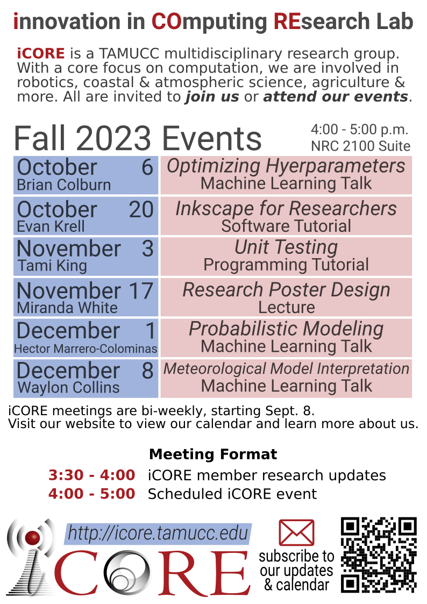

# iCORE Newsletter – 2023/12/04

The iCORE newsletter highlights events and information related to the [innovation in COmputing REsearch (iCORE) lab](https://icore.tamucc.edu/),
as well as the broader GSCS/CS programs at Texas A&M University - Corpus Christi and whatever else might interest that community.
If you have any news or resources you would like to share, send an email to [Evan Krell](https://scholar.google.com/citations?user=jLuwYGAAAAAJ&hl=en) (ekrell@islander.tamucc.edu).

[See past newsletters.](https://github.com/ekrell/icore_website/tree/main/news)

## Welcome

A beautiful sunset (11/03) as seen from the TAMUCC hike & bike trail. 

## iCORE Meetings

**[iCORE Teams meeting link](https://teams.microsoft.com/l/meetup-join/19%3Ameeting_MDdlZDBiMTgtYzVjNS00YjhhLWE5OTctY2Y5YzMyYTljNzU5%40thread.v2/0?context=%7B%22Tid%22%3A%2234cbfaf1-67a6-4781-a9ca-514eb2550b66%22%2C%22Oid%22%3A%22994c008b-0707-4f3c-8ac0-73b65e733430%22%2C%22MessageId%22%3A%220%22%7D)**

### Fall 2023 iCORE Event Calendar

We have one more event before wrapping up the semester. Soon, we'll start thinking about next semester's events.

### Previous Meeting: December 1, 3:30 - 5:00 PM

Hector Marrero-Colominas, an undergraduate researcher in AI2ES, gave an excellent presentation on using probabilistic modeling to provide uncertainty estimates to stakeholders that rely on water temperature predictions for managing port traffic during cold-stunned sea turtle events in the Laguna Madre. This was followed by a good discussion about modeling, visualization, and designing systems to meet user's needs. 

### Next Meeting: December 8, 3:30 - 5:00 PM

**Off-schedule meeting**: We met last week, but are meeting again to enjoy a talk from Waylon Collins.
There will be snacks from V-Mart. 

- **3:30 - 4:00 PM:** General updates
- **4:00 - 5:00 PM:** Machine Learning Talk: Meteorological Model Interpretation by Waylon Collins

## Upcoming Events

### Machine Learning Talk: Probabilistic Modeling

- Title: Application of XAI methods to a 3D Convolutional Neural Network Fog Prediction Model: Meteorological Interpretations of Output
- Speaker: Meteorological Model Interpretation
- When: Friday, Dec. 8, 4:00 - 5:00 PM
- Where: iCORE (NRC 2100 suite)

## News

## Upcoming Conferences

### AGU Annual Meeting 2023 (San Francisco, CA)

| **Speaker** | **When**               | **Topic**                                                                                                                                                                     | 
|-------------|------------------------|-------------------------------------------------------------------------------------------------------------------------------------------------------------------------------|
| Wen Zhong   | Dec. 12, 18:24 - 18:27 | The Impact of Potential Land Subsidence on a Future DEM Based on InSAR, Airborne LiDAR, and Deep Learning                                                                     | 
| Marina Vicens-Miquel | Dec. 15, 16:10 - 20:30 | Advancing Coastal Inundation Frequency Predictions with an AI-based Sub-seasonal to Multi-year Water Level Model in the Gulf of Mexico                                        | 
| Evan Krell  | Dec. 15, 10:30 - 14:50 | Exploring the Influence of Correlated Features on Geoscience AI Models to Improve the Scientific Insights Gained From Using Explainable AI Techniques for Feature Attribution | 

## Get involved

As always, we encourage all iCORE members and iCORE-adjacent persons to get involved and propose workshop/lecture/training ideas that they would like to present.

## iCORE resources

- location: NRC 2100 Suite (https://goo.gl/maps/Htbp1YMASAmYqkFu9)
- website: http://icore.tamucc.edu/
- twitter: https://twitter.com/ICORE_TAMUCC
- youtube: https://www.youtube.com/channel/UCvsK07PvushTI2BA2BhN-DQ
- discord: https://discord.gg/3eeMN229cr

