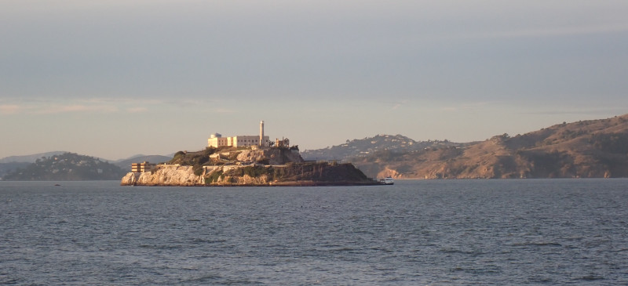
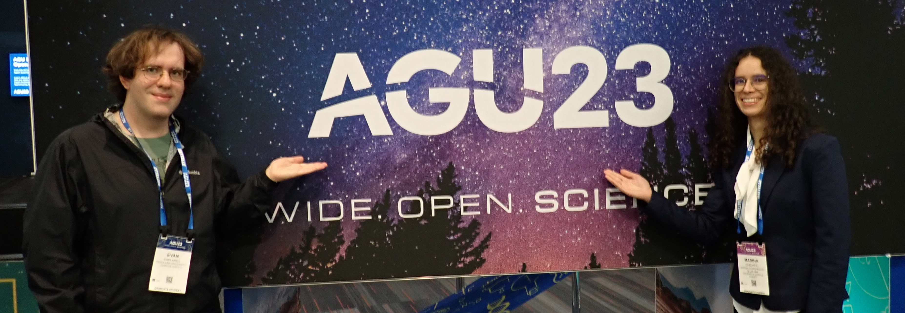
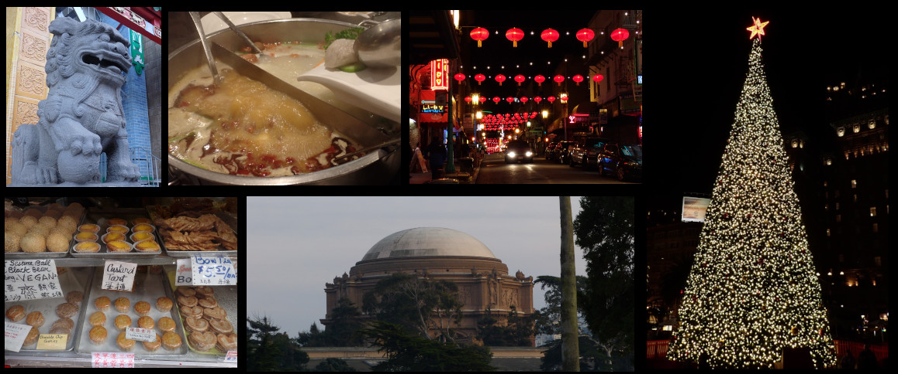

# iCORE Newsletter – 2024/01/18

The iCORE newsletter highlights events and information related to the [innovation in COmputing REsearch (iCORE) lab](https://icore.tamucc.edu/),
as well as the broader GSCS/CS programs at Texas A&M University - Corpus Christi and whatever else might interest that community.
If you have any news or resources you would like to share, send an email to [Evan Krell](https://scholar.google.com/citations?user=jLuwYGAAAAAJ&hl=en) (ekrell@islander.tamucc.edu).

[See past newsletters.](https://github.com/ekrell/icore_website/tree/main/news)

## Welcome

Alcatraz Island, seen during our conference trip [AGU Fall Meeting 2023](https://www.agu.org/fall-meeting) in San Francisco, CA.

## iCORE Meetings

**[iCORE Teams meeting link](https://teams.microsoft.com/l/meetup-join/19%3Ameeting_NzFjYmU3NWQtYWM4OS00ZGE3LTk1NWEtZjU4NDMzODE5ZWZi%40thread.v2/0?context=%7B"Tid"%3A"34cbfaf1-67a6-4781-a9ca-514eb2550b66"%2C"Oid"%3A"994c008b-0707-4f3c-8ac0-73b65e733430"%2C"MessageId"%3A"0"%7D](https://teams.microsoft.com/l/meetup-join/19%3Ameeting_NzFjYmU3NWQtYWM4OS00ZGE3LTk1NWEtZjU4NDMzODE5ZWZi%40thread.v2/0?context=%7B%22Tid%22%3A%2234cbfaf1-67a6-4781-a9ca-514eb2550b66%22%2C%22Oid%22%3A%22994c008b-0707-4f3c-8ac0-73b65e733430%22%2C%22MessageId%22%3A%220%22%7D)**

### Next Meeting: January 19, 3:00 - 5:00 PM

- **Event:** Evan Krell's practice lecture for [AMS Short Course: Machine Learning in Python for Environmental Science Problems](https://www.ametsoc.org/index.cfm/ams/education-careers/careers/professional-development/short-courses/machine-learning-in-python-for-environmental-science-problems2/)

### Events

### Machine Learning Talk: Evan Krell's [AMS Short Course](https://www.ametsoc.org/index.cfm/ams/education-careers/careers/professional-development/short-courses/machine-learning-in-python-for-environmental-science-problems2/) Practice Lecture

- Title: practice lecture for [AMS Short Course: Machine Learning in Python for Environmental Science Problems](https://www.ametsoc.org/index.cfm/ams/education-careers/careers/professional-development/short-courses/machine-learning-in-python-for-environmental-science-problems2/)
- Speaker: [Evan Krell](https://ekrell.github.io/)
- When: Friday, January 19, 3:00 - 5:00 PM
- Where: iCORE (NRC 2100 suite)

**AMS Short Course**

- The American Meteorological Society (AMS) hosts an annual meeting that consists of many conferences. 
- The [23rd Conference on Artificial Intelligence for Environmental Science](https://annual.ametsoc.org/index.cfm/2024/program-events/conferences-and-symposia/23rd-conference-on-artificial-intelligence-for-environmental-science/) is an important conference for many of us who are associated with [AI2ES]().
- [Evan Krell](https://ekrell.github.io/) is a student member of the [AMS AI Committee](https://www.ametsoc.org/index.cfm/stac/committees/committee-on-artificial-intelligence-applications-to-environmental-science/) and is working with other [AI2ES](https://www.ai2es.org/) members to develop and teach a single-day short course on [Machine Learning in Python for Environmental Science Problems](https://www.ametsoc.org/index.cfm/ams/education-careers/careers/professional-development/short-courses/machine-learning-in-python-for-environmental-science-problems2/).
  - Other course instructors: [Kara D. Lamb](https://kdlamb.github.io/), [Maria Molina](https://staff.ucar.edu/users/molina), and iCORE alumni [Hamid Kamangir](https://scholar.google.com/citations?user=YLYJGQ8AAAAJ&hl=en). 

**iCORE Practice Session**

- For tomorrow's practice, Evan will present his two course modules:
  1. Data Preprocessing
  2. EXplainable AI (XAI)
- The presentation format is Google Colab notebooks, so feel free to access the notebooks and follow along
- [Link to GitHub repo with the Colab notebooks](https://github.com/ekrell/ams_ai_shortcourse_2024)  <-- Private until tomorrow
- There are a few exercises for the class participants. These have not been tested, so... you could be a guinea pig. 

## Recent Events

### AGU Fall Meeting 2023

Last month, several of us went to the [AGU Fall Meeting 2023](https://www.agu.org/fall-meeting) in San Francisco, CA. 
Several of us in iCORE or the GSCS program presented: [Marina Vicens-Miquel](https://marinavicensmiquel.github.io/cv.html), [Wen Zhong](https://scholar.google.com/citations?user=Xj3uOfUAAAAJ&hl=en), [Evan Krell](), and [Lapone Techapinyawat](https://www.wesalab.com/team-members). 

**[San Francisco Adventure Photo Album](../img/AGU_2023_SanFrancisco.pdf)**

## Get involved

As always, we encourage all iCORE members and iCORE-adjacent persons to get involved and propose workshop/lecture/training ideas that they would like to present.

## iCORE resources

- location: NRC 2100 Suite (https://goo.gl/maps/Htbp1YMASAmYqkFu9)
- website: http://icore.tamucc.edu/
- twitter: https://twitter.com/ICORE_TAMUCC
- youtube: https://www.youtube.com/channel/UCvsK07PvushTI2BA2BhN-DQ
- discord: https://discord.gg/3eeMN229cr
