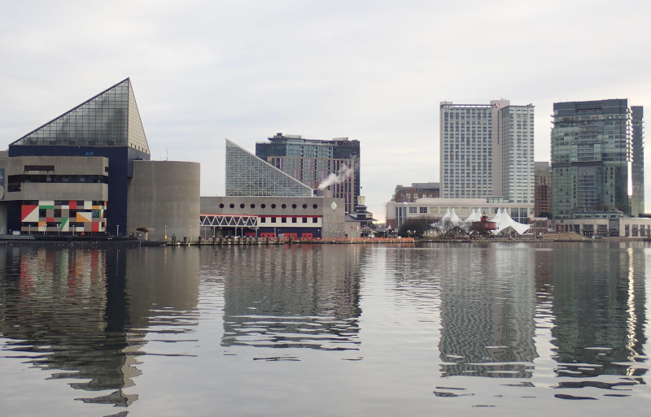
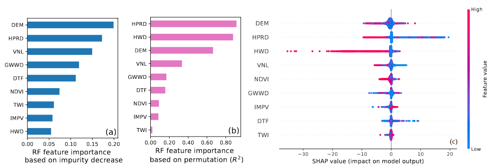
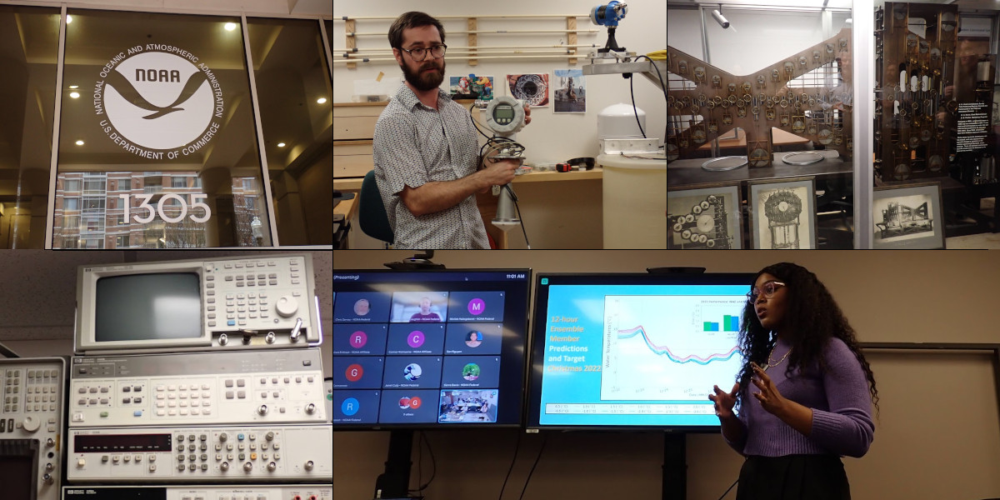
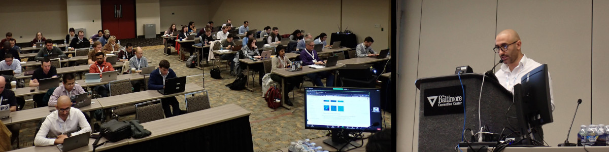
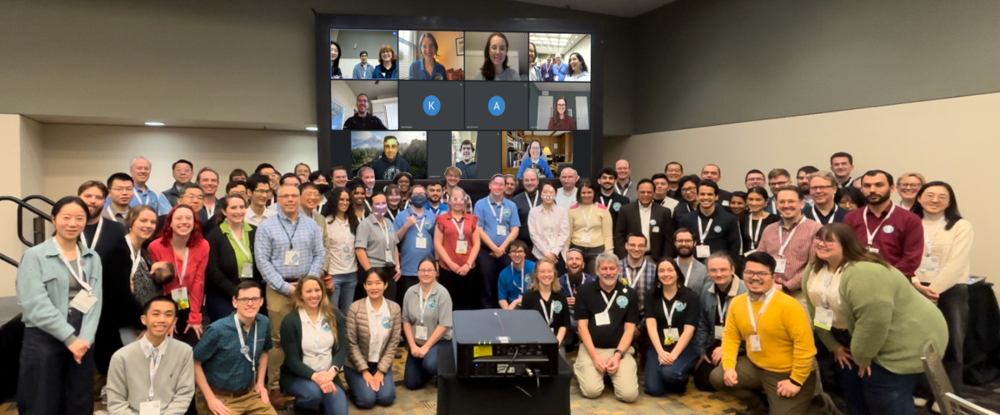
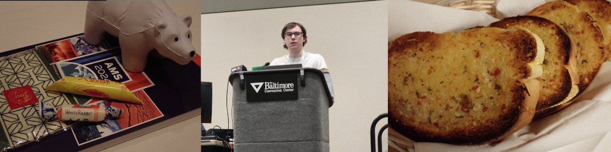
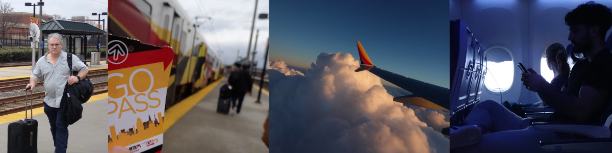

# iCORE Newsletter – 2024/02/06

The iCORE newsletter highlights events and information related to the [innovation in COmputing REsearch (iCORE) lab](https://icore.tamucc.edu/),
as well as the broader GSCS/CS programs at Texas A&M University - Corpus Christi and whatever else might interest that community.
If you have any news or resources you would like to share, send an email to [Evan Krell](https://scholar.google.com/citations?user=jLuwYGAAAAAJ&hl=en) (ekrell@islander.tamucc.edu).

[See past newsletters.](https://github.com/ekrell/icore_website/tree/main/news)

## Welcome

Baltimore Inner Harbor. Several of us were at the [104th AMS Annual Meeting](https://annual.ametsoc.org/index.cfm/2024/) last week that took place in Baltimore.

## iCORE Meetings

**[iCORE Teams meeting link](https://teams.microsoft.com/l/meetup-join/19%3Ameeting_NzFjYmU3NWQtYWM4OS00ZGE3LTk1NWEtZjU4NDMzODE5ZWZi%40thread.v2/0?context=%7B%22Tid%22%3A%2234cbfaf1-67a6-4781-a9ca-514eb2550b66%22%2C%22Oid%22%3A%22994c008b-0707-4f3c-8ac0-73b65e733430%22%2C%22MessageId%22%3A%220%22%7D)**

### Next Meeting: February 16, 3:30 - 5:00 PM

- Goals:
  1. Plan out the Spring semester events
  2. General research updates from iCORE members
  3. Introduce new iCORE members & help them get involved
 
## News

### New publication by Dr. Xiaojun Qiao

Dr. Qiao, recent GSCS PhD graduate, has returned to China after five years at TAMUCC. 
He has been a long-time iCORE supporter, attending most meetings and events. 
His research focuses on land subsidence. In this paper, he used machine learning for subsidence modeling 
and then used explainability techniques to investigate the influence of the input features on model decisions. 
He collaborated with iCORE member Evan Krell for the eXplainable AI component.

- **Title:** [Interpretation and Attribution of Coastal Land Subsidence: An InSAR and Machine Learning Perspective](https://ieeexplore.ieee.org/abstract/document/10418467)
- **Authors:** Xiaojun Qiao, Tianxing Chu, Evan Krell, Philippe Tissot, Seneca Holland, Mohamed Ahmed, Danielle Smilovsky
- **Journal:** [IEEE Journal of Selected Topics in Applied Earth Observations and Remote Sensing](https://ieeexplore.ieee.org/xpl/RecentIssue.jsp?punumber=4609443)
- Sample image below taken from the paper

## Recent Events

### 104th Annual Meeting of the American Meteorological Society

Dr. King, Evan Krell, and others in iCORE are part of [AI2ES](https://www.ai2es.org): an NSF institute for AI in environmental science with a strong focus on ensuring ethical and useful application of AI to solve societal problems. At TAMUCC, we form AI2ES's coastal group through the Conrad Blucher Institute. The details are a bit messy (there is [CBI](https://www.conradblucherinstitute.org/), [CDL](https://www.coastaldynamicslab.org/), iCORE, ...lots of logos to remember to add to my slides!) but the point is that 20 of us went to Baltimore to attend AMS. Most of these are local faculty and students, but some work with our team remotely. AMS is a great opportunity to catch up with the rest of AI2ES and other researchers applying AI to environmental science applications. I have attended the past four AMS annual meetings, and I have seen a rapid increase in the sophistication of AI being used. I remember at my first AMS, it seemed like every other model was a Random Forest. This year, generative models were the hot architecture of choice. There was also an increased focus on eXplainable AI and uncertainty quantification. 

#### NOAA CO-OPS Visit

A smaller number of our group flew to Baltimore early for a meeting with the NOAA CO-OPS team. We have been working with them to apply machine learning to detect bad water level sensor readings. iCORE's role was to refactor their Python code so that it could be run on HPC systems and take advantage of GPUs. The code is open source and [available on Github](https://github.com/NOAA-CO-OPS/wlai-uf-hackathon-2023). 

We were given a partial tour of the facilities and saw many interesting water sensors. But they had a fascinating piece of historical technology within their collection: an early 20th-century tide prediction machine. This is a crank-operated analog computer built from hand-crafted components. This beautiful machine is among ~20 similar devices created worldwide. It is still operational and we were given a short demonstration. Some contemporary photos are available [here](https://tidesandcurrents.noaa.gov/predma2.html) and there is plenty more information [available on Wikipedia](https://en.wikipedia.org/wiki/Tide-Predicting_Machine_No._2). 

We enjoyed talks on CO-OPS from Jimmy Spore & Lindsay Abrams. Our group then gave presentations from Philippe Tissot, Marina Vicens-Miquel, Marinda White, Matthew Kastl, and Evan Krell. (Beto was there, but just chillin'). After many great discussions, we headed back to Baltimore. 

#### Short Course

#### AI2ES Meeting

#### 23rd Conference on Artificial Intelligence for Environmental Science

#### Wrap-up Dinner & the Journey Home

## Get involved

As always, we encourage all iCORE members and iCORE-adjacent persons to get involved and propose workshop/lecture/training ideas that they would like to present.

## iCORE resources

- location: NRC 2100 Suite (https://goo.gl/maps/Htbp1YMASAmYqkFu9)
- website: http://icore.tamucc.edu/
- twitter: https://twitter.com/ICORE_TAMUCC
- youtube: https://www.youtube.com/channel/UCvsK07PvushTI2BA2BhN-DQ
- discord: https://discord.gg/3eeMN229cr
