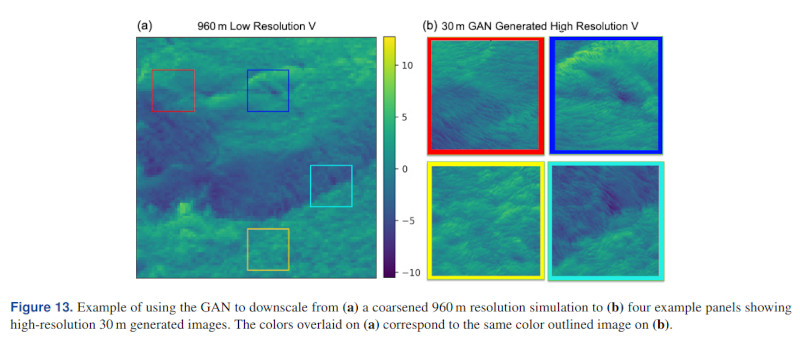
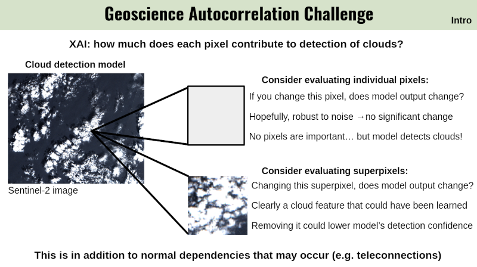
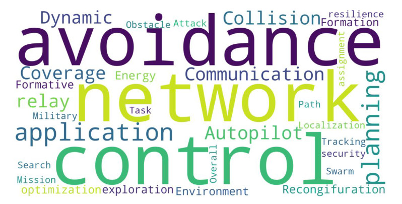
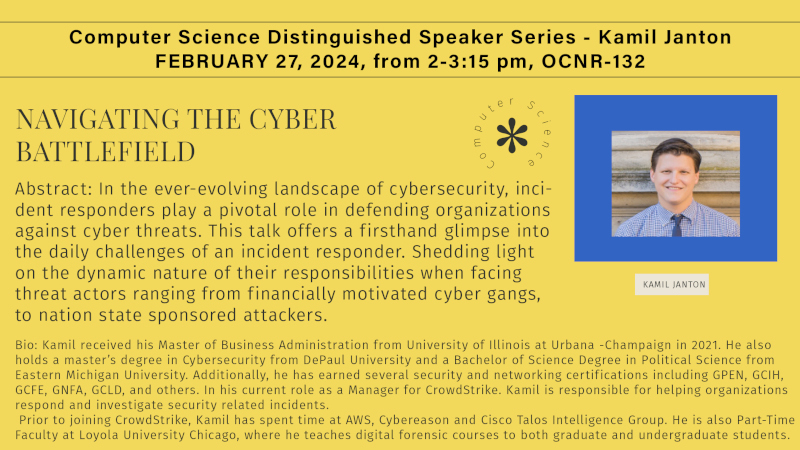
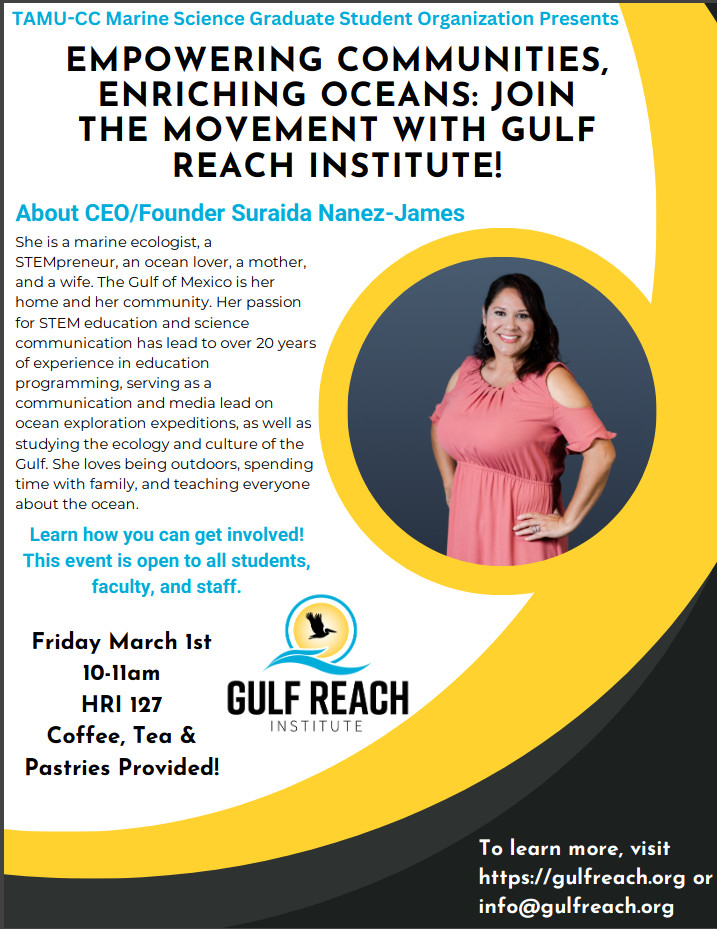

# iCORE Newsletter – 2024/02/22

The iCORE newsletter highlights events and information related to the [innovation in COmputing REsearch (iCORE) lab](https://icore.tamucc.edu/),
as well as the broader GSCS/CS programs at Texas A&M University - Corpus Christi and whatever else might interest that community.
If you have any news or resources you would like to share, send an email to [Evan Krell](https://scholar.google.com/citations?user=jLuwYGAAAAAJ&hl=en) (ekrell@islander.tamucc.edu).

[See past newsletters.](https://github.com/ekrell/icore_website/tree/main/news)

## Welcome

Hope everyone is having a good dragon year so far!

## iCORE Meetings

**[iCORE Teams meeting link](https://teams.microsoft.com/l/meetup-join/19%3Ameeting_NzFjYmU3NWQtYWM4OS00ZGE3LTk1NWEtZjU4NDMzODE5ZWZi%40thread.v2/0?context=%7B%22Tid%22%3A%2234cbfaf1-67a6-4781-a9ca-514eb2550b66%22%2C%22Oid%22%3A%22994c008b-0707-4f3c-8ac0-73b65e733430%22%2C%22MessageId%22%3A%220%22%7D)**

### Previous Meeting: February 16, 3:30 - 5:00 PM

- Discussed upcoming iCORE events
- Reached out to a number of individuals
- Recieved confirmation from Dr. Sue Dettling (NCAR) & Dr. José Baca (TAMUCC)

### Next Meeting: March 1, 3:30 - 5:00 PM

- **Event:** Exploring data using [IPyWidgets](https://ipywidgets.readthedocs.io/en/stable/) (Dr. Scott A. King)

## Upcoming iCORE Events

### Data Science Talk: Dr. King (March 1)

- **Title:** Exploring Data Using [IPyWidgets](https://ipywidgets.readthedocs.io/en/stable/)
- **Speaker:** [Dr. Scott A. King](http://faculty.tamucc.edu/sking/)
- **When:** Friday, March 1, 4:00 - 5:00 PM
- **Where:** iCORE (NRC 2100 suite)

### Machine Learning Talk: Dr. Sue Dettling (March 22)

- **Topic:** Generative Adversarial Networks (GANs)
- **Speaker:** [Dr. Sue Dettling](https://staff.ucar.edu/users/dettling)
- **When:** Friday, March 22, 4:00 - 5:00 PM
- **Where:** iCORE (NRC 2100 suite)

Image taken from [Haupt et al, 2023](https://wes.copernicus.org/articles/8/1251/2023/)

### Dissertation Practice Sessions

- Two GSCS students are soon to defend their dissertation.
- Before, they will practice their presentations at iCORE.
- These are **not** scheduled during iCORE meeting times.
- Please come support them and provide feedback to improve their talks. 

#### Marina Vicens-Miquel

- **Presenter:** [Marina Vicens-Miquel](https://marinavicensmiquel.github.io/)
- **Title:** Advancing Coastal Inundation Forecasting: A Multifaceted Machine Learning Approach
- **When:** Thursday, March 21, 3:30 - 5:00 PM
- **Where:** iCORE (NRC 2100 suite)

**Topics:**
- Artificial Intelligence
  - Machine learning
  - Deep Learning
  - Transformer-based architectures
- Coastal Inundation
  - Water Levels
    - Short-term
    - Seasonal to multi-year

#### Abhishek Phadke

- **Presenter:** [Abhishek Phadke](https://sites.google.com/view/abhishek-phadke)
- **Title:** Enabling Resilient Operations of Unoccupied Aerial Vehicle (UAV) Swarms
- **When:** Thursday, March 25, 3:00 - 4:30 PM
- **Where:** iCORE (NRC 2100 suite)

**Research Objectives:**
1. The USMART framework: Unified Swarm Management and Resource Tracking framework
2. Increasing Operational Resilience of UAV swarms: An Agent Focused Search and Rescue Framework
3. Disruption Analysis and threat modeling: Modeling wind and obstacle disturbances for effective performance observations and analysis of resilience in UAV swarms
4. Examining inclusion of heterogeneous agents in UAV swarms as a means of increasing operational resilience

## Upcoming Proposal Defenses

### Evan Krell

(Readers may recall a previous email announcing Evan's proposal defense. Evan had not been informed that his Graduate Faculty Advisor had stopped working at TAMUCC...)

- **Speaker:** [Evan Krell]()
- **Title:** Clustering Strategies For XAI with Correlated, High-Dimensional Geoscience AI Models
- **When:** March 7, 8:30 AM
- **Where:** TO BE ANNOUNCED

**Project Summary:** With the rapid deployment of high-resolution sensors and models, geospatial data is captured and generated at an extremely high rate. By automatically extracting information from large data volumes, machine learning is increasingly used to turn massive geospatial data into geoscience insights. There is widespread use of high-dimensional raster data from which complex machine learning algorithms learn to recognize spatial and spatial-temporal patterns. These models may be used for critical decision-making or as a way to aid scientific discovery. Complex models can learn highly non-linear relationships to achieve high performance, but there is a concern that their complexity makes it very difficult for users to determine how the model reached its decision. This has motivated the widespread adoption of explainable artificial intelligence (XAI) techniques that probe the model in various ways to explain how it works. XAI methods are highly sensitive to correlations among input predictors. Proposed mitigations involve grouping correlated predictors and applying XAI to groups instead of individuals. However, there are major challenges to grouping the grid cells of geoscience rasters based on their correlation. These datasets are commonly high-dimensional with substantial autocorrelation. Conventional techniques for grouping correlated tabular features are rarely applicable. The purpose of this research is to develop strategies for using data-driven clustering techniques to group raster data to improve the accuracy of XAI results. First, we describe the limitations of current approaches and identify XAI challenges related to raster-based geoscience models. We then develop a set of benchmarks so that we can quantitatively assess XAI methods in a variety of complex scenarios. Finally, we propose and evaluate methodologies for applying clustering and XAI techniques. These include a hierarchical clustering approach to automatically investigate multiple scales of patterns in high-dimensional data.

## News

### New Paper by Abhishek Phadke

- **Title:** An Analysis of Trends in UAV Swarm Implementations in Current Research: Simulation Versus Hardware
- **Published on:** February 2024
- **Journal:** Drone Systems and Applications
- **[Open Access](https://cdnsciencepub.com/doi/abs/10.1139/dsa-2023-0099)**

## Other Events

### Computer Science Distinguished Speaker Series - Kamil Janton

- **Title:** Navigating the Cyber Battlefield
- **When:** February 27, 2024,  2:00-3:15 PM
- **Where:** OCNR-132
- **Remote:** [Zoom Link](https://tamucc.zoom.us/j/99973757598?pwd=SHh3VlF6WHZOa1BWVTBGSit6NW9Gdz09
)

**Abstract:** In the ever-evolving landscape of cybersecurity, incident responders play a pivotal role in defending organizations against cyber threats. This talk offers a firsthand glimpse into the daily challenges of an incident responder. Shedding light on the dynamic nature of their responsibilities when facing threat actors ranging from financially motivated cyber gangs to nation state sponsored attackers.

### MSGSO Seminar - Suraida Nanez James

An event from our friends at the Marine Science Graduate Student Organization (MSGSO).

**Text from the MSGSO Email:**

Join the Marine Science Graduate Student Organization (MSGSO) for an engaging seminar featuring Suraida Nanez James, CEO and Founder of the Gulf Reach Institute. With a mission centered on innovation and action, the Gulf Reach Institute is dedicated to advancing STEM education for all, promoting the health of Gulf of Mexico and ocean communities, and advocating for equity and inclusion in environmental leadership. Don't miss this opportunity to learn about impactful programming and initiatives shaping the future of marine conservation in our Corpus Christi community!

- When: Friday, March 1st 10-11am
- Where: Harte Research Institute Room 127
- Coffee, tea, and pastries will be provided!
- Please share the flyer with students and colleagues who may be interested in participating. 

## Get involved

As always, we encourage all iCORE members and iCORE-adjacent persons to get involved and propose workshop/lecture/training ideas that they would like to present.

## iCORE resources

- location: NRC 2100 Suite (https://goo.gl/maps/Htbp1YMASAmYqkFu9)
- website: http://icore.tamucc.edu/
- twitter: https://twitter.com/ICORE_TAMUCC
- youtube: https://www.youtube.com/channel/UCvsK07PvushTI2BA2BhN-DQ
- discord: https://discord.gg/3eeMN229cr

