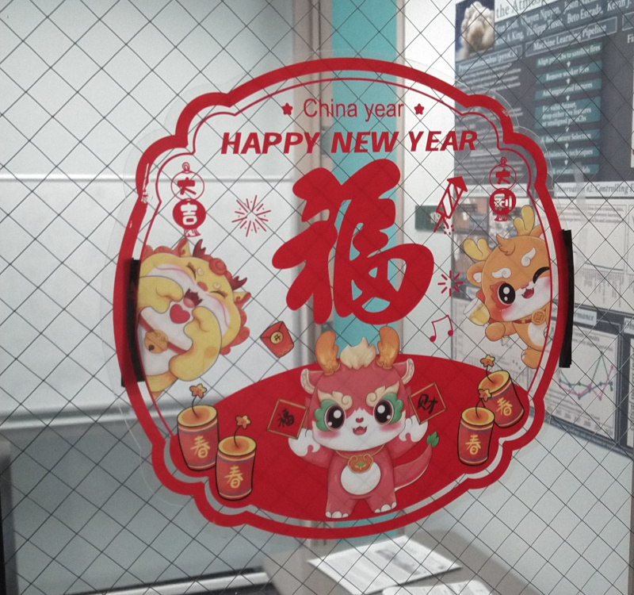

# iCORE Newsletter – 2024/02/22

The iCORE newsletter highlights events and information related to the [innovation in COmputing REsearch (iCORE) lab](https://icore.tamucc.edu/),
as well as the broader GSCS/CS programs at Texas A&M University - Corpus Christi and whatever else might interest that community.
If you have any news or resources you would like to share, send an email to [Evan Krell](https://scholar.google.com/citations?user=jLuwYGAAAAAJ&hl=en) (ekrell@islander.tamucc.edu).

[See past newsletters.](https://github.com/ekrell/icore_website/tree/main/news)

## Welcome

Hope everyone is having a good dragon year so far!

## iCORE Meetings

**[iCORE Teams meeting link](https://teams.microsoft.com/l/meetup-join/19%3Ameeting_NzFjYmU3NWQtYWM4OS00ZGE3LTk1NWEtZjU4NDMzODE5ZWZi%40thread.v2/0?context=%7B%22Tid%22%3A%2234cbfaf1-67a6-4781-a9ca-514eb2550b66%22%2C%22Oid%22%3A%22994c008b-0707-4f3c-8ac0-73b65e733430%22%2C%22MessageId%22%3A%220%22%7D)**

### Previous Meeting: February 16, 3:30 - 5:00 PM

- Discussed upcoming iCORE events
- Reached out to a number of individuals
- Recieved confirmation from Dr. Sue Dettling (NCAR) & Dr. José Baca (TAMUCC)

### Next Meeting: March 1, 3:30 - 5:00 PM

- **Event:** Exploring data using [IPyWidgets](https://ipywidgets.readthedocs.io/en/stable/) (Dr. Scott A. King)

## Upcoming Events

### Data Science Talk: Dr. King (March 1)

- **Title:** Exploring Data Using [IPyWidgets](https://ipywidgets.readthedocs.io/en/stable/)
- **Speaker:** [Dr. Scott A. King](http://faculty.tamucc.edu/sking/)
- **When:** Friday, March 1, 4:00 - 5:00 PM
- **Where:** iCORE (NRC 2100 suite)

### Machine Learning Talk: Dr. Sue Dettling (March 22)

- **Topic:** Generative Adversarial Networks (GANs)
- **Speaker:** [Dr. Sue Dettling](https://staff.ucar.edu/users/dettling)
- **When:** Friday, March 22, 4:00 - 5:00 PM
- **Where:** iCORE (NRC 2100 suite)

### Dissertation Practice Sessions

- Two GSCS students are soon to defend their dissertation.
- Before, they will practice their presentations at iCORE.
- These are **not** scheduled during iCORE meeting times.
- Please come support them and provide feedback to improve their talks. 

**Marina Vicens-Miquel** 

- **Presenter:** [Marina Vicens-Miquel](https://marinavicensmiquel.github.io/)
- **Title:** Advancing Coastal Inundation Forecasting: A Multifaceted Machine Learning Approach
- **When:** Thursday, March 21, 3:30 - 5:00 PM  ([add to calendar]())
- **Where:** iCORE (NRC 2100 suite)

**Topics:**
- Artificial Intelligence
  - Machine learning
  - Deep Learning
  - Transformer-based architectures
- Coastal Inundation
  - Water Levels
    - Short-term
    - Seasonal to multi-year

**Abhishek Phadke**

- **Presenter:** [Abhishek Phadke](https://sites.google.com/view/abhishek-phadke)
- **Title:** Enabling Resilient Operations of Unoccupied Aerial Vehicle (UAV) Swarms
- **When:** Thursday, March 25, 3:00 - 4:30 PM  ([add to calendar]())
- **Where:** iCORE (NRC 2100 suite)

- **Research Objective 1:** The USMART framework: Unified Swarm Management and Resource Tracking framework
- **Research Objective 2:** Increasing Operational Resilience of UAV swarms: An Agent Focused Search and Rescue Framework
- **Research Objective 3:** Disruption Analysis and threat modeling: Modeling wind and obstacle disturbances for effective performance observations and analysis of resilience in UAV swarms
- **Research Objective 4:** Examining inclusion of heterogeneous agents in UAV swarms as a means of increasing operational resilience

### Upcoming Proposal Defenses

**Evan**

**Lapone**

### COSC Distinguished Speaker Series: Kamil 

### MSGSO 

**Text from the MSGSO Email:**

Join the Marine Science Graduate Student Organization (MSGSO) for an engaging seminar featuring Suraida Nanez James, CEO and Founder of the Gulf Reach Institute. With a mission centered on innovation and action, the Gulf Reach Institute is dedicated to advancing STEM education for all, promoting the health of Gulf of Mexico and ocean communities, and advocating for equity and inclusion in environmental leadership. Don't miss this opportunity to learn about impactful programming and initiatives shaping the future of marine conservation in our Corpus Christi community!

- When: Friday March 1st 10-11am
- Where: Harte Research Institute Room 127
- Coffee, tea, and pastries will be provided!
- Please share the flyer with students and colleagues who may be interested in participating. 

## News

### Paper: Abhishek

## Get involved

As always, we encourage all iCORE members and iCORE-adjacent persons to get involved and propose workshop/lecture/training ideas that they would like to present.

## iCORE resources

- location: NRC 2100 Suite (https://goo.gl/maps/Htbp1YMASAmYqkFu9)
- website: http://icore.tamucc.edu/
- twitter: https://twitter.com/ICORE_TAMUCC
- youtube: https://www.youtube.com/channel/UCvsK07PvushTI2BA2BhN-DQ
- discord: https://discord.gg/3eeMN229cr

