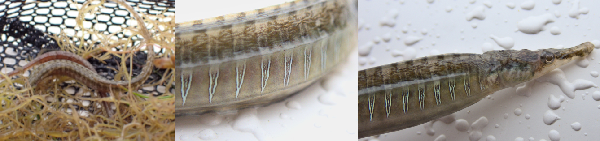
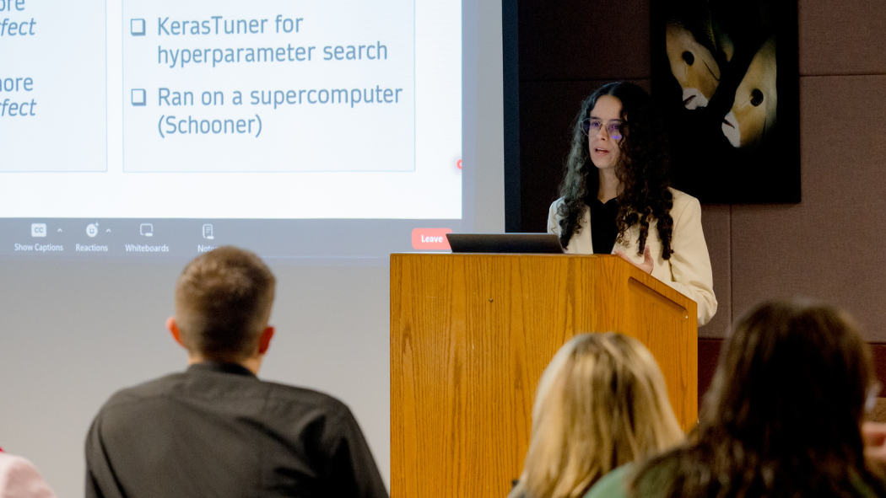
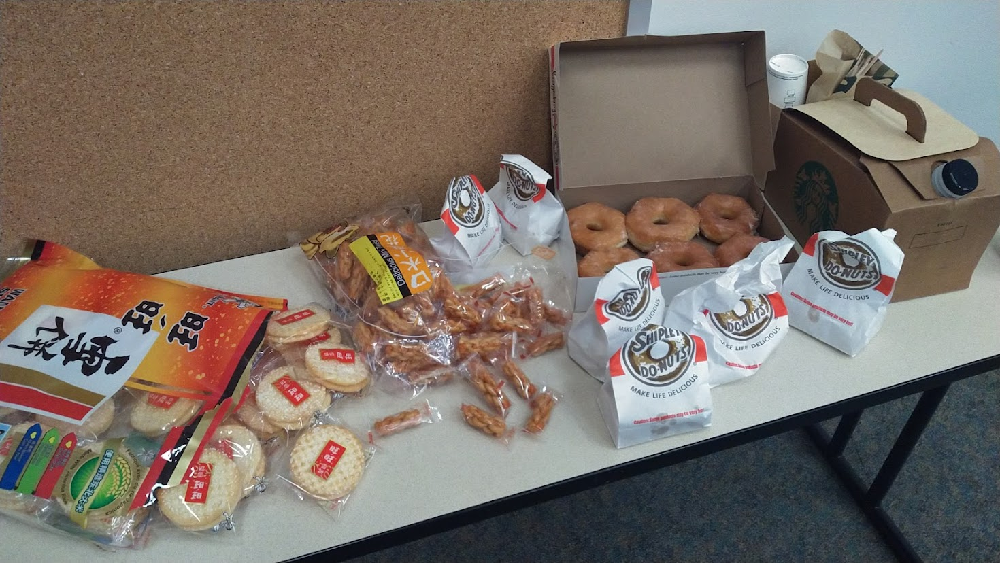

# iCORE Newsletter – 2024/03/28

The iCORE newsletter highlights events and information related to the [innovation in COmputing REsearch (iCORE) lab](https://icore.tamucc.edu/),
as well as the broader GSCS/CS programs at Texas A&M University - Corpus Christi and whatever else might interest that community.
If you have any news or resources you would like to share, send an email to [Evan Krell](https://scholar.google.com/citations?user=jLuwYGAAAAAJ&hl=en) (ekrell@islander.tamucc.edu).

[See past newsletters.](https://github.com/ekrell/icore_website/tree/main/news)

## Welcome

A tiny [Gulf Pipefish](https://www.inaturalist.org/observations/201075044#activity_identification_975eff2d-4494-4808-a0a9-f081982d848a) found in the Laguna Madre. 

## iCORE Meetings

**[iCORE Teams meeting link](https://teams.microsoft.com/l/meetup-join/19%3ameeting_MDdlZDBiMTgtYzVjNS00YjhhLWE5OTctY2Y5YzMyYTljNzU5%40thread.v2/0?context=%7b%22Tid%22%3a%2234cbfaf1-67a6-4781-a9ca-514eb2550b66%22%2c%22Oid%22%3a%22994c008b-0707-4f3c-8ac0-73b65e733430%22%7d)**

### Previous Meeting: March 22, 4:00 - 5:00 PM

**iCORE Event**

- **Topic:** Generative Adversarial Networks (GANs)
- **Speaker:** [Dr. Sue Dettling](https://staff.ucar.edu/users/dettling)
- **When:** Friday, March 22, 4:00 - 5:00 PM
- **Where:** iCORE (NRC 2100 suite)

We had an excellent talk from Dr. Sue Dettling last week. 
Dr. Dettling develops software and machine learning models for the [Research
Applications Laboratory](https://ral.ucar.edu/) at NCAR. 
She shared with us her ongoing work in using Generatve Adversarial Networks (GANs) to increase the spatial resolution of gridded model outputs.
That is, the system can learn to estimate what the detailed, high-resolution data would look like when given a coarse, low-resolution input. 
An example is wind: it is possible to produce extremely detailed wind simulations where the wind interacts with buildings and topographical details. But, it takes hundreds of GPU hours to achieve. 
A much lower-resolution output can be generated very quickly, but without the fine-grained details of interest. 
So, ML is being used to quickly estimate the detailed high-resolution from the low-detail version. 
To learn more, see her [recent publication.](https://wes.copernicus.org/articles/8/1251/2023/)

### Next Meeting: March 29, 3:30 - 5:00 PM

**iCORE EVENT**

- **Topic:** 
- **Speaker:** 
- **When:** Friday, March 29, 4:00 - 5:00 PM
- **Where:** iCORE (NRC 2100 suite)

## PhD Dissertation Defenses

### Marina Vicens-Miquel (March 27)

- Marina Vicens-Miquel has successfully defended her PhD in the GSCS program!
- She is part of [AI2ES](https://www.ai2es.org/) and the [Coastal Dynamics Lab](https://www.coastaldynamicslab.org/).
- She uses AI for a variety of research works related to water level prediction.
- Including total water level: how far the water will reach up the the beach.
- Locally, this is of high importance to conservation of endangered sea turtles.
- She already has a post-doc at The University of Oklahoma, working under [Dr. Amy McGovern](https://www.ou.edu/coe/cs/people/faculty/amy-mcgovern).

### Abhishek Phadke (March 29)

- Abhishek Phadke will defend his PhD in the GSCS program **this Friday**.
- He is part of [GOAL](https://antoniomedrano.github.io/GOAL.html) in the [Conrad Blucher Institute](https://www.conradblucherinstitute.org/).
- His research focuses on resiliency in autonomous systems.
- Autonomous vehicles (e.g. drones) can work together on complex tasks, but the real-world can be a harsh environment.
- There are many problems: loss of communications, battery depletion, high winds...
- So Abhishek has been working on systems that take into account potential failures so that the system can continue working even when such issues arise.

- **When:** Mar 29, 2024 12:00 PM 
- **Where:** OCNR 118
- [Remote Meeting Link](https://tamucc.zoom.us/j/93363507591?pwd=a1hQMUt2R2Ixek0xblVmWWVPUzFMZz09)

**Abstract:** UAVs (Unoccupied Aerial Vehicles) are used in fields such as surveying, military operations, and disaster relief due to their cost-effectiveness, temporal efficiency, operational flexibility, and uncrewed capability. Collaborative efforts among UAV swarms can further improve results. However, whereas controlling a single UAV in dynamic environments is challenging, this complexity escalates in swarm operations. Swarms need to be operationally resilient to avoid cascaded failures and maintain mission progress. Resiliency, or the ability of a system to handle disruptions, is critical yet challenging to achieve in UAV swarms. This dissertation assesses current resiliency methods in swarm systems and proposes a comprehensive framework to enhance swarm resilience from the ground up. The approach includes a unified resource tracking framework for UAVs called USMART, focusing on robust communication, environmental awareness, and optimized task assignments. Additionally, a novel self-healing module targets distressed agents, tracking their well-being, and providing reactive measures. The methods employ a modular approach, integrating predefined schemes and response selection algorithms to improve system resilience. Finally, the impact of external disruptions on swarm behavior through a systematic experimentation methodology for simulations is explored. This study aims to bridge the gap towards a resilient UAV swarm by addressing swarm resilience from both systemic development and simulated disruption perspectives. 

## PhD Proposal Defenses

### Mahmoud Eldefrawy (March 18)

- Mahmoud Eldefrawy successfully defended his proposal in the GSCS program!
- His research is on smart agriculture: using machine learning and autonomous systems to improve agricultural efficiency.
- With a growing population and environmntal pressures, food availability will be a major challenge.
- There is a huge need to apply technology to increase yield at lower costs.
- Mahmoud is combining ML and photogrammetry to turn 2D aerial imagery into 3D recustructions of crops.
- This can be used to quickly count crops and monitor growth, among other benefits. 

## Evan Krell (March 7)

- Evan Krell successully defended his GSCS proposal.
- He also writes these newsletters, so he doesn't want to make a big deal of it.
- We use complex ML models and we don't know how they work... but what if we did?
- Explainable AI (XAI) is a broad class of techniques that help us peer into these models: what strategies did the model learn?
- But Evan (1) showed that XAI for geospatial model is really hard and (2) has ideas on how to improve it.
- He also had good snacks.

## Miranda White (April 5)

- Next up: Miranda White defends her proposal in the CMSS program.
- Miranda is a convergent researcher with expertise in statistics, environmental science, and stakeholder interaction.
- She develops ML models for predicting cold-water conditions that can trigger cold-stunned sea turtles.
- And, she works with the relevant stakeholders to find out their modeling needs and what aspects of the system increase (or decrease) their trust in the model and how useful it is for their goals.

- When: April 5, 12:00 p.m. CST
- Where: NRC 1003
- [Remote Meeting Link](https://tamucc.zoom.us/j/97410020113?pwd=Q29PWjU1a2E4V1grM1R5QW51VUdVZz09)

**Abstract:** Given the climatic conditions of southern Texas, the Laguna Madre can cool down very rapidly and serve as a “trap” to marine life when cold weather fronts travel to the coast. This results in the loss of mobility of economically valuable fish and endangered sea turtles, potentially leading to severe cold-related illnesses or death. This places heavy emphasis on effectively predicting and communicating when water temperatures fall below cold-stunning thresholds to provide stakeholders with sufficient time to prepare for sea turtle and fishery recovery efforts and mitigation measures such as navigation interruptions in the Laguna Madre.

For over fifteen years (in. 2007, op. 2010), model outputs from Texas A&M University-Corpus Christi Conrad Blucher Institute’s Cold-Stunning machine learning (ML) models have been utilized by a diverse stakeholder base, often referred to as the Texas Marine Response Collaborative (TCRC), including stakeholders in the National Park Service, Texas Parks and Wildlife Department, Gulf Intracoastal Canal Association, and National Weather Service. Recent discussions with stakeholders have shown a need for uncertainty quantifications of when and how long cold-stunning events and the related responses will be. However, further problem identification between ML developers and end-users regarding relevant and useful representations of uncertainty is needed for a more use-inspired and effective ML design.

This dissertation research will thus focus on (1) exploring information and communication pathways of ML water temperature predictions within the TCRC, (2) developing and evaluating uncertainty quantifications of ML-derived water temperature predictions using an ensemble of ML models, and (3) assessing the trust, trustworthiness, and usability of the ML ensemble and its associate uncertainty information with stakeholders that is contextual to their decision space (i.e., goals, values, barriers, needs, experiences, expectations, etc.). Therefore, collaboration with various partners, ML-developers, and end-users will be facilitated to better understand the landscape around trust amongst key stakeholders when using ML-derived information and to identify the contextual factors that are most important for how they relate to users’ needs and decision-making processes. Through use-inspired ML development, this research aims to provide useful and trustworthy ML model predictions, uncertainty quantifications, and visualizations that will help improve stakeholder decision-making during extreme cold events along the southern Texas coast.

