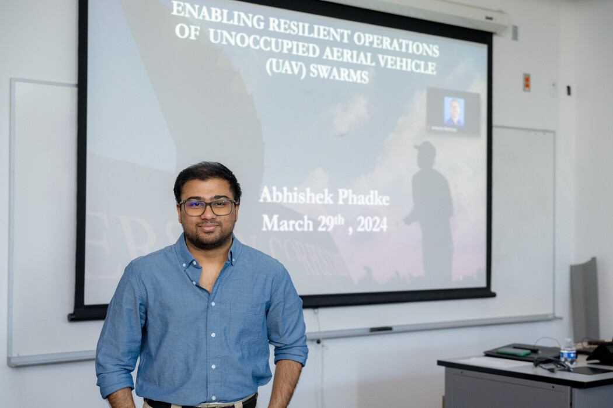
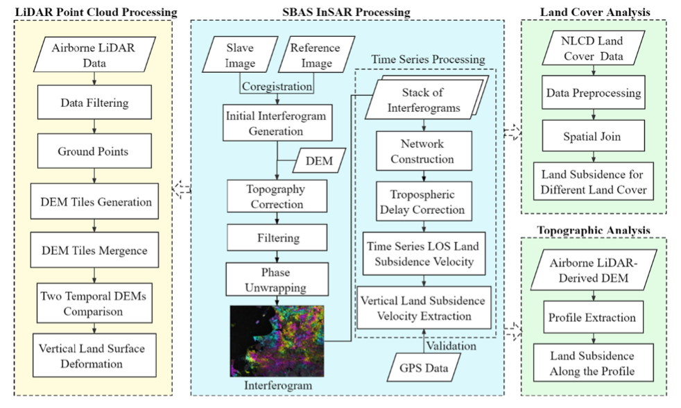
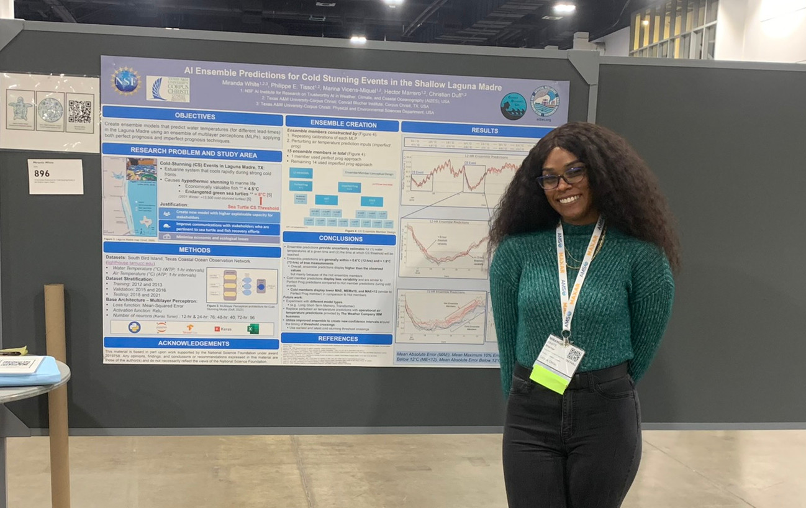

# iCORE Newsletter – 2024/04/03

The iCORE newsletter highlights events and information related to the [innovation in COmputing REsearch (iCORE) lab](https://icore.tamucc.edu/),
as well as the broader GSCS/CS programs at Texas A&M University - Corpus Christi and whatever else might interest that community.
If you have any news or resources you would like to share, send an email to [Evan Krell](https://scholar.google.com/citations?user=jLuwYGAAAAAJ&hl=en) (ekrell@islander.tamucc.edu).

[See past newsletters.](https://github.com/ekrell/icore_website/tree/main/news)

## Welcome

A member of genus _Sisyrinchium_, spotted in Port Aransas. 

## iCORE Meetings

**[iCORE Teams meeting link](https://teams.microsoft.com/l/meetup-join/19%3ameeting_MDdlZDBiMTgtYzVjNS00YjhhLWE5OTctY2Y5YzMyYTljNzU5%40thread.v2/0?context=%7b%22Tid%22%3a%2234cbfaf1-67a6-4781-a9ca-514eb2550b66%22%2c%22Oid%22%3a%22994c008b-0707-4f3c-8ac0-73b65e733430%22%7d)**

### Previous Meeting: March 29, 3:30 - 5:00 PM

Last week, we had a great talk from [Dr. José Baca](https://sites.google.com/site/bacajose/) on Modular Robot Systems. He gave a tour through a huge variety of systems for air, water, and space. Most of these were robot systems. For example, single flying robots that can be combined to create larger flying robots. These can be combined to acheive various mission configurations. Not all systems were robots: for example, a set of modular lights that can be attached to vehicles, spacesuits. etc. They are doing a lot of very interest work over at CORAL (Collaborative Robots and Agents Lab). Hopefully there will be collaboration with iCORE in the future. 

### Next Meeting: April 12, 3:30 - 5:00 PM

**iCORE Event**

- **Topic:** Machine Learning Talk: Probabilistic Modeling 
- **Speaker:** [Dr. Monique Shotande](https://www.researchgate.net/profile/Monique-Shotande)

Dr. Monique Shotande is a post-doc researcher at the University of Oklahoma and a part of [AI2ES](https://www.ai2es.org). She has background in machine learning and medical computing, and currently uses machine learning for probabilistic tornado prediction. Dr. Shotande will share some of her insights in probabilistic modeling with us at iCORE. We are increasingly interested in uncertainty in ML predictions: how to effectively quantify it and communicate it with users affected by the model. This should be broadly interesting to AI practitioners, so I encourage your attendance online or in person. 

## PhD Dissertation Defenses

### Abhishek Phadke (March 29)

Abhishke defended his PhD in the GSCS program last Friday. I believe that he is now visiting universities, having to make a choice between multiple great options. So, congrats to Abhishek for a successful defense. 

### Wen Zhong (April 5)

- Title: Assessment of the Impacts of Subsidence on Coastal Flood Risk Using Geodetic Remote Sensing, Machine Learning, and Hydrological Modeling
- When: April 5, 8:00 AM
- Where: RFEB 108 
- [Remote Meeting Link](https://nam12.safelinks.protection.outlook.com/?url=https%3A%2F%2Fus05web.zoom.us%2Fj%2F86721343628%3Fpwd%3DJXAaFNbbmmZaHWWFeoU7u2fzagd52Z.1&data=05%7C02%7Cekrell%40islander.tamucc.edu%7Cec83387d2fae42010ffe08dc54ca922c%7C34cbfaf167a64781a9ca514eb2550b66%7C0%7C0%7C638478476301497269%7CUnknown%7CTWFpbGZsb3d8eyJWIjoiMC4wLjAwMDAiLCJQIjoiV2luMzIiLCJBTiI6Ik1haWwiLCJXVCI6Mn0%3D%7C0%7C%7C%7C&sdata=ShqO7MsbecbPXiTAb5kWzW2g%2FlkHHcENYo00dqftxuM%3D&reserved=0)

Research framework, from Wen's [2022 publication](https://www.sciencedirect.com/science/article/pii/S0034425722004035).

**Abstract:** Coastal regions have been increasingly affected by floods due to heavy rainfall, storm surge, and relative sea-level rise (RSLR) in a changing climate. In particular, land subsidence has been identified as an important cause of RSLR and contributes to the growing flood risk in coastal regions. InSAR has been used as a promising tool for the mapping of coastal subsidence, but the results derived from the prevalent SAR images are limited by the low spatial resolution and short satellite records. Also, previous studies have focused on the projection of direct inundation over subsiding land surface, and there is little understanding of the impacts of subsidence on the structure and performance of stormwater drainage systems. Those impacts could affect key hydrological and hydraulic processes with implications for the magnitude, duration, and frequency of urban flood events. Using the Texas Gulf Coast as the study area, this study systematically investigated the impacts of future subsidence on urban flooding through the development of an integrated framework for measuring and predicting land subsidence and evaluating its hydrological and hydraulic effects. This was achieved through research efforts across three stages: 1) the enhanced characterization of regional land subsidence through the combined use of InSAR and airborne LiDAR results; 2) the temporal fusion of InSAR and airborne LiDAR results, the projection of spatially heterogeneous subsidence rates using deep learning, and the construction of subsidence-corrected future DEMs; and 3) the simulation-based quantification of urban flood risk by incorporating subsidence-caused elevation change of drainage structures. The results of this study could provide new scientific knowledge and predictive tools to improve the characterization, prediction, and adaptation of subsidence and associated urban flood risk in coastal regions.

## PhD Proposal Defenses

## Miranda White (April 5)

- Next up: Miranda White defends her proposal in the CMSS program.
- Miranda is a convergent researcher with expertise in statistics, environmental science, and stakeholder interaction.
- She develops ML models for predicting cold-water conditions that can trigger cold-stunned sea turtles.
- And, she works with the relevant stakeholders to find out their modeling needs and what aspects of the system increase (or decrease) their trust in the model and how useful it is for their goals.

- When: April 5, 12:00 p.m. CST
- Where: NRC 1003
- [Remote Meeting Link](https://tamucc.zoom.us/j/97410020113?pwd=Q29PWjU1a2E4V1grM1R5QW51VUdVZz09)

**Abstract:** Given the climatic conditions of southern Texas, the Laguna Madre can cool down very rapidly and serve as a “trap” to marine life when cold weather fronts travel to the coast. This results in the loss of mobility of economically valuable fish and endangered sea turtles, potentially leading to severe cold-related illnesses or death. This places heavy emphasis on effectively predicting and communicating when water temperatures fall below cold-stunning thresholds to provide stakeholders with sufficient time to prepare for sea turtle and fishery recovery efforts and mitigation measures such as navigation interruptions in the Laguna Madre.

For over fifteen years (in. 2007, op. 2010), model outputs from Texas A&M University-Corpus Christi Conrad Blucher Institute’s Cold-Stunning machine learning (ML) models have been utilized by a diverse stakeholder base, often referred to as the Texas Marine Response Collaborative (TCRC), including stakeholders in the National Park Service, Texas Parks and Wildlife Department, Gulf Intracoastal Canal Association, and National Weather Service. Recent discussions with stakeholders have shown a need for uncertainty quantifications of when and how long cold-stunning events and the related responses will be. However, further problem identification between ML developers and end-users regarding relevant and useful representations of uncertainty is needed for a more use-inspired and effective ML design.

This dissertation research will thus focus on (1) exploring information and communication pathways of ML water temperature predictions within the TCRC, (2) developing and evaluating uncertainty quantifications of ML-derived water temperature predictions using an ensemble of ML models, and (3) assessing the trust, trustworthiness, and usability of the ML ensemble and its associate uncertainty information with stakeholders that is contextual to their decision space (i.e., goals, values, barriers, needs, experiences, expectations, etc.). Therefore, collaboration with various partners, ML-developers, and end-users will be facilitated to better understand the landscape around trust amongst key stakeholders when using ML-derived information and to identify the contextual factors that are most important for how they relate to users’ needs and decision-making processes. Through use-inspired ML development, this research aims to provide useful and trustworthy ML model predictions, uncertainty quantifications, and visualizations that will help improve stakeholder decision-making during extreme cold events along the southern Texas coast.

## Get involved

As always, we encourage all iCORE members and iCORE-adjacent persons to get involved and propose workshop/lecture/training ideas that they would like to present.

## iCORE resources

- location: NRC 2100 Suite (https://goo.gl/maps/Htbp1YMASAmYqkFu9)
- website: http://icore.tamucc.edu/
- twitter: https://twitter.com/ICORE_TAMUCC
- youtube: https://www.youtube.com/channel/UCvsK07PvushTI2BA2BhN-DQ
- discord: https://discord.gg/3eeMN229cr
