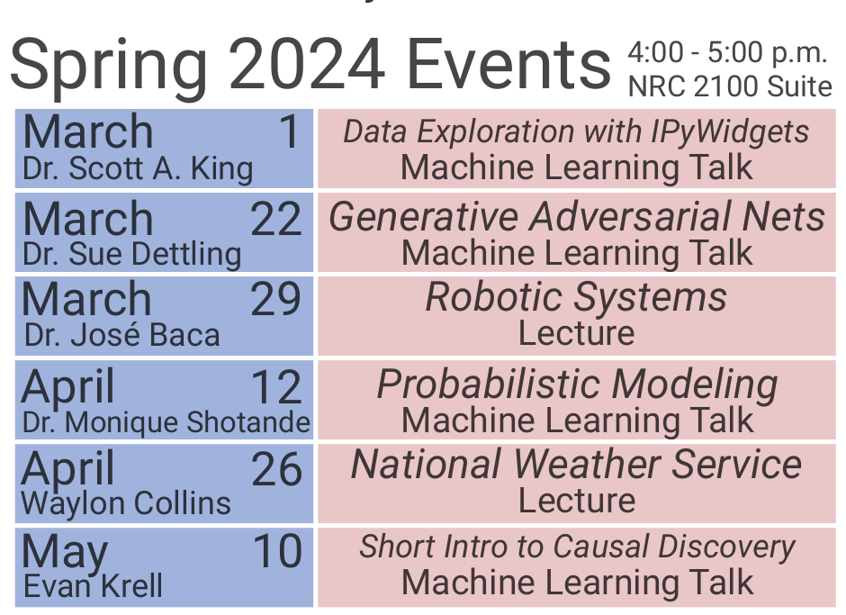

# iCORE Newsletter – 2024/04/25

The iCORE newsletter highlights events and information related to the [innovation in COmputing REsearch (iCORE) lab](https://icore.tamucc.edu/),
as well as the broader GSCS/CS programs at Texas A&M University - Corpus Christi and whatever else might interest that community.
If you have any news or resources you would like to share, send an email to [Evan Krell](https://scholar.google.com/citations?user=jLuwYGAAAAAJ&hl=en) (ekrell@islander.tamucc.edu).

[See past newsletters.](https://github.com/ekrell/icore_website/tree/main/news)

## Welcome

The editor of this newsletter, Evan Krell, is under strict orders to focus on his research and not take on side projects. He has a postion lined up at NRL-Monterey, and needs to graduate! Expect the newsletter to become shorter and less frequent. 

## iCORE Meetings

**[iCORE Teams meeting link](https://teams.microsoft.com/l/meetup-join/19%3ameeting_MDdlZDBiMTgtYzVjNS00YjhhLWE5OTctY2Y5YzMyYTljNzU5%40thread.v2/0?context=%7b%22Tid%22%3a%2234cbfaf1-67a6-4781-a9ca-514eb2550b66%22%2c%22Oid%22%3a%22994c008b-0707-4f3c-8ac0-73b65e733430%22%7d)**

### Event Calendar

### Previous Meeting: April 12, 3:30 - 5:00 PM

Last meeting, we had a talk from [Dr. Monique Shotande](https://www.researchgate.net/profile/Monique-Shotande) on probabilistic modeling. I was unable to be present, but I heard that it was a great talk!

### CANCELLED: Next Meeting: April 26, 3:30 - 5:00 PM

According to the event calendar, we have a meeting tomorrow (April 26) with a talk from Waylon Collins. 
However, this event has been cancelled so we are **not having our usual Friday meeting!**. 
However, we are collaborating with MSGSO to host a Python workshop tomorrow morning (see below). 

### iCORE + MSGSO Event: Intro to Python Workshop

iCORE and MSGSO are working together to present this Intro to Python workshop. The focus is on Python for _data science_, and assumes no previous Python experience. In this three-hour session, we will start from the absolute basics of Python and end by training a machine learning model using the Random Forest algorithm. The workshop will introduce `numpy`, `pandas`, `matplotlib`, `scipy` and other Python modules that are frequenty used for scientific computing. 

Please [RSVP here](https://tamucc.campuslabs.com/engage/event/10103109).

## News

### Congratulations

- Abhishek Phadke: graduated with a PhD in the GSCS program!
- Wen Zhong: graduated with a PhD in the GSCS program!
- Miranda White: defended a PhD proposal in the CMSS program!
- Mahmoud Eldefrawy: defended a PhD proposal in the GSCS program!
- Evan Krell: defended a PhD proposal in the GSCS program!
- Evan, Miranda, Mahmoud: either finished or are currently working on qualifying exams. 

### Symposium for Student Innovation, Research, and Creative Activities is this Friday, April 26!

- Overlaps the Intro to Python workshop
- I am told that several iCORE, GSCS, etc people will have presentations
- If you are free Friday, I encourage you to check it out

## Get involved

As always, we encourage all iCORE members and iCORE-adjacent persons to get involved and propose workshop/lecture/training ideas that they would like to present.

## iCORE resources

- location: NRC 2100 Suite (https://goo.gl/maps/Htbp1YMASAmYqkFu9)
- website: http://icore.tamucc.edu/
- twitter: https://twitter.com/ICORE_TAMUCC
- youtube: https://www.youtube.com/channel/UCvsK07PvushTI2BA2BhN-DQ
- discord: https://discord.gg/3eeMN229cr

